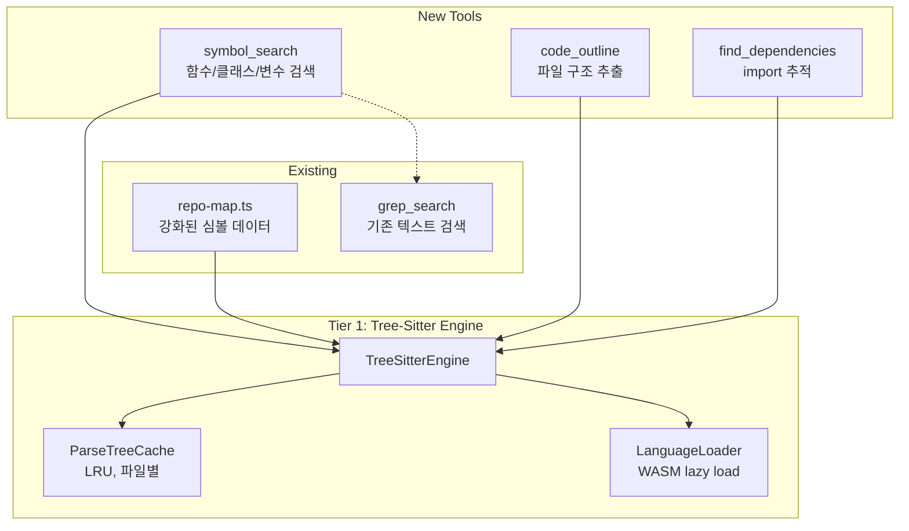
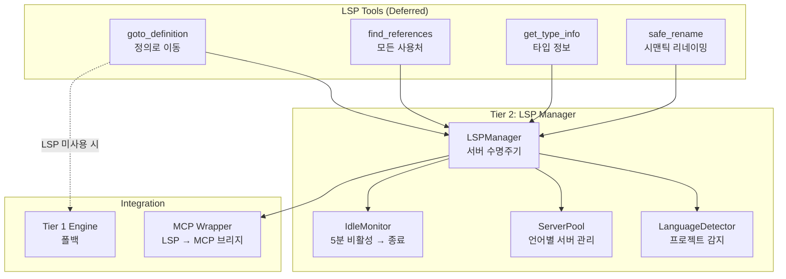
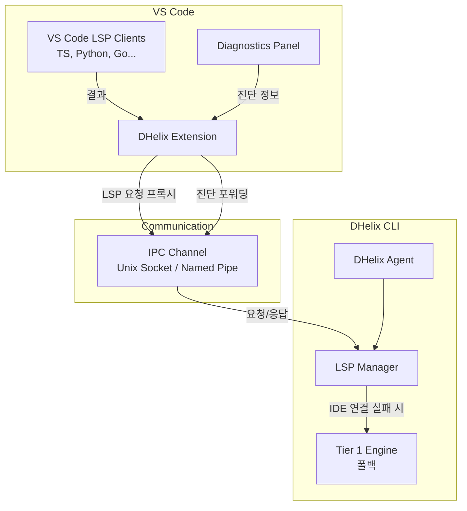

# DHelix Code — LSP / Code Intelligence 통합 개발 계획

> 작성: 2026-03-29 | AI Coding Agent Senior 책임 개발자
> 버전: v1.0 | 대상: DHelix Code v0.2.x → v0.3.0

---

## 1. Executive Summary

DHelix Code의 코드 이해 능력을 **텍스트 검색(grep/glob) 수준**에서 **시맨틱 코드 인텔리전스**로 격상시킵니다.
3-Tier 점진적 접근으로, 의존성 제로인 tree-sitter부터 시작하여 최종적으로 완전한 LSP 통합까지 진화합니다.

### 왜 필요한가

| 현재 (grep/glob)                                      | LSP 통합 후                                |
| ----------------------------------------------------- | ------------------------------------------ |
| `grep "handleSubmit"` → 문자열 매칭, 주석/문자열 포함 | `go-to-definition` → 정확한 선언 위치      |
| 파일 전체 읽어야 구조 파악 (토큰 낭비)                | `document-symbols` → 함수/클래스 목록 즉시 |
| 리팩토링 시 사용처 누락                               | `find-references` → 모든 참조 100%         |
| 타입 정보 없음 → 에이전트가 추측                      | `hover` → 정확한 타입 시그니처             |
| 대규모 코드베이스에서 정확도 급감                     | 시맨틱 이해로 정확도 유지                  |

### 예상 효과

- **에이전트 정확도**: +30-40% (특히 대규모 코드베이스)
- **토큰 효율**: -25% (파일 전체 대신 필요한 심볼만 읽음)
- **리팩토링 안전성**: find-references로 누락 제로
- **경쟁 우위**: Claude Code, Aider, Codex CLI 모두 LSP 미보유 (OpenCode만 부분 지원)

---

## 2. 현재 상태 분석

### 2.1 기존 코드 인텔리전스 (repo-map.ts)

```
src/indexing/repo-map.ts
├── 정규식 기반 심볼 추출 (6가지 패턴)
│   ├── class, function, interface, type, const, enum
│   └── TypeScript/JavaScript만 지원
├── 파일별 심볼 + import 관계 추출
├── renderRepoMap() → LLM용 텍스트 표현
└── 시스템 프롬프트에 주입 (토큰 예산: 2K-5K)
```

**한계:**

- 정규식 기반 → 중첩 구조, 동적 패턴 놓침
- TS/JS만 지원 (Python, Go, Rust 미지원)
- 타입 정보 없음 (함수 시그니처만)
- cross-file 참조 추적 불가

### 2.2 활용 가능한 기존 인프라

| 인프라                    | 활용 방안                                                  |
| ------------------------- | ---------------------------------------------------------- |
| **MCP Manager**           | LSP 서버를 MCP 서버로 래핑하여 기존 도구 파이프라인 재사용 |
| **Tool Registry**         | 새 코드 인텔리전스 도구를 빌트인 또는 MCP 도구로 등록      |
| **Deferred Loading**      | LSP 도구를 on-demand로 로드 (토큰 절약)                    |
| **repo-map.ts**           | tree-sitter 결과를 기존 RepoMap 구조에 통합                |
| **system-prompt-builder** | 코드 인텔리전스 섹션을 동적으로 조립                       |

---

## 3. Tier 1: Tree-Sitter 기반 코드 인텔리전스

> **목표**: 외부 서버 없이, 빌트인 도구만으로 시맨틱 코드 이해
> **공수**: 1.5-2주 | **의존성**: `tree-sitter`, 언어별 파서 npm 패키지
> **결과물**: 3개 신규 도구 + repo-map 강화

### 3.1 왜 tree-sitter인가

| 비교 항목    | 정규식 (현재) | tree-sitter | 전체 LSP         |
| ------------ | ------------- | ----------- | ---------------- |
| 파싱 정확도  | 70%           | 95%         | 99%              |
| 속도 (1만줄) | 5ms           | 15ms        | 500ms+           |
| 메모리       | 0             | 10MB        | 300MB+           |
| 설치 부담    | 없음          | npm install | 서버별 설치      |
| 언어 지원    | TS/JS만       | 20+ 언어    | 언어별 서버 필요 |
| cross-file   | 불가          | 부분 가능   | 완전 가능        |
| 타입 추론    | 불가          | 불가        | 완전 가능        |

**tree-sitter의 핵심 가치**: LSP의 80% 효과를 10%의 비용으로 얻음.

### 3.2 설치할 패키지

```bash
npm install tree-sitter tree-sitter-typescript tree-sitter-python \
  tree-sitter-go tree-sitter-rust tree-sitter-java tree-sitter-c-sharp
```

또는 WASM 바인딩 사용 (네이티브 빌드 불필요):

```bash
npm install web-tree-sitter
# + 언어별 .wasm 파일 (tree-sitter-typescript.wasm 등)
```

**추천: `web-tree-sitter`** — 크로스 플랫폼, 네이티브 빌드 불필요, CI 호환.

### 3.3 아키텍처



### 3.4 핵심 모듈 설계

#### `src/indexing/tree-sitter-engine.ts`

```typescript
/**
 * Tree-Sitter 기반 코드 파싱 엔진
 * WASM 바인딩으로 크로스 플랫폼 지원, LRU 캐시로 반복 파싱 방지
 */

export interface ParsedSymbol {
  readonly name: string;
  readonly kind:
    | "function"
    | "class"
    | "interface"
    | "type"
    | "variable"
    | "method"
    | "enum"
    | "import";
  readonly filePath: string;
  readonly startLine: number;
  readonly endLine: number;
  readonly exported: boolean;
  readonly signature?: string; // 함수 시그니처 (파라미터 + 리턴 타입)
  readonly parentName?: string; // 소속 클래스/모듈
  readonly documentation?: string; // JSDoc/docstring 첫 줄
}

export interface FileOutline {
  readonly filePath: string;
  readonly language: string;
  readonly symbols: readonly ParsedSymbol[];
  readonly imports: readonly ImportInfo[];
  readonly exports: readonly string[];
}

export interface ImportInfo {
  readonly source: string; // import 소스 경로
  readonly specifiers: readonly string[]; // 가져온 이름들
  readonly isDefault: boolean;
  readonly line: number;
}

export class TreeSitterEngine {
  private readonly cache: Map<string, { tree: Tree; mtime: number }>;
  private readonly languages: Map<string, Language>;

  /** 파일 파싱 (캐시 히트 시 재사용) */
  async parseFile(filePath: string): Promise<FileOutline>;

  /** 프로젝트 전체 심볼 검색 */
  async searchSymbols(
    query: string,
    options?: {
      kind?: ParsedSymbol["kind"];
      directory?: string;
      limit?: number;
    },
  ): Promise<readonly ParsedSymbol[]>;

  /** 파일의 구조(아웃라인) 추출 */
  async getOutline(filePath: string): Promise<FileOutline>;

  /** import/export 의존 관계 추적 */
  async findDependencies(
    filePath: string,
    direction: "imports" | "importedBy",
  ): Promise<readonly ImportInfo[]>;
}
```

#### 언어 감지 + WASM 로딩

```typescript
const LANGUAGE_MAP: Record<string, string> = {
  ".ts": "typescript",
  ".tsx": "tsx",
  ".js": "javascript",
  ".jsx": "javascript",
  ".py": "python",
  ".go": "go",
  ".rs": "rust",
  ".java": "java",
  ".cs": "c_sharp",
  ".rb": "ruby",
  ".php": "php",
  ".swift": "swift",
  ".kt": "kotlin",
  ".cpp": "cpp",
  ".c": "c",
};

/** Lazy WASM 로딩 — 실제로 사용되는 언어만 로드 */
async function loadLanguage(lang: string): Promise<Language> {
  // 첫 사용 시에만 WASM 파일 로드 (100-500KB per language)
  const wasmPath = join(__dirname, `tree-sitter-${lang}.wasm`);
  return await Parser.Language.load(wasmPath);
}
```

### 3.5 신규 도구 3개

#### Tool 1: `symbol_search`

```typescript
{
  name: "symbol_search",
  description: "프로젝트에서 함수, 클래스, 인터페이스, 변수를 시맨틱 검색합니다. grep보다 정확합니다.",
  permissionLevel: "safe",
  parameters: {
    query: z.string().describe("검색할 심볼 이름 (부분 일치 지원)"),
    kind: z.enum(["function","class","interface","type","variable","method","enum"]).optional(),
    directory: z.string().optional().describe("검색 범위 제한 디렉토리"),
    includeSignature: z.boolean().optional().default(true).describe("함수 시그니처 포함 여부"),
  },
}
```

**LLM에게 주는 가이드:**

```
symbol_search는 grep_search보다 정확합니다.
- 함수/클래스/변수 찾기: symbol_search 사용
- 텍스트 패턴/문자열/주석 찾기: grep_search 사용
```

#### Tool 2: `code_outline`

```typescript
{
  name: "code_outline",
  description: "파일의 구조(함수, 클래스, 메서드, 타입)를 추출합니다. 파일 전체를 읽지 않고 구조만 파악할 때 사용합니다.",
  permissionLevel: "safe",
  parameters: {
    filePath: z.string().describe("분석할 파일 경로"),
    includeImports: z.boolean().optional().default(false),
  },
}
```

**핵심 가치**: file_read로 500줄 파일 전체를 읽는 대신, code_outline으로 구조만 파악 → 토큰 90% 절약.

#### Tool 3: `find_dependencies`

```typescript
{
  name: "find_dependencies",
  description: "파일의 import/export 의존 관계를 추적합니다. 리팩토링 전 영향 범위 파악에 사용합니다.",
  permissionLevel: "safe",
  parameters: {
    filePath: z.string().describe("분석할 파일 경로"),
    direction: z.enum(["imports", "importedBy"]).default("imports"),
    depth: z.number().optional().default(1).describe("추적 깊이 (1=직접, 2=간접)"),
  },
}
```

### 3.6 repo-map.ts 강화

기존 정규식 기반 → tree-sitter 기반으로 교체:

```typescript
// 기존: regex 기반 (부정확)
const classDecl = /(?:export\s+)?(?:abstract\s+)?class\s+(\w+)/g;

// 변경: tree-sitter 기반 (정확)
const outline = await treeSitterEngine.getOutline(filePath);
const symbols = outline.symbols.map((s) => ({
  name: s.name,
  kind: s.kind,
  line: s.startLine,
  exported: s.exported,
  signature: s.signature, // 새로 추가: 함수 시그니처
}));
```

**하위 호환**: tree-sitter 로드 실패 시 기존 정규식으로 폴백.

### 3.7 파싱 캐시 전략

```
캐시 키: filePath + mtime
캐시 크기: LRU 200개 파일 (약 50MB 메모리)
무효화: 파일 수정 시간(mtime) 변경 시 자동
세션 간: 메모리 캐시만 (디스크 캐시 불필요 — 파싱 충분히 빠름)
```

### 3.8 성능 예측

DHelix 자체 프로젝트 기준 (252 파일, 64K 줄):

| 작업                       | 예상 시간 | 메모리 |
| -------------------------- | --------- | ------ |
| 전체 프로젝트 파싱         | 200-400ms | 30MB   |
| 단일 파일 파싱 (캐시 미스) | 1-5ms     | <1MB   |
| 단일 파일 파싱 (캐시 히트) | <0.1ms    | 0      |
| symbol_search (전체)       | 50-100ms  | -      |
| WASM 초기 로드 (언어당)    | 50-100ms  | 2MB    |

### 3.9 Hot Tool 등록 전략

`symbol_search`와 `code_outline`을 **hot tool로 등록하지 않습니다.**

이유:

- Hot tool 추가 = 매 LLM 호출마다 토큰 소비
- 대신 시스템 프롬프트에 가이드만 삽입:
  ```
  코드 구조를 파악할 때는 code_outline 도구를 사용하세요.
  심볼을 찾을 때는 symbol_search 도구를 사용하세요.
  텍스트 패턴은 grep_search를 사용하세요.
  ```
- LLM이 필요할 때 deferred tool로 호출

### 3.10 테스트 계획

```
test/unit/indexing/tree-sitter-engine.test.ts
├── TypeScript 파싱 (class, function, interface, type, enum, const)
├── Python 파싱 (def, class, decorator)
├── 다중 언어 감지 (확장자 → 언어 매핑)
├── 캐시 히트/미스 검증
├── 내보내기(export) 감지 정확도
├── 함수 시그니처 추출 정확도
├── import/export 관계 추출
├── WASM 로드 실패 시 폴백
└── 대용량 파일 처리 (10K줄+)

test/unit/tools/definitions/symbol-search.test.ts
test/unit/tools/definitions/code-outline.test.ts
test/unit/tools/definitions/find-dependencies.test.ts
```

### 3.11 Tier 1 마일스톤

| 주차        | 목표                                     | 산출물                   |
| ----------- | ---------------------------------------- | ------------------------ |
| Week 1 전반 | web-tree-sitter 통합 + TS/Python 파서    | `tree-sitter-engine.ts`  |
| Week 1 후반 | symbol_search + code_outline 도구        | 2개 도구 + 테스트        |
| Week 2 전반 | find_dependencies + repo-map 강화        | 1개 도구 + repo-map 개선 |
| Week 2 후반 | 추가 언어 (Go, Rust, Java) + 통합 테스트 | 전체 테스트 통과         |

---

## 4. Tier 2: LSP On-Demand

> **목표**: 정밀한 타입 정보와 리팩토링이 필요할 때만 LSP 서버를 자동으로 시작
> **공수**: 2-3주 | **전제**: Tier 1 완료
> **결과물**: LSP 매니저 + 4개 시맨틱 도구 + 자동 감지/시작/종료

### 4.1 설계 철학

```
"LSP 서버는 비싸다. 필요할 때만 켜고, 안 쓰면 끈다."

사용자: "이 함수의 모든 사용처를 찾아줘"
  ↓
DHelix: tree-sitter로 시도 (Tier 1)
  ↓ (cross-file 참조 필요 → tree-sitter 한계)
DHelix: LSP 서버 자동 시작 → find-references → 결과 반환
  ↓ (5분 비활성)
DHelix: LSP 서버 자동 종료 (메모리 회수)
```

### 4.2 아키텍처



### 4.3 지원 언어 서버

| 언어       | LSP 서버                     | 설치 명령                                    | 시작 시간 | 메모리    |
| ---------- | ---------------------------- | -------------------------------------------- | --------- | --------- |
| TypeScript | `typescript-language-server` | `npm i -g typescript-language-server`        | 3-5초     | 200-400MB |
| Python     | `pyright` (또는 `pylsp`)     | `pip install pyright`                        | 2-3초     | 100-200MB |
| Go         | `gopls`                      | `go install golang.org/x/tools/gopls@latest` | 1-2초     | 100-300MB |
| Rust       | `rust-analyzer`              | `rustup component add rust-analyzer`         | 3-5초     | 200-500MB |
| Java       | `jdtls`                      | Eclipse JDT.LS                               | 5-10초    | 300-600MB |

**자동 감지 규칙:**

```
tsconfig.json / package.json   → TypeScript
pyproject.toml / setup.py      → Python
go.mod                         → Go
Cargo.toml                     → Rust
pom.xml / build.gradle         → Java
```

### 4.4 핵심 모듈 설계

#### `src/lsp/manager.ts`

```typescript
export class LSPManager {
  private readonly servers: Map<string, LSPServerInstance>;
  private readonly idleTimers: Map<string, NodeJS.Timeout>;

  /** 프로젝트 언어 감지 → 필요한 LSP 서버 목록 반환 */
  async detectLanguages(projectDir: string): Promise<readonly string[]>;

  /** LSP 서버 시작 (이미 실행 중이면 재사용) */
  async ensureServer(language: string): Promise<LSPServerInstance>;

  /** LSP 요청 실행 (서버 자동 시작 포함) */
  async request<T>(language: string, method: string, params: unknown): Promise<T>;

  /** 비활성 서버 종료 (5분 타이머) */
  private resetIdleTimer(language: string): void;

  /** 전체 서버 종료 (세션 종료 시) */
  async shutdownAll(): Promise<void>;
}
```

#### `src/lsp/protocol.ts`

```typescript
/** LSP 요청/응답을 DHelix 내부 타입으로 변환 */
export interface DefinitionResult {
  readonly filePath: string;
  readonly line: number;
  readonly column: number;
  readonly preview: string; // 해당 줄의 코드 미리보기
}

export interface ReferenceResult {
  readonly filePath: string;
  readonly line: number;
  readonly column: number;
  readonly context: string; // 주변 코드 컨텍스트
  readonly kind: "read" | "write" | "definition";
}

export interface TypeInfoResult {
  readonly type: string; // 타입 문자열
  readonly documentation?: string; // JSDoc/docstring
  readonly signature?: string; // 함수 시그니처
}
```

### 4.5 MCP 래핑 전략 (대안)

LSP 서버를 직접 관리하는 대신, **MCP 서버로 래핑**하는 전략도 고려:

```
장점:
- 기존 MCP 인프라 100% 재사용 (manager, bridge, scope)
- 설정을 mcp.json에 통합
- 사용자가 원하는 LSP 서버를 자유롭게 추가

단점:
- MCP ↔ LSP 변환 레이어 필요
- 지연 시간 약간 증가 (JSON-RPC 이중 변환)
```

**추천**: Tier 2는 직접 관리, Tier 3에서 MCP 래핑 옵션 제공.

### 4.6 신규 도구 4개

| 도구              | 설명                                      | LSP 메서드                | Tree-Sitter 폴백            |
| ----------------- | ----------------------------------------- | ------------------------- | --------------------------- |
| `goto_definition` | 심볼의 정의 위치로 이동                   | `textDocument/definition` | import 경로 + 파일 검색     |
| `find_references` | 심볼의 모든 사용처 찾기                   | `textDocument/references` | grep + 컨텍스트 분석        |
| `get_type_info`   | 심볼의 타입 정보 조회                     | `textDocument/hover`      | 시그니처 추출 (Tier 1)      |
| `safe_rename`     | 시맨틱 리네이밍 (모든 참조 자동 업데이트) | `textDocument/rename`     | find_references + file_edit |

### 4.7 Graceful Degradation (우아한 퇴보)

```
LSP 사용 가능?
  ├─ Yes → LSP 결과 반환 (100% 정확)
  └─ No (서버 미설치 or 시작 실패)
       ├─ tree-sitter 사용 가능?
       │   ├─ Yes → tree-sitter 결과 반환 (90% 정확)
       │   └─ No → grep/glob 폴백 (70% 정확)
       └─ 사용자에게 LSP 서버 설치 안내 표시
```

에이전트는 **항상 결과를 반환**합니다. 정확도만 단계적으로 떨어질 뿐.

### 4.8 Tier 2 마일스톤

| 주차   | 목표                                     | 산출물                                                               |
| ------ | ---------------------------------------- | -------------------------------------------------------------------- |
| Week 1 | LSPManager + TS 서버 통합                | `lsp/manager.ts`, `lsp/protocol.ts`                                  |
| Week 2 | 4개 도구 구현 + 폴백 체인                | `goto_definition`, `find_references`, `get_type_info`, `safe_rename` |
| Week 3 | Python/Go 서버 + 자동 감지 + Idle 모니터 | 다중 언어 + 자동 시작/종료                                           |

---

## 5. Tier 3: Persistent LSP + IDE 연동

> **목표**: VS Code Extension과 연동하여 IDE의 LSP 커넥션을 DHelix가 직접 사용
> **공수**: 4-6주 | **전제**: Tier 2 완료 + VS Code Extension 개발
> **결과물**: IDE 연동 LSP + 실시간 진단 + 코드 액션

### 5.1 설계 철학

```
"IDE가 이미 LSP 서버를 돌리고 있다. 또 돌릴 필요 없다."

VS Code에서 DHelix 실행:
  ↓
VS Code Extension이 IDE의 LSP 커넥션을 DHelix에 공유
  ↓
DHelix는 별도 LSP 서버 없이 IDE의 코드 인텔리전스 사용
  ↓
IDE의 진단(Diagnostic) 정보도 실시간으로 활용
```

### 5.2 아키텍처



### 5.3 VS Code Extension 연동 프로토콜

```typescript
/** Extension → DHelix CLI 공유 프로토콜 */
interface LSPBridgeProtocol {
  /** IDE가 지원하는 언어 목록 */
  "lsp/capabilities": { languages: string[] };

  /** LSP 요청 프록시 */
  "lsp/request": {
    language: string;
    method: string; // "textDocument/definition" 등
    params: unknown;
  };

  /** 실시간 진단 포워딩 */
  "lsp/diagnostics": {
    filePath: string;
    diagnostics: Diagnostic[];
  };

  /** 파일 변경 알림 */
  "lsp/didChange": {
    filePath: string;
    version: number;
  };
}
```

### 5.4 실시간 진단 활용

IDE의 진단(에러, 경고)을 에이전트가 실시간으로 활용:

```
에이전트가 파일 수정 → VS Code가 자동 진단 실행
  ↓
진단 결과가 DHelix에 전달:
  "src/app.ts:15: Type 'string' is not assignable to type 'number'"
  ↓
에이전트가 자동으로 수정 시도 (별도 도구 호출 없이)
```

### 5.5 추가 기능

| 기능                  | 설명                                                     |
| --------------------- | -------------------------------------------------------- |
| **Code Actions**      | Quick Fix 자동 적용 (missing import, type annotation 등) |
| **Workspace Symbols** | 프로젝트 전체 심볼 즉시 검색                             |
| **Call Hierarchy**    | 함수 호출 체인 추적                                      |
| **Type Hierarchy**    | 클래스 상속 구조 시각화                                  |
| **Semantic Tokens**   | 변수의 역할(parameter, property, local) 구분             |

### 5.6 Tier 3 마일스톤

| 주차     | 목표                                           | 산출물                   |
| -------- | ---------------------------------------------- | ------------------------ |
| Week 1-2 | VS Code Extension 기본 구조 + IPC 채널         | Extension + IPC 프로토콜 |
| Week 3-4 | LSP 브리지 프록시 + 진단 포워딩                | 양방향 LSP 통신          |
| Week 5-6 | Code Actions + Workspace Symbols + 통합 테스트 | 전체 기능 검증           |

---

## 6. 리스크 및 대응

| 리스크                                 | 확률 | 영향 | 대응                                    |
| -------------------------------------- | ---- | ---- | --------------------------------------- |
| tree-sitter WASM 로딩 실패 (OS 호환성) | 중   | 중   | 정규식 폴백 유지                        |
| LSP 서버 미설치 환경                   | 높   | 중   | Tier 1만으로 기능 제공 + /doctor에 안내 |
| LSP 서버 크래시                        | 중   | 낮   | 자동 재시작 (최대 3회) + Tier 1 폴백    |
| 토큰 예산 초과 (도구 설명 증가)        | 중   | 중   | deferred loading + 간결한 설명          |
| VS Code Extension 마켓 경쟁            | 높   | 높   | 차별화 기능에 집중 (팀, 컴팩션, DNA)    |

---

## 7. 성공 지표

| Tier       | KPI                        | 목표                                      |
| ---------- | -------------------------- | ----------------------------------------- |
| **Tier 1** | 심볼 검색 정확도 (vs grep) | 90%+ (현재 70%)                           |
| **Tier 1** | file_read 호출 감소율      | -30% (code_outline 대체)                  |
| **Tier 1** | 지원 언어 수               | 7+ (TS, Python, Go, Rust, Java, C#, Ruby) |
| **Tier 2** | go-to-definition 정확도    | 98%+                                      |
| **Tier 2** | 리팩토링 참조 누락률       | 0%                                        |
| **Tier 2** | LSP 서버 시작 시간         | <5초                                      |
| **Tier 3** | IDE 연동 지연시간          | <100ms                                    |
| **Tier 3** | 진단 기반 자동 수정률      | 60%+                                      |

---

## 8. 의사결정 요약

| 결정 사항          | 선택                       | 근거                                |
| ------------------ | -------------------------- | ----------------------------------- |
| Tier 1 파서        | web-tree-sitter (WASM)     | 크로스 플랫폼, 네이티브 빌드 불필요 |
| Tier 2 관리 방식   | 직접 관리 (MCP 래핑 아님)  | 지연 시간 최소화                    |
| Tier 2 TS 서버     | typescript-language-server | 가장 널리 사용, 안정적              |
| Tier 2 Python 서버 | pyright                    | 타입 추론 정확도 최고               |
| Tier 3 IPC         | Unix Socket / Named Pipe   | 낮은 지연, 양방향 통신              |
| Hot Tool 등록      | 하지 않음 (deferred)       | 토큰 예산 보호                      |
| 폴백 전략          | LSP → tree-sitter → regex  | 항상 결과 반환 보장                 |

---

## 부록: 파일 구조 (예상)

```
src/
├── indexing/
│   ├── repo-map.ts           (기존 — tree-sitter 통합)
│   └── tree-sitter-engine.ts (신규 — Tier 1)
├── lsp/
│   ├── manager.ts            (신규 — Tier 2)
│   ├── protocol.ts           (신규 — Tier 2)
│   ├── server-pool.ts        (신규 — Tier 2)
│   ├── language-detector.ts  (신규 — Tier 2)
│   └── ide-bridge.ts         (신규 — Tier 3)
├── tools/definitions/
│   ├── symbol-search.ts      (신규 — Tier 1)
│   ├── code-outline.ts       (신규 — Tier 1)
│   ├── find-dependencies.ts  (신규 — Tier 1)
│   ├── goto-definition.ts    (신규 — Tier 2)
│   ├── find-references.ts    (신규 — Tier 2)
│   ├── get-type-info.ts      (신규 — Tier 2)
│   └── safe-rename.ts        (신규 — Tier 2)
test/
├── unit/indexing/
│   └── tree-sitter-engine.test.ts
├── unit/lsp/
│   ├── manager.test.ts
│   └── protocol.test.ts
└── unit/tools/definitions/
    ├── symbol-search.test.ts
    ├── code-outline.test.ts
    └── find-dependencies.test.ts
```
