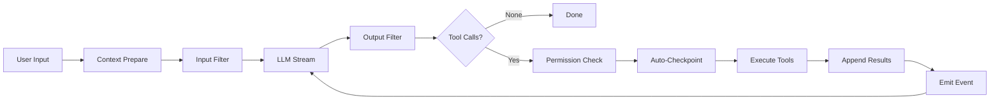

# Architecture Deep Dive

> 참조 시점: Agent loop, 렌더링 시스템, 컨텍스트 관리 작업 시

## Agent Loop (ReAct Pattern)



- **maxIterations**: 50 (infinite loop protection)
- **Tool timeout**: bash 120s, file ops 30s
- **Parallel execution**: read-only tools always parallel, file writes conflict on same path
- **Auto-compaction**: triggers at 83.5% context usage
- **Intermediate messages**: emitted as `agent:assistant-message` events

## Multi-Turn Message Pairing

Agent loop results must maintain proper assistant→tool pairing:

```
assistant(toolCalls=[tc1,tc2]) → tool(tc1 result) → tool(tc2 result) → assistant("done")
```

Never store tool messages without a preceding assistant message containing matching `toolCalls`.
The `useAgentLoop` hook extracts new messages via `result.messages.slice(initialMessageCount)`.

## Context Compaction (3-Layer)

- **Layer 1 — Microcompaction**: Bulky tool outputs → disk cold storage; hot tail of 5 recent results inline
- **Layer 2 — Structured summarization**: At 83.5% context. Preserves: user intent, key decisions, files touched, errors, next steps
- **Layer 3 — Post-compaction rehydration**: Re-reads 5 most recently accessed files after compaction

## Rendering Architecture (Anti-Flicker)

Logo printed to stdout BEFORE Ink's `render()` — never part of dynamic area.

### Progressive Static Flushing (ActivityFeed)

- Completed entries → immediately moved to `<Static>` (rendered once, never re-drawn)
- Only in-progress entries stay in dynamic area
- Keeps dynamic area small regardless of conversation length

### DEC Mode 2026 (synchronized-output.ts)

- Wraps Ink render cycles with BEGIN/END markers for atomic frame display
- Supported: Ghostty, iTerm2, WezTerm, VSCode terminal, kitty, tmux 3.4+
- Unsupported terminals safely ignore the escape sequences

### Timing

- Text buffer: 100ms
- Spinner animation: 500ms

## 주의사항

- `useAgentLoop` hook은 agent-loop.ts와 React state를 연결하는 브릿지 — 직접 수정 시 메시지 순서 깨질 수 있음
- CheckpointManager는 file_write/file_edit 전에 자동으로 파일 상태를 저장 — /undo, /rewind 기능의 기반
- ActivityCollector의 `tool-start` → `tool-complete` 쌍이 깨지면 UI에서 도구가 영원히 "running" 상태로 표시됨
