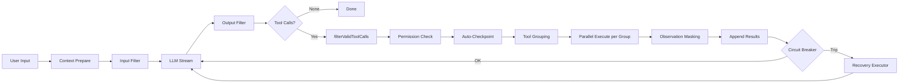
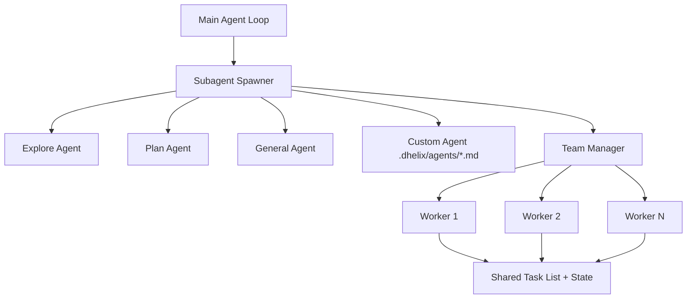

# Architecture Deep Dive

> 참조 시점: Agent loop, 컨텍스트 관리, 서브에이전트, 렌더링 시스템 작업 시

## Agent Loop (ReAct Pattern)



- **maxIterations**: 50 (infinite loop protection)
- **Circuit breaker**: 시맨틱 진행 분석 — 3회 연속 무변경, 5회 같은 에러 반복 시 트립
- **Recovery executor**: 에러 유형별 전략 — compact/retry/fallback/strategy-switch
- **Observation masking**: 재생성 가능한 도구 출력(file_read, grep, glob) 마스킹
- **Tool grouping**: 같은 파일 쓰기 충돌 감지 → 그룹 간 순차, 그룹 내 병렬
- **Tool timeout**: bash 120s, file ops 30s
- **Auto-compaction**: triggers at 83.5% context usage
- **Intermediate messages**: emitted as `agent:assistant-message` events
- **Dual-model routing**: 대화 흐름 분석 → 계획 단계(architect) vs 실행 단계(editor) 자동 전환

## Multi-Turn Message Pairing

Agent loop results must maintain proper assistant→tool pairing:

```
assistant(toolCalls=[tc1,tc2]) → tool(tc1 result) → tool(tc2 result) → assistant("done")
```

Never store tool messages without a preceding assistant message containing matching `toolCalls`.

## Context Compaction (3-Layer) + Cold Storage

- **Layer 1 — Microcompaction**: 200토큰+ 도구 출력 → 디스크 cold storage (content-addressable hash); hot tail 5개만 인라인
- **Layer 2 — Structured summarization**: 83.5% 임계값. 보존: user intent, key decisions, files touched, errors, next steps
- **Layer 3 — Post-compaction rehydration**: 압축 후 최근 5개 파일 재읽기 → LLM에게 최신 상태 제공
- **Adaptive GC**: 컨텍스트 소비 속도 기반 동적 압축 주기 조정
- **Cold storage 경로**: `~/.dhelix/projects/{hash}/cold-storage/` (24h TTL)

## Recovery Strategies

에러 유형별 복구 전략 (`recovery-strategy.ts`):

| 에러 패턴                          | 전략                                 | 최대 재시도 |
| ---------------------------------- | ------------------------------------ | ----------- |
| request too large / context exceed | compact (대화 압축)                  | 1           |
| ETIMEDOUT / timeout                | retry (지수 백오프)                  | 2           |
| parse error / invalid JSON         | fallback-strategy (텍스트 파싱 전환) | 1           |
| ELOCK / locked                     | retry (1s 백오프)                    | 3           |

## Subagent System



- **spawner.ts**: 서브에이전트 생성 — 도구 필터링, 모델 오버라이드, 백그라운드 실행
- **Git worktree 격리**: `isolation: "worktree"` 옵션으로 독립 브랜치에서 작업
- **Team manager**: 다수 에이전트 병렬 조율, 태스크 분배
- **Shared state**: 에이전트 간 공유 변수 (`shared-state.ts`)
- **Agent memory**: 에이전트별 메모리 영속화 (`agent-memory.ts`)

## System Prompt Caching

- **system-prompt-cache.ts**: SHA-256 hash + mtime 기반 — 변경 없는 시스템 프롬프트 재빌드 방지

## Code Review Agent

- **code-review-agent.ts**: Generator-Critic 패턴 — 코드 생성 후 자체 리뷰

## Rendering Architecture (Anti-Flicker)

Logo printed to stdout BEFORE Ink's `render()` — never part of dynamic area.

### Progressive Static Flushing (ActivityFeed)

- Completed entries → `<Static>` (한 번 렌더링, 다시 안 그림)
- In-progress entries만 dynamic area에 유지
- 대화 길이와 무관하게 dynamic area 크기 일정

### DEC Mode 2026 (synchronized-output.ts)

- Ink 렌더 사이클을 BEGIN/END 마커로 감싸서 원자적 프레임 표시
- 지원: Ghostty, iTerm2, WezTerm, VSCode terminal, kitty, tmux 3.4+

### Timing

- Text buffer: 100ms
- Spinner animation: 500ms

## Security Layers

- **secret-scanner.ts**: 정규식 기반 API 키/비밀번호 감지
- **entropy-scanner.ts**: Shannon 엔트로피 기반 고엔트로피 문자열 감지
- **command-filter.ts**: 위험 셸 명령 차단 (rm -rf, dd 등)
- **path-filter.ts**: 경로 탈출 + 민감 경로 접근 차단 (/etc, ~/.ssh)
- **injection-detector.ts**: 프롬프트 인젝션 패턴 감지
- **audit-log.ts**: JSONL 권한 감사 로그
- **logger.ts**: Pino redaction — 16개 API 키 패턴

## 주의사항

- `useAgentLoop` hook은 agent-loop.ts와 React state를 연결하는 브릿지 — 직접 수정 시 메시지 순서 깨질 수 있음
- CheckpointManager는 file_write/file_edit 전에 자동으로 파일 상태를 저장 — /undo, /rewind 기능의 기반
- ActivityCollector의 `tool-start` → `tool-complete` 쌍이 깨지면 UI에서 도구가 영원히 "running" 상태로 표시됨
- Circuit breaker는 agent-loop.ts에 통합 — 루프 패턴 감지 실패 시 recovery-executor로 위임
- Observation masking은 tool result append 시점에 적용
- 서브에이전트는 메인 에이전트의 컨텍스트를 상속하지 않음 — 독립적 컨텍스트 윈도우
