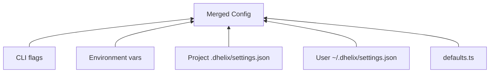

# Config & Instructions System

> 참조 시점: DHELIX.md 처리, 설정 계층, MCP 스코프 설정, 프로젝트 초기화 시

## DHELIX.md Location

- **Primary**: `DHELIX.md` at project root (convention, same as CLAUDE.md)
- **Fallback**: `.dhelix/DHELIX.md` (backward compatible)
- `/init` creates `DHELIX.md` at project root + `.dhelix/` for settings and rules
- `DHELIX.md` is optional — dhelix works without it
- Use `getProjectConfigPaths(cwd)` from `src/constants.ts` to resolve paths consistently
- **Never hardcode DHELIX.md paths** — always use the centralized helper

## Instruction Loading Hierarchy (lowest → highest priority)

1. `~/.dhelix/DHELIX.md` — global user instructions
2. `~/.dhelix/rules/*.md` — global user rules
3. Parent directory `DHELIX.md` files (walking up from cwd)
4. Project root `DHELIX.md`
5. `.dhelix/rules/*.md` — project path-conditional rules
6. `DHELIX.local.md` — local overrides (gitignored)

## Config Hierarchy (5-level)



Priority: CLI flags > env vars > project > user > defaults

## Key Config Paths

| 용도             | 경로                                      |
| ---------------- | ----------------------------------------- |
| 프로젝트 설정    | `.dhelix/settings.json`                   |
| 사용자 전역 설정 | `~/.dhelix/settings.json`                 |
| 프로젝트 규칙    | `.dhelix/rules/*.md`                      |
| 전역 규칙        | `~/.dhelix/rules/*.md`                    |
| 키바인딩         | `~/.dhelix/keybindings.json`              |
| 입력 히스토리    | `~/.dhelix/input-history.json`            |
| 권한 감사 로그   | `.dhelix/audit.jsonl`                     |
| 프로젝트 메모리  | `~/.dhelix/projects/{hash}/memory/`       |
| 콜드 스토리지    | `~/.dhelix/projects/{hash}/cold-storage/` |

## MCP Config Paths (3-Scope)

MCP 서버 설정은 3개 스코프로 관리됩니다. 우선순위: local > project > user

| 스코프  | 경로                         | 용도                       | Git        |
| ------- | ---------------------------- | -------------------------- | ---------- |
| local   | `.dhelix/mcp-local.json`     | 개인 개발 서버 (API 키 등) | .gitignore |
| project | `.dhelix/mcp.json`           | 팀 공용 서버               | 커밋       |
| user    | `~/.dhelix/mcp-servers.json` | 글로벌 서버                | N/A        |

모든 스코프의 설정 파일 형식:

```json
{
  "servers": {
    "server-name": {
      "transport": "stdio",
      "command": "npx",
      "args": ["@some/mcp-server"]
    }
  }
}
```

- **MCPScopeManager** (`src/mcp/scope-manager.ts`): 3개 스코프 병합 담당
- **MCPManager** (`src/mcp/manager.ts`): `loadScopedConfigs()` → `connectAll()` → 도구 등록
- **레거시 fallback**: `~/.dhelix/mcp.json` (`{ mcpServers: {...} }` 형식) — scope-manager가 없을 때만 사용

## DEFAULT_MODEL Resolution

Model selection follows env-var priority chain:

```
DHELIX_MODEL > OPENAI_MODEL > "gpt-5.1-codex-mini" (schema.ts hardcoded default)
```

**dotenv 타이밍 주의사항:**

- `src/index.ts`에서 dotenv는 **패키지 루트의 `.env`만** 로드 (cwd의 `.env`는 읽지 않음)
- `config/schema.ts`의 Zod 기본값은 **import 시점**(dotenv 로드 전)에 평가되므로 `"gpt-5.1-codex-mini"` 하드코딩 필수
- 런타임 env 오버라이드는 `config/loader.ts`의 `loadEnvConfig()`에서 처리
- `/model` 명령의 Default 항목은 실행 시점에 `process.env`를 직접 읽어 정확한 env 모델 표시

CLI `--model` flag overrides all.

## Permission Audit Logging

- **audit-log.ts** (`src/permissions/`): Logs every permission check to JSONL format
- Each entry: timestamp, tool name, permission level, user decision, file path
- Stored at `.dhelix/audit.jsonl` (project-level, gitignored)

## Health Checks (/doctor)

`/doctor` runs 12 health checks: config, permissions, sandbox, LLM connectivity, MCP servers, etc.

## 주의사항

- `getProjectConfigPaths(cwd)` 헬퍼를 항상 사용 — 경로 하드코딩 금지
- `.dhelix/rules/*.md`는 glob 기반 path-conditional — `path-matcher.ts` 참조
- `DHELIX.local.md`는 `.gitignore`에 포함되어야 함
- `audit.jsonl`은 `.gitignore`에 포함되어야 함
- MCP 스코프 설정 변경 시 dhelix 재시작 필요 (부트스트랩에서 연결)
- MCP 서버 추가/제거는 `/mcp add|remove` 명령어로 — 직접 JSON 수정도 가능
