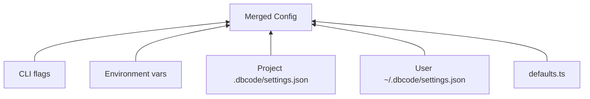

# Config & Instructions System

> 참조 시점: DBCODE.md 처리, 설정 계층, 프로젝트 초기화 작업 시

## DBCODE.md Location

- **Primary**: `DBCODE.md` at project root (convention, same as CLAUDE.md)
- **Fallback**: `.dbcode/DBCODE.md` (backward compatible)
- `/init` creates `DBCODE.md` at project root + `.dbcode/` for settings and rules
- `DBCODE.md` is optional — dbcode works without it
- Use `getProjectConfigPaths(cwd)` from `src/constants.ts` to resolve paths consistently
- **Never hardcode DBCODE.md paths** — always use the centralized helper

## Instruction Loading Hierarchy (lowest → highest priority)

1. `~/.dbcode/DBCODE.md` — global user instructions
2. `~/.dbcode/rules/*.md` — global user rules
3. Parent directory `DBCODE.md` files (walking up from cwd)
4. Project root `DBCODE.md`
5. `.dbcode/rules/*.md` — project path-conditional rules
6. `DBCODE.local.md` — local overrides (gitignored)

## Config Hierarchy (5-level)

Priority: CLI flags > env vars > project > user > defaults

## Key Config Paths

| 용도             | 경로                           |
| ---------------- | ------------------------------ |
| 프로젝트 설정    | `.dbcode/settings.json`        |
| 사용자 전역 설정 | `~/.dbcode/settings.json`      |
| 프로젝트 규칙    | `.dbcode/rules/*.md`           |
| 전역 규칙        | `~/.dbcode/rules/*.md`         |
| 키바인딩         | `~/.dbcode/keybindings.json`   |
| 입력 히스토리    | `~/.dbcode/input-history.json` |

## Gap Analysis & Roadmap

`docs/dbcode-vs-claude-code-v2.md` — Claude Code와의 포괄적 비교 (7.5/10).
주요 격차: persistent permissions, auto-memory, Windows sandbox (WSL2/Git Bash), MCP integration depth.

## 주의사항

- `getProjectConfigPaths(cwd)` 헬퍼를 항상 사용 — 경로를 하드코딩하면 Windows/macOS 호환성 깨짐
- `.dbcode/rules/*.md`는 glob 기반 path-conditional — `path-matcher.ts` 참조
- `DBCODE.local.md`는 `.gitignore`에 포함되어야 함 (개인 오버라이드용)
