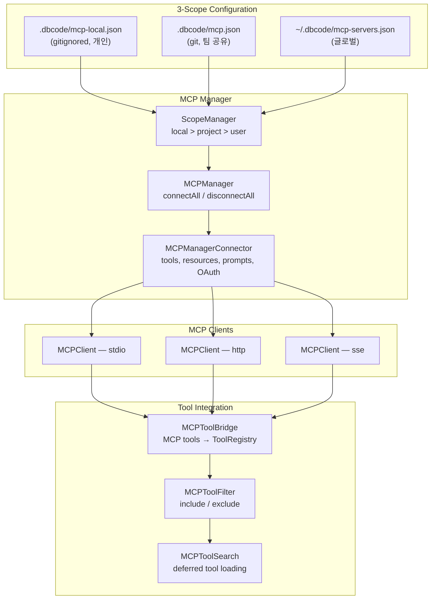

# MCP System

> 참조 시점: MCP 서버 연동, 스코프 설정, 도구 브리지, MCP 프로토콜 작업 시

## 개요

MCP(Model Context Protocol)는 LLM에게 외부 도구와 데이터 소스를 표준 프로토콜(JSON-RPC 2.0)로 연결하는 시스템입니다. dbcode는 MCP 클라이언트로서 외부 MCP 서버에 연결하고, 서버가 제공하는 도구를 내부 도구처럼 사용합니다.

## 아키텍처



## 3-Scope Config System

우선순위: **local > project > user** (같은 이름의 서버는 높은 우선순위가 덮어씀)

| 스코프 | 파일 | 용도 | Git |
|--------|------|------|-----|
| local | `.dbcode/mcp-local.json` | API 키가 필요한 개인 서버 | .gitignore |
| project | `.dbcode/mcp.json` | 팀이 공유하는 서버 | 커밋 |
| user | `~/.dbcode/mcp-servers.json` | 모든 프로젝트에서 쓰는 서버 | N/A |

파일 형식 (모든 스코프 동일):

```json
{
  "servers": {
    "playwright": {
      "transport": "stdio",
      "command": "npx",
      "args": ["@playwright/mcp@latest"]
    },
    "my-api": {
      "transport": "http",
      "url": "https://mcp.example.com/v1"
    }
  }
}
```

## /mcp 슬래시 명령어

```
/mcp list                           — 스코프별 서버 목록 + 연결 상태 + 도구 수
/mcp add <name> <command> [args]    — user 스코프에 추가 (기본)
/mcp add -s project <name> <cmd>    — 특정 스코프에 추가
/mcp remove <name>                  — 모든 스코프에서 제거
/mcp remove -s local <name>         — 특정 스코프에서만 제거
```

`/mcp list` 출력 예시:

```
  user (~/.dbcode/mcp-servers.json)
    * playwright: npx @playwright/mcp@latest
      3 tools | connected

  project (.dbcode/mcp.json)
    - postgres: pg-mcp --port 5432
      not connected
```

## Transport Types

| Transport | 용도 | 연결 방식 |
|-----------|------|----------|
| stdio | 로컬 CLI 도구 (가장 일반적) | 자식 프로세스 stdin/stdout |
| http | 원격 API 서버 | HTTP POST 요청/응답 |
| sse | 실시간 스트리밍 서버 | Server-Sent Events |

## MCP Tool Bridge

MCP 서버의 도구가 dbcode에 등록되는 과정:

1. `MCPManager.connectAll()` → 모든 설정된 서버에 병렬 연결
2. `MCPClient.connect()` → JSON-RPC `initialize` → `tools/list` 호출
3. `MCPToolBridge.registerTools()` → MCP 도구를 `ToolDefinition`으로 변환
4. `ToolRegistry`에 `mcp__{server}__{tool}` 이름으로 등록
5. Lazy loading: 도구 스키마는 처음 호출될 때 로드 (MEDIUM/LOW 티어)

## 부트스트랩 흐름

`src/index.ts`에서 MCP 초기화 순서:

```
설정 로드 → 도구 레지스트리 생성 → 명령어 등록 → MCP 서버 연결 → Ink 렌더링
```

- MCPManager는 명령어 등록 이후에 생성됨
- `CommandContext.mcpManager`를 통해 `/mcp` 명령어에서 접근
- App props에 `mcpManager`와 `mcpConnector` 모두 전달됨

## 주요 파일

| 파일 | 역할 |
|------|------|
| `scope-manager.ts` | 3-scope 설정 로딩 + 우선순위 병합 |
| `manager.ts` | 서버 수명주기 관리 (connect/disconnect) |
| `manager-connector.ts` | 6개 서브모듈 초기화 |
| `client.ts` | JSON-RPC 2.0 통신 |
| `tool-bridge.ts` | MCP 도구 → ToolRegistry 변환 |
| `tool-filter.ts` | 도구 include/exclude |
| `tool-search.ts` | deferred tool 검색 |
| `output-limiter.ts` | 도구 출력 토큰 제한 |
| `oauth.ts` | OAuth 인증 |
| `types.ts` | 전체 MCP 타입 정의 |

## 주의사항

- MCP 서버 연결은 부트스트랩에서만 수행 — `/mcp add`로 추가 후 재시작 필요
- 연결 실패 시 stderr에 경고만 출력, 나머지 서버는 정상 동작
- `scope-manager.ts`의 파일 형식(`{ servers: {...} }`)과 레거시 `manager.ts` 형식(`{ mcpServers: {...} }`)이 다름에 주의
- MCP 도구 이름에 `__` (더블 언더스코어) 구분자 사용 — 사용자 도구와 충돌 방지
