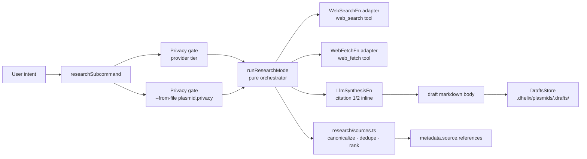
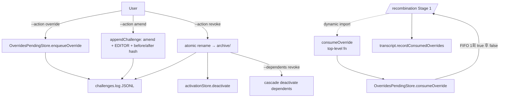

# Plasmid Governance & Research-Assisted Authoring (Phase 5 — GAL-1)

> 참조 시점: `/plasmid --research` / `/plasmid challenge` / `/plasmid archive` / `/plasmid inspect` 작업, foundational tier 정책 관련 변경, `.dhelix/governance/` 하위 파일 다룰 때, override → executor Stage 1 통합 디버깅, I-8 governance 차단 검증.

## 개요

Phase 5 는 두 갈래의 새 기능을 추가했다:

1. **Research-Assisted Authoring** — `/plasmid --research "<intent>"` 가 `web_search` + `web_fetch` 를 통해 외부 출처를 조사하고 `metadata.source.references` 에 출처 보존 (PRD §9).
2. **Foundational Governance** — `/plasmid challenge <id>` 가 foundational tier plasmid 에 대한 ceremony (override / amend / revoke) 를 강제 + `.dhelix/governance/` JSONL audit log + override one-shot consume (PRD §22.4 + P-1.10).

SSOT: PRD §9, §22.4 · 설계: `docs/design/P-1.5-plasmid-quick-first.md`, `docs/design/P-1.10-foundational-challenge.md` · 실행 계획: `docs/prd/plasmid-recombination-execution-plan.md` v1.8.

## Research-Assisted Authoring



| 모듈 | 역할 |
|-----|-----|
| `src/plasmids/research-mode.ts` | `runResearchMode(input, deps, signal)` pure orchestrator. **Privacy gate FIRST** (throws `PLASMID_RESEARCH_PRIVACY_BLOCKED` BEFORE any DI call). 8-source hard ceiling. 4000-char per-source budget. |
| `src/plasmids/research/sources.ts` | `canonicalizeUrl` (lowercase host, strip `utm_*` / `gclid` / `fbclid` / `ref` / `mc_*`, sort query params, normalize trailing slash) · `dedupeByCanonicalUrl` · `rankByIntentOverlap` (Unicode-aware tokenisation, title 2× snippet weight, stable sort) · `topN`. |
| `src/plasmids/research/web-adapter.ts` | Production `WebSearchFn` + `WebFetchFn` wrapping `webSearchTool` / `webFetchTool`. Parses Brave / DDG markdown output. Strips `[Cached response]` / `[Redirected to: ...]` / `[Truncated: ...]` annotations BEFORE sha256. |
| `src/commands/plasmid/research.ts` | `researchSubcommand` — `--dry-run` / `--from-file <path>` / `--template <name>` / `--locale <ko\|en>` / `--force-network`. Routed via `--research` anywhere in argv OR `research` keyword. |

### Privacy enforcement matrix

| 조건 | 동작 |
|-----|-----|
| active provider tier === `"local"` AND no `--force-network` | `PLASMID_RESEARCH_PRIVACY_BLOCKED` |
| `--from-file` plasmid metadata.privacy === `"local-only"` | `PLASMID_RESEARCH_PRIVACY_BLOCKED` (unconditional, `--force-network` 무시) |
| WebSearch returns 0 results | warn + empty body, NO error (caller falls back to Quick mode) |
| All WebFetch fail | `PLASMID_RESEARCH_NETWORK_ERROR` (refs preserved with no `contentSha256`) |

### Production wiring 주의

`defaultDeps.runResearch` 는 의도적으로 `undefined` (Phase 6 polish — LLM seam 추가 대기). 프로덕션에서 `/plasmid --research` 호출 시 사용자 친화적 "not enabled in this build" 메시지 + `/plasmid edit` 워크어라운드 안내. 테스트는 stub 주입으로 동작.

## Foundational `/plasmid challenge` Ceremony



| 모듈 | 역할 |
|-----|-----|
| `src/plasmids/types.ts` | Phase-5 contract: `ChallengeableBy`, `ChallengeAction`, `CooldownDecision`, `ChallengeLogEntry`, `OverridePending`, `ResearchSource` / `ResearchSourceRef`, `RESEARCH_MAX_SOURCES = 5`, `CHALLENGE_LOG_PATH`, `OVERRIDE_PENDING_PATH`, `PLASMIDS_ARCHIVE_DIR`. |
| `src/plasmids/governance/challenges-log.ts` | `appendFile {flag:"a"}` JSONL append-only · `readChallengesLog` (malformed-line skip + warn) · `queryChallenges(plasmidId? / action? / since?)` · `computeChallengeRate(plasmidId, "7d"\|"30d")`. |
| `src/plasmids/governance/cooldown.ts` | `parseCooldown(\d+[hdw])` 엄격 regex · `checkCooldown(plasmid, action, log, now?)` — **override entry 는 cooldown anchor 계산에서 제외** (P-1.10 §4.2 critical invariant). |
| `src/plasmids/governance/overrides-pending.ts` | `OverridesPendingStore` class (atomic tmp+rename, sha256-only rationale persistence — secret-safe) **+ top-level `consumeOverride({workingDirectory, plasmidId, signal?})` wrapper** (executor 의 dynamic-import contract — 이 export 가 없으면 production 에서 silent no-op). |
| `src/commands/plasmid/challenge.ts` | 7-gate validation 순서: 1) loaded → 2) foundational → 3) action ∈ enum → 4) rationale ≥ `min-justification-length` → 5) cooldown (override 제외) → 6) `--confirm "REVOKE <id>"` verbatim → 7) `--dependents` resolves via `requires ∪ extends ∪ conflicts` union. |
| `src/commands/plasmid/archive.ts` | 비-foundational 만 archive 허용 · foundational rejection 시 `/plasmid challenge --action revoke` hint cite · **`activationStore.deactivate([id])` 호출** (active.json sync). |
| `src/commands/plasmid/inspect.ts` | `inspect compression <id>` — 최신 transcript 에서 body / summary token 추정 + preserved-constraint 추출 (LLM call 없음, pure file read). |

### Executor 통합 지점 (Stage 1)

`src/recombination/executor.ts` 의 Stage 1:

```text
loadPlasmids → activation filter (preOverrideActive)
            → consumePendingOverrides (BEFORE enforcePrivacy)
              ↓
              drop overridden ids → activePlasmids
            → enforcePrivacy(caps, activePlasmids)
            → transcript.recordConsumedOverrides(droppedIds)
```

Override 소비는 **`enforcePrivacy` 보다 먼저** 실행 — overridden foundational plasmid 가 자기 자신의 privacy gate 를 trigger 하지 않도록.

### Loader Default-Fill (foundational `challengeable`)

`src/plasmids/loader.ts` 는 Zod parse 후 `metadata.foundational === true && metadata.challengeable === undefined` 일 때 다음 default 로 채움 (Zod transform 대신 loader-level fill — schema input/output type narrow 유지):

```typescript
{ "require-justification": true,
  "min-justification-length": 50,
  "audit-log": true,
  "require-cooldown": "24h",
  "require-team-consensus": false,
  "min-approvers": 1 }
```

### I-8 확장: `.dhelix/governance/`

`RUNTIME_BLOCKED_PATTERNS` 에 `.dhelix/governance/` 추가됨 — `challenges.log` 와 `overrides.pending.json` 모두 runtime agent context 진입 차단. 3개 attack vector test 커버 (`test/unit/plasmids/hermeticity-attack.test.ts` 12-14번).

## 통합 함정 (Phase 5 학습)

1. **Top-level fn vs class export 불일치** — executor 가 `dynamic import` 로 top-level `consumeOverride` 함수를 기대했는데 governance 모듈이 **클래스만** export 한 경우 `typeof !== "function"` guard 가 silent return → override 가 절대 소비되지 않음. **`vi.mock` 으로 import 자체를 우회한 테스트는 이 버그를 감지 못함** — non-mocked E2E 테스트 필수 (`test/integration/recombination/override-consume-e2e.test.ts`).
2. **Cooldown anchor 계산 — `find` ≠ 명세** — P-1.10 §4.2 의 `"override 는 cooldown 을 시작하지 않는다"` 는 단순 `log.find(e => e.plasmidName === plasmid.name)` 로는 구현 불가. log 를 역순 walk 하면서 `action === "override"` 항목 skip 해야 함 (`cooldown.ts` 참조).
3. **archive / revoke activation sync** — 파일 이동 후 `activationStore.deactivate([id])` 호출 누락 시 다음 `/recombination` 에서 "active 인데 loaded 안 됨" 혼란. Cascade (`--dependents revoke`) 시 dependents 도 함께 deactivate.
4. **Production runResearch wiring 의도적 부재** — Team 1 `runResearchMode` 가 `{search, fetch, llm, now, allowNetwork?}` 를 기대하지만 deps.ts 는 `{webSearch, webFetch, allowNetwork, now?}` 로 선언 → production 직접 wire 불가. `defaultDeps.runResearch: undefined` 로 두고 사용자 친화적 fallback 메시지 반환 (Phase 6 polish 로 LLM seam 추가 예정).

## Phase 5 에러 코드

| 코드 | 발생 |
|-----|-----|
| `PLASMID_RESEARCH_PRIVACY_BLOCKED` | provider local-only 또는 plasmid `privacy: local-only` 인데 research 시도 |
| `PLASMID_RESEARCH_NETWORK_ERROR` | 모든 WebFetch 실패 |
| `PLASMID_CHALLENGE_COOLDOWN` | amend / revoke 인데 cooldown 미경과 |
| `PLASMID_CHALLENGE_JUSTIFICATION_TOO_SHORT` | rationale 길이 < `min-justification-length` |
| `PLASMID_CHALLENGE_NOT_FOUNDATIONAL` | non-foundational plasmid 에 challenge 시도 |
| `PLASMID_OVERRIDE_CONSUMED` | (예약) — 향후 idempotent consume 의 explicit signal |

## 관련 참조 문서

- `recombination-pipeline.md` — `/recombination` 8-stage 파이프라인 + `/cure` + executor 의 override consumption hook 위치
- `directory-structure.md` — `.dhelix/governance/` 디렉토리 위치
- `security-sandbox.md` — Trust T0-T3 및 I-8 hermeticity enforcement
