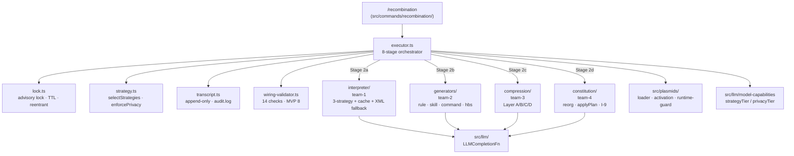

# Recombination Pipeline (Phase 2 — GAL-1)

> 참조 시점: `/recombination` 실행 흐름, `src/recombination/` 모듈 수정, plasmid→artifact 변환 로직, I-1/3/5/7/8/9/10 불변식이 관여하는 작업.

## 개요

`/recombination`은 활성화된 plasmid들을 읽어 `.dhelix/` 하위 artifact (rules/skills/commands) + prompt-section 파일 + DHELIX.md marker 블록으로 변환하는 8-stage 파이프라인이다. Phase 2는 Stage 0–5를 구현, Stage 6 (runtime validation L1-L4)과 Stage 7 (release) 확장은 Phase 3+.

**SSOT**: `docs/prd/plasmid-recombination-system.md` §6.3. Phase 2 실행 계획은 `docs/prd/plasmid-recombination-execution-plan.md` v1.5.

## 구조



## 8-Stage 흐름 (executor.ts)

| Stage | 이름 | 구현 위치 | Phase |
|-------|------|----------|-------|
| 0 | Preflight | `lock.acquire` + `loadPlasmids` + `getModelCapabilities` + `selectStrategies` + `enforcePrivacy` | 2 ✓ |
| 1 | Input collection | `readFileOrEmpty(DHELIX.md)` + activation filter | 2 ✓ |
| 2a | Interpret | `deps.interpret(plasmid, strategy, …)` (parallel, cap `validationParallelism`) | 2 ✓ |
| 2b | Generate | `deps.generate({ irs, strategies })` → `GeneratedArtifact[]` (in-memory) | 2 ✓ |
| 2c | Compress | `deps.compress({ irs, strategies })` → 5 bucket sections + project profile | 2 ✓ |
| 2d | Reorganize | `deps.reorganize({ irs, existingConstitution })` → `ReorgPlan` | 2 ✓ |
| 3 | Preview + approval | dry-run 분기 / `approvalMode` ("auto" | "interactive" | "auto-on-clean") | 2 ✓ |
| 4 | Persist | atomic write (tmp+rename): 4a artifacts → 4b sections + 40-project-profile → 4c DHELIX.md (applyPlan + I-9 verify) | 2 ✓ |
| 5 | Static wiring validation | `validateWiring(artifacts, plan, …)` (P-1.3, 8 MVP checks) · strict fail → rollback | 2 ✓ |
| 6 | Runtime validation | L1-L4 cascade · auto-rollback (I-10) | **3** (stub) |
| 7 | Release | `persistTranscript` · audit.log · lock release (finally) | 2 ✓ |

## 팀 모듈 경계

| Team | 디렉토리 | 진입점 (contract) | Phase 2 테스트 |
|------|---------|------------------|---------------|
| 1 | `src/recombination/interpreter/` | `interpret: InterpretFn` | 59 |
| 2 | `src/recombination/generators/` | `generate: GenerateFn` | 48 |
| 3 | `src/recombination/compression/` | `compress: CompressFn` | 53 |
| 4 | `src/recombination/constitution/` | `reorganize: ReorganizeFn` + `applyPlan` + `verifyUserAreaInvariance` | 70 |
| 5 (top-level) | `src/recombination/*.ts` + `src/commands/recombination/` | `executeRecombination: ExecuteRecombinationFn` | 80 |

계약(`types.ts`)의 `LLMCompletionFn`을 통해 DI로 연결. 각 team 모듈은 디스크 write 금지 — 모두 in-memory return. 오직 executor Stage 4만 atomic write.

## Marker Grammar (P-1.15 v0.2 LOCKED)

```
<!-- BEGIN plasmid-derived: <marker-id> -->
## <heading>

<body>
<!-- END plasmid-derived: <marker-id> -->
```

- `<marker-id>` 포맷: `<plasmid-id>/<kebab-slug>` (권장) 또는 `<kebab-slug>` (legacy). 길이 ≤ 96자
- 파싱 regex는 **오직** `src/recombination/constitution/marker.ts` 에 존재. 다른 곳에서 marker 텍스트를 직접 생성/파싱 금지
- Team 4의 `applyPlan()` 이 유일한 render 경로. Executor는 이를 호출만 (과거 로컬 helper를 썼으나 포맷 불일치로 제거됨)

## 불변식 (enforcement 지점)

| ID | 내용 | Enforcement |
|----|-----|------------|
| I-1 | Plasmid `.md` 는 recombination이 수정하지 않음 | Loader는 read-only; executor가 `.md` 쓸 경로 없음 |
| I-3 | Two-stage 멱등성 | Interpreter cache (`content-addressed` objects), Team 4 applyPlan update-vs-insert |
| I-5 | Transcript append-only | `transcript.ts` — `appendFile` audit.log만; JSON은 atomic create |
| I-7 | 모든 mutation은 advisory lock | Stage 0 `acquire` → Stage 7 `release` (outer try/finally) |
| I-8 | Runtime agent는 plasmids/recombination 읽지 못함 | `src/plasmids/runtime-guard.ts` (`RUNTIME_BLOCKED_PATTERNS` + tool guardrail + telemetry) |
| I-9 | Constitution reorg는 user 영역 불변 | `validateUpdateTargets` (structural) + `verifyUserAreaInvariance` (SectionTree semantic diff) |
| I-10 | L1/L2 validation 실패 시 auto-rollback | Phase 3 scope; 현재 Stage 5 strict만 rollback |

## `/recombination` CLI

```
/recombination                               # extend with defaults
/recombination --dry-run                     # plan only, no writes
/recombination --mode <extend|dry-run>       # rebuild → phase-4
/recombination --plasmid <id>                # restrict to one
/recombination --model <name>                # override capability detect
/recombination --validate=<smoke|local|exhaustive|none|ci>  # transcript only (phase-3)
/recombination --static-validation=<strict|warn-only|skip>
```

`src/commands/recombination/deps.ts`는 peer 모듈을 dynamic `import()` 로 lazy-load — 테스트는 `makeRecombinationCommand(stubDeps)` 로 DI.

## 파일 레이아웃 (PRD §7.1 / 7.2)

**Input (compile-time only, I-8)**: `.dhelix/plasmids/<id>/{metadata.yaml,body.md}`

**Output (runtime reads)**:
- `.dhelix/agents/`, `.dhelix/skills/`, `.dhelix/commands/`, `.dhelix/rules/`, `.dhelix/hooks/`
- `.dhelix/prompt-sections/generated/{40-project-profile, 60-principles, 65-domain-knowledge, 70-project-constraints, 75-active-capabilities}.md`
- `DHELIX.md` (marker 블록만)

**System-internal (I-8)**: `.dhelix/recombination/{.lock, transcripts/*.json, objects/<hash>.json, audit.log}`

## 검증에서 발견한 통합 함정 (향후 유사 모듈 설계 시 주의)

1. **Marker 포맷 single-sourcing**: 여러 팀이 같은 문자열 grammar를 다루면 반드시 한 모듈(여기선 `constitution/marker.ts`)에서 regex 소유. 다른 팀은 API로만 접근.
2. **경로 상수 re-export**: 파일명/경로는 생성자 모듈(`compression/section-assembler.ts`의 `projectProfileRelativePath()`)에서 헬퍼로 export, 소비자는 문자열 하드코딩 금지.
3. **Transcript 필드 의미**: `reorgMarkerIds`는 "actually written" 이어야 함 (`applyResult.markerIdsWritten`), plan.keptMarkerIds 아님 — `/cure`가 이 필드로 undo.
4. **Integration test가 실 write 경로를 exercise하는지 확인**: dry-run만 커버하면 Stage 4 이후 통합 버그를 놓침. `test/integration/recombination/dry-run.test.ts` 끝에 extend-mode E2E 테스트 같이 둠.

## Phase 3 backlog (이 파이프라인 관련)

- Stage 6 runtime validation L1-L4 + grading cascade + volume governor (P-1.16)
- I-10 auto-rollback (10s grace, per-run opt-out)
- `/cure` command (PRD §6.4)
- extend 재실행 idempotency E2E (실 reorganizer + deterministic planner)
- Stage 4b/4c fs 에러 → `GENERATOR_ERROR` 등 typed wrapping
- `/recombination` 출력에 artifact diff / DHELIX.md diff 렌더링
