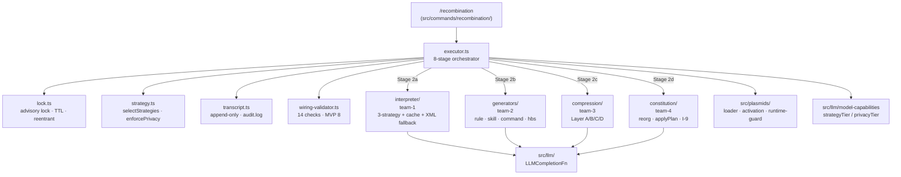

# Recombination Pipeline (Phase 2–3 — GAL-1)

> 참조 시점: `/recombination` / `/cure` 실행 흐름, `src/recombination/` 모듈 수정, plasmid→artifact 변환, Stage 6 runtime validation(L1-L4), I-10 auto-rollback, I-1/3/5/7/8/9/10 불변식이 관여하는 작업.

## 개요

`/recombination`은 활성화된 plasmid들을 읽어 `.dhelix/` 하위 artifact (rules/skills/commands) + prompt-section 파일 + DHELIX.md marker 블록으로 변환하는 8-stage 파이프라인이다. Phase 2가 Stage 0–5를 구현, Phase 3는 Stage 6 (runtime validation L1-L4) + Stage 7 (release: telemetry + `refs/plasmids/<id>`) + I-10 auto-rollback + `/cure` 역전 명령을 구현.

**SSOT**: `docs/prd/plasmid-recombination-system.md` §6.3 + §6.4 + §8 + §10.1. 실행 계획은 `docs/prd/plasmid-recombination-execution-plan.md` v1.6.

## 구조



## 8-Stage 흐름 (executor.ts)

| Stage | 이름 | 구현 위치 | Phase |
|-------|------|----------|-------|
| 0 | Preflight | `lock.acquire` + `loadPlasmids` + `getModelCapabilities` + `selectStrategies` + `enforcePrivacy` | 2 ✓ |
| 1 | Input collection | `readFileOrEmpty(DHELIX.md)` + activation filter | 2 ✓ |
| 2a | Interpret | `deps.interpret(plasmid, strategy, …)` (parallel, cap `validationParallelism`) | 2 ✓ |
| 2b | Generate | `deps.generate({ irs, strategies })` → `GeneratedArtifact[]` (in-memory) | 2 ✓ |
| 2c | Compress | `deps.compress({ irs, strategies })` → 5 bucket sections + project profile | 2 ✓ |
| 2d | Reorganize | `deps.reorganize({ irs, existingConstitution })` → `ReorgPlan` | 2 ✓ |
| 3 | Preview + approval | dry-run 분기 / `approvalMode` ("auto" | "interactive" | "auto-on-clean") | 2 ✓ |
| 4 | Persist | atomic write (tmp+rename): 4a artifacts → 4b sections + 40-project-profile → 4c DHELIX.md (applyPlan + I-9 verify) | 2 ✓ |
| 5 | Static wiring validation | `validateWiring(artifacts, plan, …)` (P-1.3, 8 MVP checks) · strict fail → rollback | 2 ✓ |
| 6 | Runtime validation | `deps.validate(...)` → case gen → CoW workspace → run → grade cascade → `decideRollback` → 10s grace → rollback or keep+audit | **3 ✓** |
| 7 | Release | `persistTranscript` · audit.log · `writePlasmidRef` per active plasmid · lock release (finally) | 2/3 ✓ |

## 팀 모듈 경계

| Team | 디렉토리 | 진입점 (contract) | Phase 2 테스트 |
|------|---------|------------------|---------------|
| 1 | `src/recombination/interpreter/` | `interpret: InterpretFn` | 59 |
| 2 | `src/recombination/generators/` | `generate: GenerateFn` | 48 |
| 3 | `src/recombination/compression/` | `compress: CompressFn` | 53 |
| 4 | `src/recombination/constitution/` | `reorganize: ReorganizeFn` + `applyPlan` + `verifyUserAreaInvariance` | 70 |
| 5 (top-level) | `src/recombination/*.ts` + `src/commands/recombination/` | `executeRecombination: ExecuteRecombinationFn` | 80 |

계약(`types.ts`)의 `LLMCompletionFn`을 통해 DI로 연결. 각 team 모듈은 디스크 write 금지 — 모두 in-memory return. 오직 executor Stage 4만 atomic write.

## Marker Grammar (P-1.15 v0.2 LOCKED)

```
<!-- BEGIN plasmid-derived: <marker-id> -->
## <heading>

<body>
<!-- END plasmid-derived: <marker-id> -->
```

- `<marker-id>` 포맷: `<plasmid-id>/<kebab-slug>` (권장) 또는 `<kebab-slug>` (legacy). 길이 ≤ 96자
- 파싱 regex는 **오직** `src/recombination/constitution/marker.ts` 에 존재. 다른 곳에서 marker 텍스트를 직접 생성/파싱 금지
- Team 4의 `applyPlan()` 이 유일한 render 경로. Executor는 이를 호출만 (과거 로컬 helper를 썼으나 포맷 불일치로 제거됨)

## 불변식 (enforcement 지점)

| ID | 내용 | Enforcement |
|----|-----|------------|
| I-1 | Plasmid `.md` 는 recombination이 수정하지 않음 | Loader는 read-only; executor가 `.md` 쓸 경로 없음 |
| I-3 | Two-stage 멱등성 | Interpreter cache (`content-addressed` objects), Team 4 applyPlan update-vs-insert |
| I-5 | Transcript append-only | `transcript.ts` — `appendFile` audit.log만; JSON은 atomic create |
| I-7 | 모든 mutation은 advisory lock | Stage 0 `acquire` → Stage 7 `release` (outer try/finally) |
| I-8 | Runtime agent는 plasmids/recombination 읽지 못함 | `src/plasmids/runtime-guard.ts` (`RUNTIME_BLOCKED_PATTERNS` + tool guardrail + telemetry) |
| I-9 | Constitution reorg는 user 영역 불변 | `validateUpdateTargets` (structural) + `verifyUserAreaInvariance` (SectionTree semantic diff) |
| I-10 | L1/L2 validation 실패 시 auto-rollback | Phase 3 scope; 현재 Stage 5 strict만 rollback |

## `/recombination` CLI

```
/recombination                               # extend with defaults
/recombination --dry-run                     # plan only, no writes
/recombination --mode <extend|dry-run>       # rebuild → phase-4
/recombination --plasmid <id>                # restrict to one
/recombination --model <name>                # override capability detect
/recombination --validate=<smoke|local|exhaustive|none|ci>  # transcript only (phase-3)
/recombination --static-validation=<strict|warn-only|skip>
```

`src/commands/recombination/deps.ts`는 peer 모듈을 dynamic `import()` 로 lazy-load — 테스트는 `makeRecombinationCommand(stubDeps)` 로 DI.

## 파일 레이아웃 (PRD §7.1 / 7.2)

**Input (compile-time only, I-8)**: `.dhelix/plasmids/<id>/{metadata.yaml,body.md}`

**Output (runtime reads)**:
- `.dhelix/agents/`, `.dhelix/skills/`, `.dhelix/commands/`, `.dhelix/rules/`, `.dhelix/hooks/`
- `.dhelix/prompt-sections/generated/{40-project-profile, 60-principles, 65-domain-knowledge, 70-project-constraints, 75-active-capabilities}.md`
- `DHELIX.md` (marker 블록만)

**System-internal (I-8)**: `.dhelix/recombination/{.lock, transcripts/*.json, objects/<hash>.json, audit.log}`

## 검증에서 발견한 통합 함정 (향후 유사 모듈 설계 시 주의)

1. **Marker 포맷 single-sourcing**: 여러 팀이 같은 문자열 grammar를 다루면 반드시 한 모듈(여기선 `constitution/marker.ts`)에서 regex 소유. 다른 팀은 API로만 접근.
2. **경로 상수 re-export**: 파일명/경로는 생성자 모듈(`compression/section-assembler.ts`의 `projectProfileRelativePath()`)에서 헬퍼로 export, 소비자는 문자열 하드코딩 금지.
3. **Transcript 필드 의미**: `reorgMarkerIds`는 "actually written" 이어야 함 (`applyResult.markerIdsWritten`), plan.keptMarkerIds 아님 — `/cure`가 이 필드로 undo.
4. **Integration test가 실 write 경로를 exercise하는지 확인**: dry-run만 커버하면 Stage 4 이후 통합 버그를 놓침. `test/integration/recombination/dry-run.test.ts` 끝에 extend-mode E2E 테스트 같이 둠.

## Phase 3 모듈 맵 (Stage 6 + /cure)

### Runtime validation (`src/recombination/validation/`)

| 파일 | 역할 | 팀 |
|-----|-----|---|
| `expectation-dsl.ts` | DSL 7-prefix 파서 (output contains/excludes, file:, exit code, tool:, hook:) + free-text | 1 |
| `eval-seeds.ts` | Zod schema (tier required, max 20, duplicate-id check) + YAML/JSON 로더 + legacy auto-convert | 1 |
| `volume-governor.ts` | PRD §8.3 matrix × profile scale × `categorizePlasmid()` 파생(foundational/policy/tactical) | 1 |
| `case-generator.ts` | 3-source priority: seeds → deterministic(L1 trig+desc, L2 behavior conditionals, L3 constraints) → LLM auto (L4 multilingual) | 1 |
| `artifact-env.ts` | CoW workspace (symlink/copy, I-8 FORBIDDEN_DIRS assertion) + cleanup | 2 |
| `runtime-executor.ts` | LLMCompletionFn 직접 소비 + `tool:<name>`/`hook:<event>` marker line 규약 + parallelism + time budget + error-run ceiling | 2 |
| `grader-cascade.ts` | deterministic → semi → llm 라우팅; skipped on unavailable tier; LLM judge 에러 graceful degrade | 2 |
| `rollback-decision.ts` | I-10 matrix: L1/L2 miss → rollback; 파운데이셔널 L4 ≥5% fail → rollback; L3 / non-foundational L4 → warn | 3 |
| `reporter.ts` | PRD §6.3.3 포맷 렌더러 + 10s grace frame + `awaitRollbackDecision` (GracePromptIO 주입) + `autoTimeoutDecisionIO` (headless) | 3 |
| `override-tracker.ts` | `validation-overrides.jsonl` 추가 전용 + `countOverrides(plasmidId, sinceDays)` | 3 |
| `regression-tracker.ts` | `validation-history.jsonl` + `detectRegressions` (≥5% drop 감지) | 3 |
| `index.ts` | `createValidate(deps)` facade composition + `buildValidationReport` + `defaultValidateFacadeDeps` | 5 |

### `/cure` (`src/recombination/cure/` + `src/commands/cure/`)

| 파일 | 역할 |
|-----|-----|
| `cure/planner.ts` | 4개 mode (latest/all/transcript/plasmid) → `CurePlan` (delete-file + remove-marker + archive-plasmid + clear-refs) + warnings (manual-edit, later-transcript, git-uncommitted, unknown-marker) |
| `cure/restorer.ts` | lock 획득 → dry-run short-circuit → hash-gated delete → **reverse ReorgPlan** via `applyPlan` + `verifyConcatenatedUserArea` (cure-local I-9 check) → archive (I-1 safe move) → audit.log 추가 |
| `cure/edit-detector.ts` | SHA-256 vs `WrittenFile.contentHash` + 1s mtime slack |
| `cure/refs.ts` | `.dhelix/recombination/refs/plasmids/<id>` atomic tmp+rename |
| `cure/index.ts` | `createCure(deps)` + `defaultCureFacadeDeps` |
| `commands/cure/{index,extend,deps,render}.ts` | 슬래시 명령 (`--all`/`--transcript`/`--plasmid`/`--dry-run`/`--purge`/`--yes`); MVP는 `--yes` 필수, 아니면 미리보기만 |

### Executor Stage 6/7 연결 (Team 5)

`executor.ts` 주요 변경:
1. **Stage 1**: `preReorgSnapshot = { beforeContent, beforeHash, capturedAt }` 저장 → transcript
2. **Stage 2d**: `transcript.recordReorgOps(reorgPlan.ops)` — /cure가 정확한 역전 plan 구성에 사용
3. **Stage 6**: `opts.validateProfile && deps.validate` 가드 뒤 `deps.validate(...)` 호출. Rollback 시 `rollbackErrorCode` 매핑 (`VALIDATION_FAILED_L1|L2|FOUNDATIONAL_L4`), rollback actions 실행 → 조기 반환; warn은 status만 `"warn"`; crash는 `"warn"` with preserved continuation
4. **Stage 7**: `writePlasmidRef(cwd, id, transcript.id)` 각 active plasmid (non-fatal)

`transcript.ts`: `recordValidation / recordOverride / recordPreReorgSnapshot / recordReorgOps` 추가. `build()`는 optional 필드 설정된 경우에만 포함 → Phase-2 transcript shape 보존.

`commands/recombination/extend.ts`: `--validate=<profile>` → `opts.validateProfile` 실제 전달. 보고서에 `renderReport(validation)` 인클루드.

## Marker Grammar 주의 (Phase 3에서 재학습)

`src/recombination/constitution/marker.ts` 의 regex는 `[a-z0-9-]+(?:/[a-z0-9-]+)?` — **콜론 미허용**. Phase 3 fixture 작성 시 `plasmid-derived:foo:bar` 형식은 silent-fail. `foo/bar` 또는 `<kebab-slug>` 만 사용.

## I-9 다중 상태 엣지 케이스 (Phase 3 학습)

Phase 2의 `verifyUserAreaInvariance`는 user section을 multiset-of-hashes로 비교한다. Forward flow (insert는 user section을 둘로 쪼갬)에서는 정확하지만, **cure의 marker 제거 역방향**에서는 인접 user section이 병합되면서 `missing=2, added=1` 형태의 거짓 위반이 발생한다. 해결: `src/recombination/cure/restorer.ts::verifyConcatenatedUserArea` — user section 연결문자열을 공백 정규화(`\n{2,}` → `\n\n`)한 뒤 비교. Phase 2 API 유지, cure-local 완화만.

## Phase 3 에러 코드

| 코드 | 발생 | 대응 |
|-----|-----|-----|
| `VALIDATION_FAILED_L1` | L1 pass-rate < threshold | auto-rollback |
| `VALIDATION_FAILED_L2` | L2 pass-rate < threshold | auto-rollback |
| `VALIDATION_FAILED_FOUNDATIONAL_L4` | 파운데이셔널 plasmid L4 실패 ≥5% | auto-rollback |
| `VALIDATION_TIMEOUT` | time budget 초과 | partial + warn |
| `VALIDATION_REGRESSION_DETECTED` | 이전 transcript 대비 ≥5% drop | warning (비차단) |
| `CURE_CONFLICT` | file hash ≠ expected, `--yes` 없음 | 중단 + 사용자 안내 |
| `TRANSCRIPT_CORRUPT` | transcript JSON 파싱/shape 실패 | abort |
| `CURE_ABORTED` | I-9 위반 감지 또는 signal abort | abort + partial 보고 |
| `CURE_NO_TRANSCRIPT` | mode 대상 transcript 없음 | abort |

## Phase 4+ 백로그

- rebuild 모드 (PRD §6.3.1)
- 대화형 grace UX (현재는 `GracePromptIO` 인터페이스만, 터미널 구현은 Phase 4)
- `--yes` 프롬프트 → 대화형 y/N
- validation-overrides 누적 후 자동 blocking (Phase 3는 audit-only)
- 실제 sub-agent spawn 통합 (현재는 `LLMCompletionFn` 직접 소비 + marker-line 규약)
- gradeByAstMatch (`code matches:` DSL)
- `/recombination --validate=ci` JUnit XML export
- 터미널 대화형 approval (현재 `/cure`는 `--yes` 게이트)
