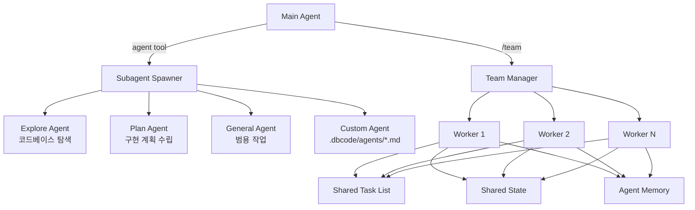

# Subagents & Teams

> 참조 시점: 서브에이전트 생성, 팀 오케스트레이션, 에이전트 메모리 작업 시

## 개요

dbcode는 복잡한 작업을 하위 에이전트(subagent)에게 위임할 수 있습니다. 단일 에이전트부터 다수 에이전트의 팀 조율까지 지원합니다.

## 아키텍처



## Built-in Agent Types

| 타입    | 파일         | 용도                 | 도구 제한        |
| ------- | ------------ | -------------------- | ---------------- |
| explore | `explore.ts` | 코드베이스 빠른 탐색 | 읽기 전용 도구만 |
| plan    | `plan.ts`    | 구현 계획 수립       | 읽기 전용 도구만 |
| general | `general.ts` | 범용 작업 처리       | 전체 도구        |

## 서브에이전트 생성 (agent tool)

LLM이 `agent` 도구를 호출하면 `spawner.ts`가 서브에이전트를 생성합니다:

```typescript
// agent tool 파라미터 (src/tools/definitions/agent.ts)
{
  prompt: "src/ 디렉토리에서 unused exports 찾아줘",
  subagent_type: "explore",        // explore | plan | general
  model: "haiku",                  // 선택: 모델 오버라이드
  isolation: "worktree",           // 선택: git worktree 격리
  run_in_background: true,         // 선택: 백그라운드 실행
}
```

## Custom Agent Definitions

`.dbcode/agents/` 또는 `~/.dbcode/agents/`에 마크다운 파일로 정의:

```markdown
---
name: security-reviewer
description: Security vulnerability scanner
model: sonnet
tools:
  - file_read
  - grep_search
  - glob_search
---

You are a security expert. Analyze the codebase for vulnerabilities...
```

**definition-loader.ts**가 에이전트 정의를 로딩합니다.

## Git Worktree Isolation

`isolation: "worktree"` 옵션을 사용하면:

1. 현재 리포의 임시 worktree 생성 (고유 브랜치)
2. 에이전트는 독립된 파일 시스템에서 작업
3. 변경 없으면 worktree 자동 정리
4. 변경 있으면 worktree 경로와 브랜치명 반환

**orphaned worktree 정리**: `cleanOrphanedWorktrees()`가 부트스트랩 시 비동기로 실행

## Team Orchestration

`/team` 명령어 또는 `team-manager.ts`로 다수 에이전트를 조율:

### 주요 기능

- **태스크 분배**: 작업을 여러 에이전트에게 나눠줌
- **병렬 실행**: `Promise.allSettled`로 동시 실행
- **공유 태스크 리스트** (`task-list.ts`): 에이전트 간 작업 상태 공유
- **공유 상태** (`shared-state.ts`): 에이전트 간 변수 공유
- **팀 이벤트** (`hooks/team-events.ts`): 에이전트 시작/완료/에러 이벤트

### Agent Memory

`agent-memory.ts`로 에이전트별 메모리를 영속화:

- 에이전트가 학습한 패턴/선호도 저장
- 세션 간 유지
- 경로: `~/.dbcode/projects/{hash}/agent-memory/`

## 슬래시 명령어

| 명령      | 설명                           |
| --------- | ------------------------------ |
| `/agents` | 서브에이전트 상태 조회 및 관리 |
| `/team`   | 팀 구성 및 오케스트레이션      |

## 주요 파일

| 파일                     | 역할                                        |
| ------------------------ | ------------------------------------------- |
| `spawner.ts`             | 서브에이전트 생성, 병렬 실행, worktree 관리 |
| `agent-types.ts`         | 빌트인 에이전트 타입 정의                   |
| `definition-types.ts`    | AgentDefinition 인터페이스                  |
| `definition-loader.ts`   | .dbcode/agents/\*.md 로딩                   |
| `team-manager.ts`        | 팀 조율, 태스크 분배                        |
| `task-list.ts`           | 공유 태스크 리스트                          |
| `shared-state.ts`        | 에이전트 간 공유 변수                       |
| `agent-hooks.ts`         | 에이전트 레벨 훅                            |
| `agent-skills-loader.ts` | 에이전트용 스킬 로딩                        |
| `agent-memory.ts`        | 에이전트 메모리 영속화                      |

## 주의사항

- 서브에이전트는 메인 에이전트의 컨텍스트 윈도우를 공유하지 않음 — 독립 실행
- worktree 격리 시 메인 브랜치의 uncommitted changes는 포함되지 않음
- 서브에이전트의 도구 호출도 권한 시스템 적용 (메인과 동일)
- 백그라운드 에이전트 결과는 완료 후 메인 에이전트에게 반환
- `agent-memory.ts`는 에이전트별 독립 — 팀 멤버 간 자동 동기화 없음
