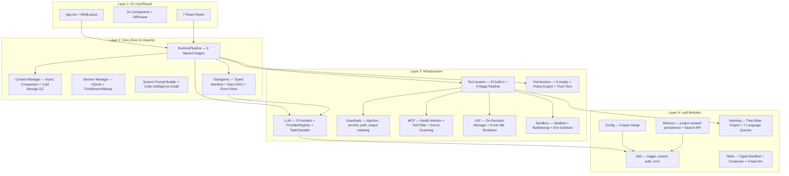

# CLAUDE.md — Dhelix Code

CLI AI coding assistant for local/external LLMs. (Double Helix = DNA of your code)
Node.js 20+ / TypeScript 5.x / ESM only / Ink 5.x (React for CLI) / Vitest / tsup / v0.5.0

## Architecture



**Dependency rule**: top -> bottom only. Circular deps forbidden (`madge --circular src/`).

## Commands

```bash
npm run dev          # tsup --watch
npm run build        # tsup (ESM output)
npm test             # vitest run
npm run test:watch   # vitest
npm run typecheck    # tsc --noEmit
npm run lint         # eslint src/
npm run format       # prettier --write
npm run check        # typecheck + lint + test + build (pre-commit)
npm run ci           # typecheck + lint + coverage + build
```

## Key Rules

- **Named exports only** — no default exports
- **Immutable state** — readonly properties, spread copy for mutations
- **ESM imports** — use `.js` extension (`import { foo } from './bar.js'`)
- **No circular deps** — CLI never imports from core/llm/tools/utils backwards
- **No `any`** — use `unknown` + type guards; Zod for external inputs
- **All async** — no sync fs; use `src/utils/path.ts` for cross-platform paths
- **AbortController** — all cancellable operations use AbortSignal
- **Commit**: `feat(module)`, `fix(module)`, `test(module)`, `refactor(module)` — all checks pass first

## Skills

| Skill                           | When to Use                                     |
| ------------------------------- | ----------------------------------------------- |
| `verify-tool-metadata-pipeline` | After tool definition/executor/display changes  |
| `verify-model-capabilities`     | After LLM model config or default model changes |
| `verify-architecture`           | After new module/import changes/refactoring     |
| `add-slash-command`             | When adding a new slash command                 |
| `add-tool`                      | When adding a new built-in tool                 |
| `debug-test-failure`            | When tests fail and need systematic diagnosis   |
| `sprint-execution`              | When executing improvement plans with agent teams |

## Compact Instructions

When compacting, always preserve:
- Current phase and deliverable progress (X/N complete)
- Recent test failures and their root causes
- Architecture decisions made during this session
- Files created/modified in this session
- Any blockers or workarounds discovered

## Reference Docs

| 문서 | 참조 시점 | 경로 |
|------|----------|------|
| Directory Structure | 파일 위치, 모듈 배치 | `.claude/docs/reference/directory-structure.md` |
| Architecture Deep | Agent loop, 컨텍스트, 서브에이전트 | `.claude/docs/reference/architecture-deep.md` |
| Interfaces & Tools | Tool 추가, LLM 연동, MCP 브리지 | `.claude/docs/reference/interfaces-and-tools.md` |
| Config & Instructions | DHELIX.md, 설정 계층, MCP 스코프 | `.claude/docs/reference/config-system.md` |
| Skills & Commands | 스킬 개발, 42개 슬래시 명령 | `.claude/docs/reference/skills-and-commands.md` |
| Coding Conventions | TS 설정, 이벤트 패턴, 팀 컨벤션 | `.claude/docs/reference/coding-conventions.md` |
| MCP System | MCP 서버 연동, 스코프, 도구 브리지 | `.claude/docs/reference/mcp-system.md` |
| Subagents & Teams | 서브에이전트 생성, 팀 오케스트레이션 | `.claude/docs/reference/subagents-and-teams.md` |
| E2E Test Guide | headless QA, NEXUS.md 패턴 | `.claude/docs/reference/e2e-test-guide.md` |
| Naming & Brand | 네이밍 규칙, 브랜드 컬러, 키보드 단축키 | `.claude/docs/reference/naming-and-brand.md` |
| **Comprehensive Audit** | **전체 기능 점검, 경쟁사 비교** | **`.claude/docs/dhelix-comprehensive-audit-20260329.md`** |
| **LSP Integration Plan** | **Tier 1-3 LSP 개발 계획** | **`.claude/docs/lsp-integration-plan.md`** |
| **Skill System Fixes** | **스킬 fork/보안/모델 수정** | **`.claude/docs/skill-system-critical-fixes.md`** |
