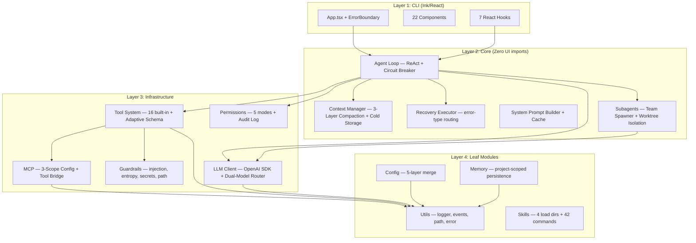

# CLAUDE.md — dhelix

CLI AI coding assistant for local/external LLMs.
Node.js 20+ / TypeScript 5.x / ESM only / Ink 5.x (React for CLI) / Vitest / tsup

## Architecture



**Dependency rule**: top → bottom only. Circular deps forbidden (`madge --circular src/`).

## Commands

```bash
npm run dev          # tsup --watch
npm run build        # tsup (ESM output)
npm test             # vitest run
npm run test:watch   # vitest
npm run typecheck    # tsc --noEmit
npm run lint         # eslint src/
npm run format       # prettier --write
npm run check        # typecheck + lint + test + build (pre-commit)
npm run ci           # typecheck + lint + coverage + build
```

## Key Rules

- **Named exports only** — no default exports
- **Immutable state** — readonly properties, spread copy for mutations
- **ESM imports** — use `.js` extension (`import { foo } from './bar.js'`)
- **No circular deps** — CLI never imports from core/llm/tools/utils backwards
- **No `any`** — use `unknown` + type guards; Zod for external inputs
- **All async** — no sync fs; use `src/utils/path.ts` for cross-platform paths
- **AbortController** — all cancellable operations use AbortSignal
- **Commit**: `feat(module)`, `fix(module)`, `test(module)`, `refactor(module)` — all checks pass first

## Keyboard Shortcuts

| Shortcut  | Action            | Shortcut | Action         |
| --------- | ----------------- | -------- | -------------- |
| Esc       | Cancel agent loop | Ctrl+O   | Toggle verbose |
| Shift+Tab | Cycle permissions | Ctrl+D   | Exit           |
| Alt+T     | Toggle thinking   |          |                |

Customizable: `~/.dhelix/keybindings.json`

## Verify Skills

| Skill                           | When to Use                                     |
| ------------------------------- | ----------------------------------------------- |
| `verify-tool-metadata-pipeline` | After tool definition/executor/display changes  |
| `verify-model-capabilities`     | After LLM model config or default model changes |
| `verify-architecture`           | After new module/import changes/refactoring     |

## Development Skills

| Skill                | When to Use                                   |
| -------------------- | --------------------------------------------- |
| `add-slash-command`  | When adding a new slash command               |
| `add-tool`           | When adding a new built-in tool               |
| `debug-test-failure` | When tests fail and need systematic diagnosis |

## Compact Instructions

When compacting, always preserve:

- Current phase and deliverable progress (X/N complete)
- Recent test failures and their root causes
- Architecture decisions made during this session
- Files created/modified in this session
- Any blockers or workarounds discovered

## E2E 멀티턴 테스트 가이드

> 상세: `.claude/docs/reference/e2e-test-guide.md` — QA 에이전트 원칙, NEXUS.md 패턴, 채점 기준

## 개발가이드 페이지

모듈별 다이어그램 + 코드 설명 + 구현 방향을 시각적으로 정리한 웹 문서입니다.

| 페이지              | 설명                                   | 경로 / 실행                                       |
| ------------------- | -------------------------------------- | ------------------------------------------------- |
| Architecture 개요   | 4-Layer, Agent Loop, MCP 등 전체 구조  | `docs/architecture.html` (브라우저로 열기)        |
| Module Deep Dive    | 9개 모듈 내부 상태머신 + TS 인터페이스 | `docs/architecture-deep.html`                     |
| Deep Dive (Next.js) | 위와 동일 내용의 React/Next.js 버전    | `cd guide && npm run dev` → http://localhost:3333 |

> `guide/` 디렉토리에 별도 `CLAUDE.md`가 있습니다. guide 작업 시 디자인 시스템(Ethereal Glass), Tailwind v4 함정, 컴포넌트 규칙 등을 참조하세요.

## Reference Docs

작업 맥락에 따라 아래 문서를 참조하세요:

| 문서                  | 참조 시점                            | 경로                                             |
| --------------------- | ------------------------------------ | ------------------------------------------------ |
| Directory Structure   | 파일 위치 파악, 새 모듈 배치         | `.claude/docs/reference/directory-structure.md`  |
| Architecture Deep     | Agent loop, 컨텍스트, 서브에이전트   | `.claude/docs/reference/architecture-deep.md`    |
| Interfaces & Tools    | Tool 추가/수정, LLM 연동, MCP 브리지 | `.claude/docs/reference/interfaces-and-tools.md` |
| Config & Instructions | DHELIX.md, 설정 계층, MCP 스코프     | `.claude/docs/reference/config-system.md`        |
| Skills & Commands     | 스킬 개발, 42개 슬래시 명령          | `.claude/docs/reference/skills-and-commands.md`  |
| Coding Conventions    | TS 설정, 이벤트 패턴, 팀 컨벤션      | `.claude/docs/reference/coding-conventions.md`   |
| MCP System            | MCP 서버 연동, 스코프, 도구 브리지   | `.claude/docs/reference/mcp-system.md`           |
| Subagents & Teams     | 서브에이전트 생성, 팀 오케스트레이션 | `.claude/docs/reference/subagents-and-teams.md`  |
| E2E Test Guide        | headless QA, NEXUS.md 패턴, 채점     | `.claude/docs/reference/e2e-test-guide.md`       |
