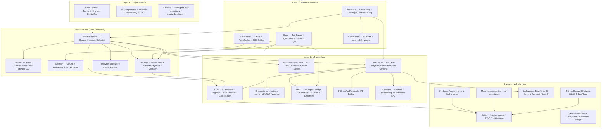

# CLAUDE.md — Dhelix Code

CLI AI coding assistant for local/external LLMs. (Double Helix = DNA of your code)
Node.js 20+ / TypeScript 5.8 / ESM only / Ink 5.1 (React for CLI) / Vitest 3 / tsup 8
`package.json: v0.2.0` (internal v0.6~v0.7 modules merged)

## Architecture



**Dependency rule**: top → bottom only. Circular deps forbidden (`madge --circular src/`).

## Commands

```bash
npm run dev          # tsup --watch
npm run build        # tsup (ESM output, code splitting)
npm test             # vitest run (~326 files / ~6,361 tests)
npm run test:watch   # vitest
npm run test:coverage# vitest --coverage
npm run typecheck    # tsc --noEmit
npm run lint         # eslint src/ --ext .ts,.tsx
npm run format       # prettier --write
npm run check        # typecheck + lint + test + build (pre-commit)
npm run quality      # check + madge --circular (full gate)
npm run ci           # typecheck + lint + coverage + build
```

## Key Rules

- **NEVER** add default exports — named exports only (ESM + tree-shaking)
- **NEVER** import from `cli/` inside `core/` / `llm/` / `tools/` / `utils/` — layer violation
- **NEVER** omit `.js` extension on relative imports — ESM requires it (`from './bar.js'`)
- **NEVER** mutate state — return spread copies; entities are `readonly`
- **NEVER** use `any` — use `unknown` + type guards; Zod for all external inputs
- **NEVER** block with sync fs — all I/O async; use `src/utils/path.ts` for cross-platform paths
- **NEVER** omit `AbortSignal` on cancellable operations — propagate to all network/tool calls
- **NEVER** introduce circular deps — verify with `npm run quality` before commit
- **Commit**: `feat(module)`, `fix(module)`, `test(module)`, `refactor(module)` — `npm run check` passes first

## Skills

| Skill                           | When to Use                                        |
| ------------------------------- | -------------------------------------------------- |
| `verify-tool-metadata-pipeline` | After tool definition / executor / display changes |
| `verify-model-capabilities`     | After LLM model config or default model changes    |
| `verify-architecture`           | After new module / import / refactor               |
| `verify-implementation`         | General implementation correctness gate            |
| `add-slash-command`             | When adding a new slash command                    |
| `add-tool`                      | When adding a new built-in tool                    |
| `debug-test-failure`            | When tests fail and need systematic diagnosis      |
| `sprint-execution`              | Executing improvement plans with agent teams       |
| `manage-skills`                 | Create / modify / organize skills                  |
| `generate-class-docs`           | Generate class/module docs into `guide/`           |
| `dhelix-e2e-test`               | E2E validation (project + conversation quality)    |
| `create-pptx`                   | Generate DB Inc. branded PPTX presentations        |
| `create-skill`                  | 새 스킬 생성 인터뷰 + 검증 + 스캐폴딩 (Claude Code v2.0 호환)                   |

## Compact Instructions

When compacting, always preserve:

- Current phase and deliverable progress (X/N complete)
- Recent test failures and their root causes
- Architecture decisions made during this session
- Files created/modified in this session
- Any blockers or workarounds discovered

## Reference Docs

| 문서                  | 참조 시점                                            | 경로                                             |
| --------------------- | ---------------------------------------------------- | ------------------------------------------------ |
| Directory Structure   | 파일 위치, 모듈 배치, 신규 디렉토리                  | `.claude/docs/reference/directory-structure.md`  |
| Architecture Deep     | Agent loop, Context compaction, Subagents, Rendering | `.claude/docs/reference/architecture-deep.md`    |
| Interfaces & Tools    | Tool 추가 (29개), LLM 인터페이스, Tool-Call 전략     | `.claude/docs/reference/interfaces-and-tools.md` |
| Config & Instructions | DHELIX.md, 5-layer 설정, MCP 3-scope                 | `.claude/docs/reference/config-system.md`        |
| Skills & Commands     | 스킬 개발, 43개 슬래시 명령, Input 히스토리          | `.claude/docs/reference/skills-and-commands.md`  |
| Coding Conventions    | TS 설정, Immutability, Event 시스템, 네이밍          | `.claude/docs/reference/coding-conventions.md`   |
| MCP System            | 3-Scope, Tool Bridge, Transport, OAuth PKCE, A2A     | `.claude/docs/reference/mcp-system.md`           |
| Subagents & Teams     | Spawner, Worktree 격리, Team Manager, Agent Memory   | `.claude/docs/reference/subagents-and-teams.md`  |
| E2E Test Guide        | headless QA, NEXUS.md 패턴, 채점 가이드              | `.claude/docs/reference/e2e-test-guide.md`       |
| Naming & Brand        | 네이밍, 브랜드 컬러, 키보드 단축키, 29 도구 카테고리 | `.claude/docs/reference/naming-and-brand.md`     |
| LLM Providers         | 8개 프로바이더, Registry, TaskClassifier, DualModel  | `.claude/docs/reference/llm-providers.md`        |
| Security & Sandbox    | Trust T0-T3, Sandbox 5-layer, Guardrails, SIEM       | `.claude/docs/reference/security-sandbox.md`     |
| Dashboard & Cloud     | REST / SSE, Job Queue, Agent Runner, SSO/SAML        | `.claude/docs/reference/dashboard-cloud.md`      |
| Recent Fixes          | 최근 수정 이력, QA 결과, Local 프로바이더 이슈       | `.claude/docs/reference/recent-fixes.md`         |

---

## Harness Engineering Integration

### 운영 모드

- `HARNESS_MODE`는 `.claude/settings.local.json` 의 `env` 섹션에서 관리한다.
- `auto`: UserPromptSubmit hook이 harness 단계를 강제 주입하고, `git commit` 전 `aggregate-verdict.md` 가 PASS가 아니면 커밋을 차단한다.
- `suggest` (기본): hook이 제안만 하며 차단하지 않는다.
- `off`: Harness 비활성.

### 워크플로 규칙

- `/jira-plan` 완료 후 `/harness-plan` 실행을 제안한다.
- `/jira-execute` 각 Phase 완료 후 `/harness-review` 를 제안한다.
- `/jira-commit` 전 `.claude/runtime/aggregate-verdict.md` 의 verdict 확인을 권장한다.

### 에이전트 디스패치 (프로젝트 > 글로벌)

- `dhelix-*` 로 시작하는 프로젝트 에이전트는 동일 역할의 글로벌 에이전트보다 **우선** 선택한다.
- 대표 디스패치 규칙:
  - 코드베이스 탐색 → `dhelix-explorer`
  - 보안 리뷰 → `dhelix-security-reviewer`
  - 테스트 드래프트 → `dhelix-test-writer`
  - 빌드/타입 에러 → `dhelix-build-resolver`
  - 새 모듈/import/리팩토링 → `dhelix-architecture-reviewer`
  - 새/수정된 built-in tool → `dhelix-tool-reviewer`
  - LLM provider/capabilities/registry 변경 → `dhelix-llm-adapter-reviewer`
  - `src/cli/` (Ink 컴포넌트·훅·레이아웃) 변경 → `dhelix-ink-ui-reviewer`
  - RuntimePipeline/Recovery/Compaction/Session 변경 → `dhelix-agent-loop-reviewer`
  - MCP (3-scope·OAuth·A2A) 변경 → `dhelix-mcp-reviewer`
  - `src/guardrails/` 변경 → `dhelix-guardrails-reviewer`
  - Trust tier·ApprovalDB·SIEM·Sandbox 변경 → `dhelix-permissions-reviewer`
  - Skills·슬래시 커맨드·Command Bridge 변경 → `dhelix-skills-reviewer`

### 아티팩트 경로

- dev-guide: `docs/{ISSUE-KEY}-dev-guide.md`
- Sprint Contract: `.claude/runtime/sprint-contract/{ISSUE-KEY}.md`
- Verdict: `.claude/runtime/aggregate-verdict.md`
- Workflow State: `.claude/runtime/workflow-state.json`
- Checkpoint: `.claude/runtime/checkpoint.md`
- Metrics Scorecard: `.claude/runtime/harness-metrics/scorecard.md` (aggregate.sh 로 갱신)

---

Last Updated: 2026-04-23
