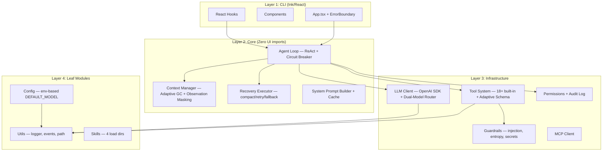

# CLAUDE.md — dbcode

CLI AI coding assistant for local/external LLMs.
Node.js 20+ / TypeScript 5.x / ESM only / Ink 5.x (React for CLI) / Vitest / tsup

## Architecture



**Dependency rule**: top → bottom only. CLI → Core → Infra → Leaf. Circular deps forbidden (`madge --circular src/`).

## Commands

```bash
npm run dev          # tsup --watch
npm run build        # tsup (ESM output)
npm test             # vitest run
npm run test:watch   # vitest
npm run typecheck    # tsc --noEmit
npm run lint         # eslint src/
npm run format       # prettier --write
npm run check        # typecheck + lint + test + build (pre-commit)
npm run ci           # typecheck + lint + coverage + build
```

## Key Rules

- **Named exports only** — no default exports
- **Immutable state** — readonly properties, spread copy for mutations
- **ESM imports** — use `.js` extension (`import { foo } from './bar.js'`)
- **No circular deps** — CLI never imports from core/llm/tools/utils backwards
- **No `any`** — use `unknown` + type guards; Zod for external inputs
- **All async** — no sync fs operations; use `src/utils/path.ts` for cross-platform paths
- **AbortController** — all cancellable operations use AbortSignal
- **Commit**: `feat(module)`, `fix(module)`, `test(module)`, `refactor(module)` — all checks pass first

## Keyboard Shortcuts

| Shortcut  | Action            | Shortcut | Action         |
| --------- | ----------------- | -------- | -------------- |
| Esc       | Cancel agent loop | Ctrl+O   | Toggle verbose |
| Shift+Tab | Cycle permissions | Ctrl+D   | Exit           |
| Alt+T     | Toggle thinking   |          |                |

Customizable: `~/.dbcode/keybindings.json`

## Verify Skills

| Skill                           | When to Use                                     |
| ------------------------------- | ----------------------------------------------- |
| `verify-tool-metadata-pipeline` | After tool definition/executor/display changes  |
| `verify-model-capabilities`     | After LLM model config or default model changes |

## Compact Instructions

When compacting, always preserve:

- Current phase and deliverable progress (X/N complete)
- Recent test failures and their root causes
- Architecture decisions made during this session
- Files created/modified in this session
- Any blockers or workarounds discovered

## Reference Docs

작업 맥락에 따라 아래 문서를 참조하세요:

| 문서                  | 참조 시점                             | 경로                                             |
| --------------------- | ------------------------------------- | ------------------------------------------------ |
| Directory Structure   | 파일 위치 파악, 새 모듈 배치          | `.claude/docs/reference/directory-structure.md`  |
| Architecture Deep     | Agent loop, 렌더링, 컨텍스트 관리     | `.claude/docs/reference/architecture-deep.md`    |
| Interfaces & Tools    | Tool 추가/수정, LLM 연동              | `.claude/docs/reference/interfaces-and-tools.md` |
| Config & Instructions | DBCODE.md, 설정 계층, 로드맵          | `.claude/docs/reference/config-system.md`        |
| Skills & Commands     | 스킬 개발, 슬래시 명령, 입력 히스토리 | `.claude/docs/reference/skills-and-commands.md`  |
| Coding Conventions    | TS 설정 상세, 이벤트 패턴             | `.claude/docs/reference/coding-conventions.md`   |
