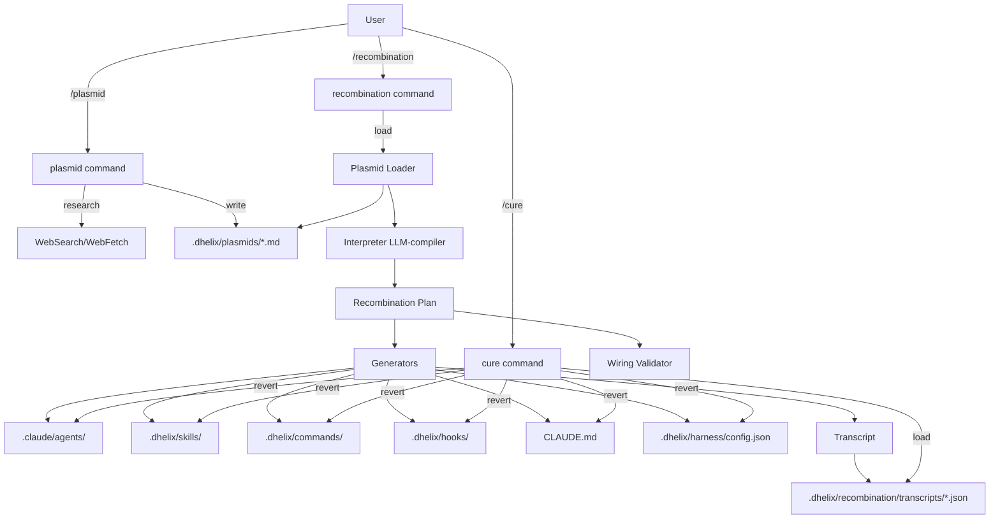

# PRD — Plasmid & Recombination System

**작성일**: 2026-04-22
**작성자**: AI Coding Agent Master (dhelix-code core team)
**상태**: Draft v0.1
**대상 릴리스**: dhelix-code v0.4 (Genetic Agent Layer — GAL-1)
**관련 문서**:
- `CLAUDE.md` — 프로젝트 아키텍처 개요
- `.claude/docs/reference/skills-and-commands.md` — 기존 스킬/커맨드 시스템
- `~/.claude/skills/harness-setup/SKILL.md` — 선행 참조 시스템 (one-shot 프로비저너)
- `src/skills/creator/packaging/package.ts` — `.dskill` 패키지 포맷

---

## 0. TL;DR

**dhelix-code는 사용자의 의도(intent)를 작성 가능한 유전 정보(plasmid)로 받아들이고, 이를 실행 가능한 에이전트 구성요소(agents, skills, commands, hooks, rules, harness)로 재조합(recombination)하여 사용자가 원하는 코딩 에이전트를 합성하고, 언제든지 원상복구(cure)할 수 있도록 한다.**

이는 단순한 설정 템플릿이 아니라, **"사용자 의도 → 에이전트 표현형(phenotype)"** 으로 컴파일하는 선언적 메타레이어다. `harness-setup`이 스택 감지 기반 one-shot 프로비저너라면, Plasmid System은 **사용자 주도의 반복적·가역적 에이전트 합성 시스템**이다.

**3-Command API**:
- `/plasmid` — 요구사항을 plasmid 파일로 작성 (직접 또는 research-assisted)
- `/recombination` — 활성 plasmid들을 컴파일하여 agent 구성요소 생성/확장
- `/cure` — recombination 결과를 롤백하여 초기 상태로 복원

---

## 1. Product Identity

### 1.1 브랜드 위치

**dhelix** = **double helix** = DNA. 이 네이밍은 단순한 수사가 아니라 **제품 철학의 핵심 비유**다.

| 슬로건 후보 | 메시지 |
|------------|--------|
| "Your code's DNA. Your agent's genotype." | 코드의 본질을 에이전트의 유전형으로 매핑한다는 선언 |
| "Compile your intent into your agent." | 의도를 에이전트의 실체로 컴파일 |
| "The coding agent that evolves with you." | 사용자와 함께 진화하는 에이전트 |

Plasmid System은 이 비유를 **수사적 장치가 아닌 구현적 실체로 격상**시킨다.

### 1.2 경쟁 포지셔닝

| 제품 | 커스터마이징 모델 | 한계 | dhelix의 차별점 |
|------|------------------|------|----------------|
| Cursor | `.cursorrules` 단일 파일 | 규칙만, 합성 불가, 가역 불가 | 다중 plasmid 합성 + cure |
| Claude Code | Skills + Hooks + CLAUDE.md + Agents (수동 와이어링) | 수작업, 비가역 | 선언적 의도 → 자동 컴파일 |
| GitHub Copilot | Custom Instructions | 블랙박스, 합성 불가 | 투명한 plasmid, 추적 가능 |
| Custom GPTs | GPT 레벨 설정 | 비공개 저장소, 롤백 없음 | 로컬 `.md`, git 친화, cure |
| Aider `.aider.conf` | 단일 설정 파일 | 의도 표현력 부족 | 의미론적 plasmid 문법 |
| `harness-setup` (dbcode 내) | 스택 감지 → one-shot 템플릿 | 사전 정의된 구성만, 확장 불가 | 사용자 주도, 임의 구성 |

핵심 차별점: **선언적(declarative) + 합성적(composable) + 가역적(reversible) + 연구 보조(research-augmented)**.

### 1.3 타깃 사용자

1. **Power developer** — 자신만의 코딩 워크플로를 에이전트에 각인하고 싶은 개발자
2. **Team lead** — 팀의 표준/정책을 plasmid로 배포하고 싶은 리더
3. **Polyglot engineer** — 스택마다 다른 에이전트 성격을 원하는 엔지니어
4. **Researcher** — 실험적 에이전트 구성을 빠르게 시도하고 되돌리고 싶은 연구자

---

## 2. Problem Statement

### 2.1 현재 문제

현재 에이전트 커스터마이징 경로는 **단절되어 있다**:

```
사용자 의도
   ↓ (수동 번역)
CLAUDE.md 수정    ← rules
   ↓
.claude/agents/*.md 작성  ← sub-agents
   ↓
.claude/skills/*/SKILL.md 작성  ← skills
   ↓
.claude/hooks/*.sh 작성  ← hooks
   ↓
.claude/commands/*.md 작성  ← commands
   ↓
settings.json 편집  ← permissions/harness
   ↓ (수동 와이어링 검증)
"왜 안 되지?" 디버깅
```

각 artifact는 **형식·위치·문법·권한 모델이 다르다**. 사용자는:
- 어느 artifact에 어떤 로직을 넣어야 하는지 판단해야 함
- 각 포맷을 개별 학습해야 함
- 와이어링(파일 간 참조·트리거·권한) 정합성을 직접 검증해야 함
- 실험이 실패해도 **되돌릴 방법이 없음** (파일이 흩어져 있음)

`harness-setup` skill은 이를 일부 해결하지만 **스택별 사전정의 템플릿만** 지원한다. 사용자가 "내 팀의 리뷰 정책은 A + B 조합이야"처럼 **임의 조합**을 원하면 여전히 수작업이다.

### 2.2 근본 원인

에이전트 커스터마이징이 **파일 중심 (file-centric)** 이지 **의도 중심 (intent-centric)** 이 아니다.

파일은 실행 수단(how)이지 의도(what/why)가 아니다. 사용자는 "이런 에이전트를 원해"라고 말하고 싶은데, 현재 시스템은 "어느 파일에 어떤 문법으로 무엇을 쓰세요"를 요구한다.

---

## 3. 관련 선행 연구 / 산업 사례

### 3.1 학술

| 분야 | 레퍼런스 | Plasmid 시스템과의 연결 |
|------|---------|----------------------|
| **LLM-as-Compiler** | DSPy (Khattab et al., 2023), LMQL | 고수준 의도 → 저수준 프롬프트 컴파일 |
| **Declarative Agent Design** | ReAct (Yao et al., 2022), Toolformer | 의도 선언 → 도구 선택 |
| **Agent Memory Architectures** | MemGPT, Voyager (Wang et al., 2023) | 지속 가능한 행동 기억 |
| **Program Synthesis** | Flash Fill, DreamCoder | 예시·의도로부터 프로그램 합성 |
| **Policy-as-Code** | Open Policy Agent (OPA), Rego | 선언적 정책 → 런타임 강제 |
| **Software Product Lines (SPL)** | Feature-Oriented Programming | 기능 조합으로 제품 변이 생성 |
| **Behavioral Contracts** | Design by Contract (Meyer), AI Constitution (Bai et al., 2022) | 선언적 제약 → 행동 규범 |

### 3.2 합성생물학 비유의 공학적 근거

| 생물학 개념 | 엔지니어링 대응 | 설계 시사점 |
|------------|---------------|-----------|
| Plasmid (원형 DNA) | 독립적·이식 가능한 capability 단위 | 파일 1개 단위, frontmatter 메타데이터 |
| Selection marker (Amp^R) | 권한/신뢰 레벨 | `trustLevel` 필드 재사용 |
| Promoter (발현 조절) | 활성화 조건 / 트리거 | `triggers`, `active` 필드 |
| Homology arm | 확장 지점 (extension anchor) | `extends` 필드로 기존 artifact 확장 |
| Origin of replication (ori) | 복제/전파 규칙 | `.dskill` 배포 포맷 (기존) |
| BioBricks (iGEM) | 표준화된 조합 가능 부품 | Plasmid는 조합 가능해야 함 |
| Gibson Assembly | Scar-less 조합 | 여러 plasmid → 단일 artifact 병합 |
| CRISPR-Cas9 | 정밀 편집 | `cure`의 transcript 기반 정밀 롤백 |
| Epistasis (유전자 상호작용) | Plasmid 간 충돌 | 충돌 해소 규칙 필요 (priority, conflicts-with) |
| Horizontal gene transfer | 팀 간 plasmid 공유 | 향후 marketplace 확장 |

이 비유는 **네이밍 레벨의 장식이 아니라 설계 원리의 원천**이다. 합성생물학은 "조합 가능한 부품 + 명확한 조합 규칙 + 정밀한 편집"으로 수십 년간 검증된 모델이다.

### 3.3 산업 내 유사 시도

- **LangGraph** (LangChain) — 그래프 기반 에이전트 합성. 단 **노드 작성은 수동**.
- **CrewAI** — multi-agent 오케스트레이션. 단 **역할 정의는 코드 레벨**.
- **AutoGPT** — 자율 에이전트. 단 **사용자 커스터마이징 레이어 부재**.
- **Replit Agent Rules** — Cursor와 유사. 단일 파일.

**Plasmid System의 위치**: declarative-layer와 runtime-layer 사이의 **compile layer**. 사용자는 의도만 작성하고, 컴파일러(recombination engine)가 적절한 artifact를 생성한다.

---

## 4. Core Concepts

### 4.1 Plasmid (플라스미드)

**정의**: 사용자 의도를 담는 자기완결적 `.md` 파일. 에이전트에게 심고 싶은 **단일한 요구사항 또는 정책**을 표현한다.

**물리적 위치**: `.dhelix/plasmids/<name>.md`

**속성**:
- 사람이 읽고 쓸 수 있는 마크다운
- Frontmatter로 메타데이터 (활성 여부, scope, 우선순위, 충돌관계 등)
- git으로 버전 관리
- 단일 책임 원칙: 하나의 plasmid = 하나의 의도

**플라스미드 != 스킬**:
- **스킬** = 이미 컴파일된 LLM 지시문 (SKILL.md). LLM이 바로 읽음.
- **플라스미드** = 컴파일 전의 의도 선언. **recombination을 거쳐야** skill/agent/hook 등으로 변환됨.

### 4.2 Recombination (재조합)

**정의**: 활성 plasmid들을 입력으로 받아 실행 가능한 에이전트 artifact를 생성/확장하는 컴파일 프로세스.

**입력**: `.dhelix/plasmids/*.md` (active=true인 것들)
**출력**: `.claude/agents/`, `.dhelix/skills/`, `.dhelix/commands/`, `.dhelix/hooks/`, `CLAUDE.md` rules, harness 설정

**모드**:
1. **Extend** (기본, 권장) — 기존 artifact를 유지하면서 plasmid 의도를 추가
2. **Rebuild** — 이전 recombination 산물을 모두 제거하고 현재 plasmid만으로 재생성

**특성**:
- **결정론적**: 같은 plasmid 집합 → 같은 artifact
- **추적 가능**: 각 artifact는 어느 plasmid에서 유래했는지 기록
- **검증됨**: 완료 후 wiring validation 자동 실행

### 4.3 Expression (발현)

**정의**: Recombination으로 생성된 artifact가 실제 에이전트 런타임에서 사용자의 의도대로 동작하는 상태.

이는 **관찰 결과**이지 별도 명령이 아니다. 하지만 중요한 개념: plasmid가 제대로 "발현되고 있는지" 사용자가 확인할 수 있어야 한다 (→ `/plasmid status` 또는 evaluation 기능).

### 4.4 Cure (치유)

**정의**: Recombination으로 생성/확장된 모든 artifact를 제거·복원하여 coding agent를 "pre-recombination" 상태로 되돌리는 연산.

**핵심 요구사항**:
- **완전성**: 모든 생성물 제거, 모든 확장물 원복
- **안전성**: 사용자가 직접 쓴 artifact는 **절대 건드리지 않음**
- **추적 기반**: `.dhelix/recombination/transcripts/`의 기록으로만 동작

**왜 필요한가**: 사용자가 작성한 plasmid가 원하는 방향이 아닐 수 있다. 빠르고 안전한 "되돌리기"는 실험의 담보다.

---

## 5. User Stories

### 5.1 Story: 표준 리뷰 정책 주입

```
As a team lead
I want to declare "모든 커밋 전에 OWASP Top 10 검사"
So that dhelix-code가 자동으로 pre-commit hook + security-reviewer agent + CLAUDE.md 규칙을 생성해준다

Acceptance:
- /plasmid "OWASP 검사를 커밋 전에 강제" 실행 시 research로 OWASP 최신 버전 찾아 초안 생성
- 확인 후 .dhelix/plasmids/owasp-gate.md 저장
- /recombination 실행 시 hook + agent + rule 자동 생성
- 와이어링 검증 통과 (hook이 실제로 실행 가능, agent가 tool 권한 일치)
```

### 5.2 Story: 스택별 에이전트 성격

```
As a polyglot developer
I want to declare "Spring Boot 프로젝트에서는 DDD 패턴 강조, Next.js에서는 RSC 최적화 강조"
So that 프로젝트마다 다른 "유전형"의 에이전트를 갖는다

Acceptance:
- 두 개의 plasmid를 각각 .dhelix/plasmids/spring-ddd.md, nextjs-rsc.md로 작성
- active 플래그로 프로젝트마다 켜고 끔
- /recombination이 활성 plasmid만으로 agent 구성
```

### 5.3 Story: 실험 후 되돌리기

```
As a researcher
I want to try "aggressive refactoring agent" plasmid
And if it doesn't work, instantly revert

Acceptance:
- /plasmid로 실험적 plasmid 작성
- /recombination 실행
- 며칠 사용 후 마음에 들지 않음
- /cure 실행 → 모든 생성물 제거
- plasmid 파일만 남음 (언제든 다시 시도 가능)
```

### 5.4 Story: 연구 보조 작성

```
As a developer new to observability
I want to say "이 프로젝트에 OpenTelemetry 관찰성 규칙 추가해줘"
And have dhelix research OTEL best practices and propose a plasmid

Acceptance:
- /plasmid "OpenTelemetry 관찰성 도입"
- dhelix가 웹/문서에서 OTEL 2025 best practices 조사
- 의심되는 부분 사용자에게 질문 (e.g., "Trace sampling rate은 어떻게?")
- 최종 plasmid 초안 제시 → 사용자 확인 → 저장
```

---

## 6. Feature Specification

### 6.1 Plasmid 파일 포맷

#### 6.1.1 파일 위치 규약

```
<project-root>/
  .dhelix/
    plasmids/
      <kebab-case-name>.md         ← 활성 plasmid
      archive/
        <name>-<timestamp>.md      ← 비활성/히스토리
    recombination/
      transcripts/
        <timestamp>-<name>.json    ← cure를 위한 기록
      last-run.json                ← 최근 recombination 상태
```

**전역 plasmid** (모든 프로젝트 공통): `~/.dhelix/plasmids/`

**우선순위**: project > global (같은 name일 때 project가 덮어씀)

#### 6.1.2 Frontmatter 스키마

```yaml
---
# ─── 필수 ───
name: owasp-gate                     # kebab-case, unique, filename과 일치 권장
description: "커밋 전 OWASP Top 10 보안 검사를 강제"

# ─── 활성화 ───
active: true                         # default: true
scope:                               # 생성 허용 artifact 타입
  - sub-agents
  - skills
  - commands
  - hooks
  - rules
  - harness
triggers:                            # (선택) 이 plasmid를 언급할 자연어 트리거
  - "보안 검사"
  - "OWASP"

# ─── 메타데이터 ───
version: 0.1.0
created: 2026-04-22
author: dhpyun
tags: [security, review, owasp]

# ─── 출처 ───
source:
  type: research                     # manual | research | template | imported
  references:
    - type: url
      value: "https://owasp.org/Top10/2021/"
    - type: paper
      value: "arXiv:2303.14345"

# ─── 합성 규칙 ───
priority: high                       # low | normal | high — 충돌 시 해소 순서
compatible-with: [security-baseline] # 함께 있을 때 안전
conflicts-with: [no-security-gates]  # 함께 있으면 실패
extends:                             # (선택) 확장 대상
  - artifact: CLAUDE.md
    section: "Review Rules"
  - artifact: agent
    name: code-reviewer

# ─── 검증 ───
evals:                               # (선택) 발현 검증 케이스
  - prompt: "이 코드 커밋해줘"
    expect: "보안 검사 hook이 먼저 실행됨"
---
```

#### 6.1.3 본문 구조 (관례)

```markdown
## Intent
이 plasmid가 에이전트에게 심고 싶은 의도를 1-2문단으로 서술.

## Behavior
에이전트가 언제 어떻게 행동해야 하는지.

## Constraints
절대 하지 말아야 할 것.

## Evidence
Research로 수집된 근거 (URL, 발췌, 논문 등).

## Compilation Hints
(선택) 어떤 artifact로 변환되기를 원하는지 힌트:
  - hook: pre-commit
  - agent: security-reviewer
  - rule: CLAUDE.md Review Rules section
```

Recombination 엔진은 이 본문을 LLM으로 해석하여 artifact를 결정한다. `Compilation Hints`가 있으면 그것을 우선 따른다.

### 6.2 `/plasmid` Command

#### 6.2.1 실행 모드

```bash
/plasmid                              # 인터뷰 모드 (기본)
/plasmid "OWASP 검사 추가"              # quick mode — 한 줄 의도로 시작
/plasmid --from-file ./spec.md        # 기존 .md를 변환
/plasmid --template security-gate      # 템플릿에서 시작
/plasmid list                          # 활성/비활성 plasmid 목록
/plasmid show <name>                   # 내용 표시
/plasmid activate <name>               # active: true로 전환
/plasmid deactivate <name>             # active: false로 전환
/plasmid archive <name>                # archive/로 이동
/plasmid validate <name>               # frontmatter + 본문 검증
```

#### 6.2.2 작성 플로우 (research-assisted)

```
[사용자] /plasmid "OpenTelemetry 관찰성 도입"

[dhelix] 범위를 확인하겠습니다.
         1) 이 프로젝트에만 적용? 또는 글로벌?
         2) 생성 허용 artifact 타입은? (기본: all)

[사용자] 프로젝트만. agents + hooks만.

[dhelix] OpenTelemetry 2025 best practices를 조사하고 있습니다...
         (WebSearch + WebFetch 도구 사용)

         [결과 요약]
         - OTEL Semantic Conventions v1.28 발표
         - Trace context propagation, Metrics API, Logs API 안정화
         - Sampling 전략: tail-based 권장 (대용량)

         의심되는 부분을 확인하겠습니다:
         Q1. Sampling rate은 얼마로? (1% / 10% / 100% / adaptive)
         Q2. Metrics는 Prometheus export? OTLP endpoint?
         Q3. Logs는 구조화? (JSON / OTLP)

[사용자] Q1: adaptive. Q2: OTLP. Q3: JSON.

[dhelix] 다음 plasmid 초안을 생성했습니다:

         [.dhelix/plasmids/otel-observability.md 미리보기]
         ...

         저장할까요? (y/edit/discard)

[사용자] y

[dhelix] ✅ 저장됨: .dhelix/plasmids/otel-observability.md
         이어서 /recombination을 실행하면 plasmid가 발현됩니다.
```

#### 6.2.3 직접 작성 모드

사용자가 `.md` 파일을 에디터로 직접 작성. dhelix는 `/plasmid validate`로 검증만 수행.

### 6.3 `/recombination` Command

#### 6.3.1 실행 플로우

```bash
/recombination                        # 전체 활성 plasmid → 컴파일
/recombination --plasmid owasp-gate   # 특정 plasmid만
/recombination --mode rebuild         # 기존 산물 전체 삭제 후 재생성
/recombination --dry-run              # 무엇이 생성/변경되는지만 표시
```

#### 6.3.2 단계

```
Step 1. 활성 Plasmid 수집
  └─ .dhelix/plasmids/*.md 중 active=true인 것
  └─ frontmatter 검증 (name 중복, conflicts-with, scope 유효성)

Step 2. 의도 해석 (LLM-as-compiler)
  └─ 각 plasmid 본문을 LLM으로 분석
  └─ "이 의도는 어떤 artifact로 표현되어야 하는가?" 분류
  └─ Compilation Hints가 있으면 우선 적용
  └─ 출력: {plasmid: [{type, target, content}, ...]} 매핑

Step 3. 충돌 검출
  └─ plasmid 간 conflicts-with 위반 검사
  └─ 동일 artifact 대상 중복 수정 검사
  └─ priority 기준 해소 또는 실행 중단 + 사용자 선택

Step 4. 모드 확인 (사용자 인터뷰)
  └─ "extend(기존 유지, 권장)" vs "rebuild(초기화 후 재생성)"
  └─ 이전 recombination transcript 존재 시에만 rebuild 옵션 제공

Step 5. Artifact 생성/수정
  └─ 각 타입별 전용 generator 호출
     - agent-generator: .claude/agents/<name>.md
     - skill-generator: .dhelix/skills/<name>/SKILL.md (기존 scaffold 재사용)
     - command-generator: .dhelix/commands/<name>.md
     - hook-generator: .dhelix/hooks/<event>/<name>.{sh|ts}
     - rule-generator: CLAUDE.md section 추가/수정
     - harness-generator: .dhelix/harness/config.json 확장

Step 6. Transcript 기록
  └─ .dhelix/recombination/transcripts/<timestamp>-run.json
  └─ 무엇을 생성했고 무엇을 확장했는지 정확히 기록
  └─ 확장(extend)의 경우 pre-state hash도 저장 → cure 시 정확한 복원

Step 7. Wiring Validation (§ 8)
  └─ 모든 참조 유효성, 권한 정합, 순환 의존 검사

Step 8. 요약 리포트
  └─ 생성된 artifact 목록
  └─ 각 artifact → 원천 plasmid 매핑
  └─ 다음 단계 제안 ("이제 이런 명령어를 쓸 수 있습니다")
```

#### 6.3.3 출력 예시

```
🧬 Recombination Report — 2026-04-22T10:30:00Z
─────────────────────────────────────────────
Active plasmids: 3
  - owasp-gate.md          (priority: high)
  - otel-observability.md  (priority: normal)
  - ddd-review.md          (priority: normal)

Mode: extend
Conflicts: 0

Generated (8):
  + .claude/agents/security-reviewer.md          ← owasp-gate
  + .claude/agents/otel-observer.md              ← otel-observability
  + .dhelix/skills/pre-commit-security/SKILL.md  ← owasp-gate
  + .dhelix/hooks/PreToolUse/owasp-gate.ts       ← owasp-gate
  + .dhelix/hooks/PostToolUse/otel-trace.ts      ← otel-observability
  + .dhelix/commands/security-scan.md            ← owasp-gate
  + CLAUDE.md [Review Rules] section updated     ← owasp-gate, ddd-review
  + .dhelix/harness/config.json [gates] extended ← owasp-gate

Wiring validation: ✅ all 8 artifacts reference-valid
  - Agents registered: 2
  - Tool permissions aligned: ✓
  - Hook event bindings: ✓
  - No circular deps: ✓

Next steps:
  /security-scan            — new slash command available
  @security-reviewer ...    — new sub-agent available
  git commit                — owasp-gate will run automatically

Transcript: .dhelix/recombination/transcripts/2026-04-22T10-30-00.json
Cure available: /cure (reverts this run)
```

### 6.4 `/cure` Command

#### 6.4.1 실행 모드

```bash
/cure                                 # 가장 최근 recombination 롤백
/cure --all                           # 모든 recombination 산물 제거 (pristine)
/cure --transcript <id>               # 특정 transcript만 롤백
/cure --plasmid <name>                # 특정 plasmid 산물만 제거
/cure --dry-run                       # 무엇이 삭제/복원되는지만 표시
```

#### 6.4.2 단계

```
Step 1. Transcript 로드
  └─ .dhelix/recombination/transcripts/<id>.json

Step 2. 계획 수립
  └─ Delete: 이 transcript가 생성(created)한 파일들
  └─ Restore: 이 transcript가 확장(extended)한 파일들의 pre-state
  └─ 후속 transcript가 건드린 파일은? → 충돌 경고 → 사용자 확인

Step 3. 안전 검사
  └─ 사용자가 수동으로 수정한 흔적이 있는가? (mtime/hash 비교)
  └─ 있으면 diff 보여주고 confirm
  └─ git이 있으면 uncommitted 변경 경고

Step 4. 실행
  └─ git-aware: cure 전 자동 커밋 옵션 제공 (anchor point)
  └─ 삭제 + 복원 수행

Step 5. Plasmid 처리
  └─ plasmid 파일 자체는 기본 유지 (의도는 남김)
  └─ --purge 플래그 시 archive/로 이동

Step 6. 요약 리포트
  └─ 삭제된 파일, 복원된 파일, 유지된 plasmid
  └─ 전후 상태 비교
```

#### 6.4.3 출력 예시

```
💊 Cure Report — 2026-04-22T14:00:00Z
─────────────────────────────────────────────
Target: transcripts/2026-04-22T10-30-00.json
Mode: selective (not --all)

Will delete (6):
  - .claude/agents/security-reviewer.md
  - .claude/agents/otel-observer.md
  - .dhelix/skills/pre-commit-security/
  - .dhelix/hooks/PreToolUse/owasp-gate.ts
  - .dhelix/hooks/PostToolUse/otel-trace.ts
  - .dhelix/commands/security-scan.md

Will restore (2):
  - CLAUDE.md [Review Rules] → pre-recombination state
    (3 lines removed, 2 lines restored)
  - .dhelix/harness/config.json [gates] → pre-extend state

Plasmids preserved (3):
  - owasp-gate.md, otel-observability.md, ddd-review.md
    (use --purge to archive them)

⚠️  Warnings:
  - security-reviewer.md was manually edited after generation
    → diff shown above. Proceed? (y/N)

Proceed with cure? (y/N)
```

---

## 7. System Architecture

### 7.1 신규 모듈 레이아웃

```
src/
  plasmids/                          ← 신규
    types.ts                         — PlasmidManifest, PlasmidBody 타입
    frontmatter.ts                   — YAML frontmatter parser (기존 skills와 통합)
    loader.ts                        — .dhelix/plasmids/ 스캔 + 로드
    validator.ts                     — 스키마 + 본문 구조 검증
    conflict-detector.ts             — conflicts-with / 중복 해소
    registry.ts                      — in-memory 활성 plasmid 인덱스

  recombination/                     ← 신규
    types.ts                         — RecombinationPlan, Transcript 타입
    interpreter.ts                   — LLM-as-compiler (plasmid → intent graph)
    planner.ts                       — intent graph → artifact generation plan
    generators/
      agent-generator.ts             — .claude/agents/*.md 생성
      skill-generator.ts             — src/skills/creator의 scaffold 재사용
      command-generator.ts           — .dhelix/commands/*.md
      hook-generator.ts              — .dhelix/hooks/<event>/*.ts
      rule-generator.ts              — CLAUDE.md section 편집
      harness-generator.ts           — .dhelix/harness/config.json
    transcript.ts                    — transcript 기록/로드
    executor.ts                      — plan 실행 orchestrator
    wiring-validator.ts              — 생성 후 정합성 검사

  commands/
    plasmid.ts                       ← 신규: /plasmid handler
    recombination.ts                 ← 신규: /recombination handler
    cure.ts                          ← 신규: /cure handler
```

### 7.2 기존 모듈과의 통합

| 기존 모듈 | 통합 방식 |
|----------|---------|
| `src/skills/creator/scaffold.ts` | skill-generator가 재사용 (의도 → SKILL.md 뼈대 생성) |
| `src/skills/manifest.ts` | Plasmid frontmatter 파서 공유 (YAML subset) |
| `src/subagents/agent-types.ts` | agent-generator가 참조 (allowedTools, prompt 기본값) |
| `src/commands/registry.ts` | 새 커맨드 등록 경로 |
| `src/hooks/loader.ts` | hook-generator 출력이 여기로 로드됨 |
| `src/instructions/loader.ts` | rule-generator가 CLAUDE.md 섹션 관리 |
| `src/permissions/*` | agent-generator가 trustLevel → 권한 매핑 |

### 7.3 데이터 흐름



### 7.4 레이어 규칙 (CLAUDE.md 준수)

- `src/plasmids/` → Layer 4 (Leaf Modules)
- `src/recombination/` → Layer 2 (Core) — pipeline과 유사 위치
- **금지**: `src/cli/`, `src/tools/` 내부에서 plasmids/recombination import
- **허용**: commands → recombination → generators → (기존 skills/subagents/hooks 로더)

---

## 8. Wiring Validation

Recombination 완료 직후, 생성된 artifact들이 **실제로 작동 가능한지** 확인.

### 8.1 검사 항목

```
[1] Reference Integrity
    - agent가 참조하는 tool 이름이 존재하는가?
    - command가 참조하는 skill/agent가 존재하는가?
    - hook이 참조하는 이벤트 타입이 유효한가?
    - rule이 참조하는 artifact 이름이 유효한가?

[2] Permission Alignment
    - agent의 allowedTools가 global policy에 위배되지 않는가?
    - hook이 요구하는 권한이 trustLevel에 맞는가?
    - skill의 allowed-tools가 사용 중인 도구 목록과 일치하는가?

[3] Cyclical Dependency
    - agent A가 agent B를 호출, B가 A를 호출? (madge-like)
    - skill A가 command /B를 트리거, /B가 skill A를 호출?

[4] Trigger Conflict
    - 두 skill이 같은 자연어 trigger를 가지는가?
    - 두 hook이 같은 이벤트 + 같은 대상에 바인드 되었는가?
    - 충돌 시 priority 기준 1개만 활성화, 나머지 경고

[5] Syntactic Validity
    - 생성된 SKILL.md의 frontmatter가 skills/manifest.ts 검증 통과
    - 생성된 agent.md가 agent-types.ts 스키마 통과
    - 생성된 hook이 실제로 컴파일 가능 (tsc --noEmit)

[6] Runtime Smoke Test (선택)
    - 각 생성물에 대해 "dry execution" 수행
    - 예: skill의 trigger 문구를 mock prompt로 넣어 컴파일된 지시문 생성 확인
    - 예: hook의 entry point가 실제로 로드 가능한지
```

### 8.2 실패 처리

```
Step A. Validation 실패 감지
  └─ 어느 artifact의 어느 규칙 위반인지 정확히 보고

Step B. 자동 복구 시도 (가능한 경우)
  └─ 예: tool 이름 오타 → 가장 가까운 이름 제안
  └─ 예: 누락된 dependency → 자동 추가

Step C. 사용자 선택
  └─ "이대로 유지" (기록만 남김)
  └─ "수정 후 재시도"
  └─ "롤백" (방금 recombination 취소)
```

### 8.3 검증 구현 위치

`src/recombination/wiring-validator.ts` — 각 검사 항목을 독립된 함수로, 타입별 검사기를 pluggable하게.

---

## 9. Research-Assisted Authoring

### 9.1 플로우

```
User intent (자연어)
   ↓
Scope/Artifact 타입 확인 (ask_user tool)
   ↓
Web Search — 관련 표준/best practice (WebSearch tool)
   ↓
Source Fetch — 상위 3-5개 문서 전문 (WebFetch tool)
   ↓
Extract & Synthesize — LLM이 핵심 요구사항 추출
   ↓
Gap 질문 — 불확실한 것만 사용자에게 (ask_user tool)
   ↓
Plasmid 초안 생성
   ↓
사용자 확인 → 저장
```

### 9.2 질문 원칙 (harness-setup에서 차용)

- **Drip-drip 금지**: 모든 질문은 한 번에 묶어서
- **선택지 제공**: 자유서술보다 "A / B / C" 또는 "A [기본값]"
- **근거 명시**: "X를 권장합니다 (이유: ...)"
- **확신이 있으면 질문하지 않음**: 명백한 경우는 그냥 진행

### 9.3 Research 도구 선택

- **WebSearch** (이미 존재) — 최신 표준, 논문, 블로그
- **WebFetch** (이미 존재) — 상위 결과 전문 로드
- **Grep/Glob** — 사용자 프로젝트 내부 관행 탐지 (e.g., 이미 있는 규칙)
- **Read** — 사용자가 제공한 로컬 참고 문서

### 9.4 연구 결과의 plasmid 내 보존

`source.references` 필드에 **실제로 참고한 URL/논문 ID**를 기록. 향후 재검증(re-research)이 가능하도록. "evidence-backed plasmid"를 향한 기반.

---

## 10. Safety & Invariants

### 10.1 불변식

```
[I-1] Plasmid ≠ Generated artifact
      → plasmid는 수정되지 않음 (사용자 소유)
      → generated artifact는 recombination이 소유 (cure가 제거 가능)

[I-2] Cure는 사용자가 쓴 artifact를 건드리지 않음
      → mtime/hash 비교로 수동 수정 감지
      → 의심되면 확인 후에만 진행

[I-3] Recombination은 멱등하다
      → 같은 plasmid 집합 → 같은 artifact (decision은 결정론적)
      → 단, LLM 호출이 포함된 단계는 temperature=0 + seed 고정

[I-4] Wiring validation 실패는 기본적으로 롤백 유도
      → "validation failure → auto rollback" 옵션 제공 (기본 on)

[I-5] Transcript는 append-only
      → 각 recombination은 새 파일
      → 이전 transcript는 수정되지 않음
      → git과 친화적

[I-6] git 없이도 동작하되, git 있으면 강화됨
      → cure 전 auto-commit 제안
      → transcript 커밋으로 히스토리 추적
```

### 10.2 보안 고려사항

- **Plasmid injection**: 외부에서 받은 plasmid의 자동 recombination 금지. 사용자 승인 필수.
- **Trust level 일관성**: plasmid의 `trustLevel`이 생성하는 artifact의 권한 상한선
- **Prompt injection 방어**: plasmid 본문을 interpreter에 넣을 때 guardrails 파이프라인 경유
- **Research 결과 sanitize**: WebFetch 결과를 그대로 plasmid에 넣지 않음 (사용자가 편집할 수 있게 초안 제시)

### 10.3 에러 분류

| 에러 코드 | 상황 | 대응 |
|---------|------|-----|
| `PLASMID_PARSE_ERROR` | frontmatter 파싱 실패 | 메시지 + 정확한 라인 표시 |
| `PLASMID_CONFLICT` | conflicts-with 위반 | 충돌 쌍 표시 + 선택지 |
| `RECOMBINATION_PLAN_ERROR` | interpreter가 의도 매핑 실패 | plasmid 본문 보강 제안 |
| `GENERATOR_ERROR` | artifact 생성 실패 | 원인 + 부분 롤백 |
| `WIRING_VALIDATION_ERROR` | 정합성 검증 실패 | 항목별 리포트 + 자동복구 제안 |
| `TRANSCRIPT_CORRUPT` | cure 대상 transcript 손상 | git history에서 복구 시도 |
| `CURE_CONFLICT` | 수동 수정된 artifact 존재 | diff + 사용자 확인 |

---

## 11. Non-Goals (이번 릴리스 제외)

- **Plasmid marketplace / 공유 레지스트리** — v2 이후 (기존 `.dskill` 인프라 확장)
- **크로스-agent 호환성** — Claude Code, Cursor 등에 plasmid 배포 (v3 이후)
- **Plasmid linting / security scanning** — 외부 plasmid 검증 툴체인 (v2)
- **자동 plasmid 진화** — 사용 로그 기반 자동 plasmid 개선 제안 (v3, 논문 영역)
- **GUI/TUI plasmid editor** — v2, 우선 에디터 + CLI 조합으로
- **Multi-user plasmid collaboration** — cloud 기능과 연계, v3+

---

## 12. Success Metrics

### 12.1 양적 지표

| 지표 | 목표 |
|------|------|
| Time to first agent customization | 기존 (수작업) 30-60분 → **5분 이내** |
| Cure 정확도 (생성물 완전 제거) | **100%** (orphan 0) |
| Recombination wiring pass rate | **≥95%** (첫 시도에서) |
| Plasmid 재사용률 | 사용자당 평균 **≥3개 active plasmid** |
| 사용자 오류율 (validation fail) | **≤10%** |

### 12.2 질적 지표

- 신규 사용자가 첫 plasmid를 만들고 recombination까지 독립적으로 완료
- "실험 후 cure" 경험이 긍정적 (NPS ≥ 8)
- 팀 단위 plasmid 공유 사례 발생

### 12.3 내부 측정 방식

- `src/telemetry/`에 `plasmid.*`, `recombination.*`, `cure.*` 이벤트 추가
- Dashboard에 Plasmid Health panel (활성 plasmid 수, 마지막 recombination, cure 이력)
- OTLP export로 팀 메트릭 가능

---

## 13. Phased Rollout

### Phase 1 — Foundation (4주)
- [ ] Plasmid 타입, frontmatter 스키마, validator
- [ ] `.dhelix/plasmids/` 디렉토리 규약
- [ ] `/plasmid` 기본 커맨드 (list/show/validate/activate/deactivate)
- [ ] Plasmid loader + registry
- [ ] 단위 테스트: frontmatter 파싱, validator, conflict detector

### Phase 2 — Recombination MVP (4주)
- [ ] Interpreter (LLM-as-compiler) — Compilation Hints 기반
- [ ] 3개 generator 우선: skill / command / rule
- [ ] Transcript 기록/로드
- [ ] `/recombination` 기본 (extend 모드만)
- [ ] Wiring validator — reference integrity + trigger conflict

### Phase 3 — Cure (2주)
- [ ] Transcript 기반 rollback
- [ ] 수동 수정 감지 + 충돌 처리
- [ ] `/cure` 커맨드 전체 모드
- [ ] git-aware auto-commit

### Phase 4 — Advanced Generators (3주)
- [ ] agent / hook / harness generator
- [ ] Permission alignment 검증
- [ ] Rebuild 모드
- [ ] Cyclical dependency 검사

### Phase 5 — Research-Assisted Authoring (3주)
- [ ] `/plasmid` 인터뷰 모드 + WebSearch/WebFetch 통합
- [ ] Scope/question aggregation 로직
- [ ] Source tracking + evidence 링크
- [ ] Template 라이브러리 초기 10종

### Phase 6 — Polish & Dogfood (2주)
- [ ] 전체 E2E 테스트 (plasmid → recombination → 사용 → cure)
- [ ] Runtime smoke test 기능
- [ ] Dashboard Plasmid Health panel
- [ ] 문서 및 튜토리얼

**총 소요: 약 18주**. Phase 1-3까지 (10주)가 사용 가능한 MVP.

---

## 14. Open Questions

1. **Interpreter 결정론**: LLM 호출을 포함한 interpreter를 어떻게 진정으로 멱등하게 만들 것인가? (seed/temperature만으로 충분한가?)
2. **Rule generator의 CLAUDE.md 편집 전략**: section 기반 편집이 안전한가? 주석 마커 `<!-- plasmid:<name> -->`로 격리?
3. **Multi-plasmid 합성 시 충돌의 미묘한 케이스**: 같은 artifact를 두 plasmid가 다른 방식으로 수정할 때 — merge? pick winner? 분리 artifact?
4. **Plasmid 버전 진화**: 이미 recombination된 plasmid의 version이 올라가면 delta recombination? 전체 재실행?
5. **Global plasmid와 project plasmid 병합**: 같은 name 시 project가 완전 override인가, merge인가?
6. **Cure의 경계**: plasmid 제거 시 관련 skill이 이미 사용자 수정을 받았다면 — 부분 유지? 전체 제거?
7. **Research의 윤리/저작권**: WebFetch한 내용을 plasmid에 인용할 때 출처 표기 자동화?

---

## 15. Glossary

| 용어 | 정의 |
|------|------|
| **Plasmid** | 사용자 의도를 담은 `.md` 파일 (`.dhelix/plasmids/*.md`) |
| **Recombination** | 활성 plasmid들을 agent artifact로 컴파일하는 프로세스 |
| **Expression** | plasmid의 의도가 런타임에 실제로 관찰되는 상태 |
| **Cure** | recombination 산물을 제거/복원하는 연산 |
| **Transcript** | 하나의 recombination 실행 내역 기록 (cure를 위한 필수 데이터) |
| **Genotype** (은유) | 사용자가 작성한 plasmid 집합 = 에이전트의 "유전 정보" |
| **Phenotype** (은유) | 실제로 생성된 artifact들 = 에이전트의 "발현된 형질" |
| **Compilation Hint** | plasmid 본문 내 generator 힌트 (의도 → artifact 매핑 지시) |
| **Wiring** | artifact 간 참조/트리거/권한 연결의 총체 |
| **Trust Level** | plasmid/artifact의 신뢰 등급 (built-in/project/community/untrusted) |

---

## 16. Appendix A — 예시 Plasmid

### A.1 보안 게이트 (복잡한 예)

```markdown
---
name: owasp-gate
description: "모든 커밋 전 OWASP Top 10 (2021) 보안 검사 강제"
active: true
scope: [sub-agents, skills, commands, hooks, rules]
version: 0.1.0
created: 2026-04-22
author: dhpyun
tags: [security, owasp, pre-commit]

source:
  type: research
  references:
    - type: url
      value: "https://owasp.org/Top10/2021/"
    - type: url
      value: "https://cheatsheetseries.owasp.org/"

priority: high
compatible-with: [security-baseline]
conflicts-with: [no-security-gates]
---

## Intent
이 프로젝트의 모든 commit은 OWASP Top 10 (2021) 카테고리에 대한 사전 검사를 통과해야 한다. 특히 A01:2021 (Broken Access Control), A03:2021 (Injection), A07:2021 (Authentication Failures)을 중점 검사한다.

## Behavior
- 사용자가 `git commit` 을 시도하면 PreToolUse hook이 trigger됨
- security-reviewer sub-agent가 diff를 분석
- 발견된 이슈는 severity별로 분류:
  - CRITICAL/HIGH: 커밋 차단 + 구체적 수정 제안
  - MEDIUM: 경고 표시 + 사용자 확인 후 진행
  - LOW: 리포트만, 진행 허용

## Constraints
- 검사 중 소스 코드 외부 시스템 호출 금지 (오프라인 검증)
- 검사 시간 60초 초과 시 timeout → 사용자 판단

## Evidence
OWASP Top 10 (2021) 기반:
- A01: Broken Access Control — `@PreAuthorize` 누락, 권한 체크 부재
- A02: Cryptographic Failures — 약한 알고리즘, 하드코딩된 비밀
- A03: Injection — unparameterized queries, eval 사용
- A07: Auth Failures — 약한 비밀번호 정책, MFA 누락
- A10: SSRF — 검증되지 않은 outbound URL

## Compilation Hints
- agent: name=security-reviewer, allowedTools=[file_read, grep_search, glob_search]
- hook: event=PreToolUse, match=Bash({cmd: "git commit*"})
- skill: name=owasp-scan, triggers=["보안 검사", "OWASP 확인"]
- command: name=/security-scan
- rule: section="Review Rules" in CLAUDE.md
```

### A.2 간결한 예

```markdown
---
name: no-console-log
description: "프로덕션 코드에 console.log 금지"
active: true
scope: [hooks, rules]
priority: normal
---

## Intent
TypeScript/JavaScript 파일에 `console.log`가 들어가면 안 된다 (테스트 파일 제외).

## Behavior
파일 편집 후 PostToolUse hook이 `console.log` 존재 감지 시 경고 + 자동 제거 제안.

## Compilation Hints
- hook: event=PostToolUse, match=Edit({file: "*.{ts,tsx,js,jsx}"}), exclude="*.test.*"
- rule: "console.log 금지" in CLAUDE.md [Code Quality]
```

---

## 17. Appendix B — 합성 시나리오

### B.1 두 plasmid가 같은 agent를 확장

```
plasmid-A: code-reviewer에 "TypeScript 타입 안정성 검사" 추가
plasmid-B: code-reviewer에 "성능 이슈 지적" 추가

Recombination:
  → 단일 .claude/agents/code-reviewer.md 생성
  → 본문에 두 plasmid 의도 merge
  → 주석으로 출처 표시:
     <!-- from plasmid: typescript-strict -->
     <!-- from plasmid: perf-review -->
```

### B.2 conflicts-with 충돌

```
plasmid-A (active): "자동 커밋 허용"
plasmid-B (active): "커밋 전 수동 확인 필수"

B.frontmatter:
  conflicts-with: [auto-commit-allow]

Recombination:
  → ❌ 충돌 감지
  → 사용자에게 선택:
     1) A 비활성화
     2) B 비활성화
     3) 중단
```

### B.3 Rebuild 모드

```
User: /recombination --mode rebuild

Dhelix:
  1. 최근 transcript 로드
  2. 이전 cure 실행 (모든 산물 제거)
  3. 새로운 recombination 실행
  4. 새 transcript 생성

결과: active plasmid 기준의 완전히 새로운 artifact 세트
```

---

## 18. Identity & 방향성 제언

### 18.1 네이밍

- **제품명**: dhelix-code (변경 없음)
- **시스템명**: **Genetic Agent Layer (GAL)** 또는 **Plasmid System**
- **커맨드 3종**: `/plasmid`, `/recombination`, `/cure` (사용자가 제안한 명명 유지)
- **릴리스 코드네임**: **GAL-1** (Genetic Agent Layer v1)

### 18.2 철학

Plasmid System은 dhelix-code를 **단순한 AI 코딩 도구**에서 **프로그래머블한 AI 에이전트 합성 플랫폼**으로 격상시킨다.

비유가 단지 마케팅이 아니라 **엔지니어링의 가이드**가 될 때 성립한다:
- 부품의 표준화 (BioBricks)
- 조합 규칙 (Gibson Assembly)
- 정밀 편집 (CRISPR)
- 가역성 (Cure)
- 추적 가능성 (Transcript)

### 18.3 제품 슬로건 권장

> **"Compile your intent into your agent."**
>
> dhelix-code — the coding agent with a genotype you write.

### 18.4 경쟁 해자

- **Cursor/Aider**: 단일 rules 파일. Plasmid 없음.
- **Claude Code**: skills + agents + hooks가 파편화. 수동 와이어링.
- **Custom GPTs**: 블랙박스, 비가역.
- **dhelix-code GAL**: 선언적 + 합성적 + 가역적 + research-assisted.

이 조합은 **현재 업계에 없다**. 선점 가능한 포지션.

---

## 19. 다음 액션

1. 이 PRD 리뷰 및 승인
2. Phase 1 개발 가이드(`docs/GAL-1-phase-1-dev-guide.md`) 작성
3. `src/plasmids/` 모듈 스캐폴딩 + 타입 정의
4. 샘플 plasmid 5종 작성 (dogfood용)
5. Interpreter LLM 프롬프트 초안 작성

---

# Part II — Philosophical & Ideational Expansion

> Part I이 **어떻게 만들 것인가(How)** 였다면, Part II는 **왜 이것이 근본적으로 다른가(Why deeply)** 그리고 **얼마나 멀리 갈 수 있는가(How far)** 에 대한 탐구다. 이 섹션은 개발 스펙이 아니라 **제품 철학의 헌장(charter)** 이자 **장기 로드맵의 발원지**다.

---

## 20. Philosophical Foundations

### 20.1 개념적 위치 — "The Gap" 를 인정하는 시스템

프로그래밍의 영원한 문제는 **"내가 원하는 것(intent)"과 "내가 말하는 것(spec)과 "실제로 실행되는 것(behavior)" 사이의 간격**이다. Rice 정리는 이 간격이 근본적으로 닫히지 않음을 증명한다.

기존 AI 에이전트 시스템은 이 간격을 **숨긴다**:
- Cursor의 `.cursorrules`: intent와 behavior를 한 파일에 뒤섞음
- Custom GPTs: intent는 설정에, behavior는 블랙박스에
- Claude Code: intent는 분산, behavior는 런타임에 암시됨

**Plasmid System은 이 간격을 명시적으로 구조화한다:**

```
Intent (plasmid.md)
    │ ← 사용자가 소유. 선언적. 가역적.
    │
    │ Recombination (컴파일)
    ▼
Spec (생성된 artifact)
    │ ← 시스템이 소유. 생성물. cure로 제거 가능.
    │
    │ Runtime (에이전트 실행)
    ▼
Behavior (관찰되는 행동)
    │ ← Evals/telemetry로 측정. drift 감지 가능.
```

**의의**: 3개 레이어가 **명시적으로 분리**되어 있기 때문에, 각각을 **독립적으로 검증·수정·되돌릴 수 있다**. 이는 Karl Popper의 반증가능성(falsifiability) 원칙을 에이전트 엔지니어링에 적용한 것이다 — "이 가설(plasmid)이 틀릴 수 있음을 전제로 설계한다."

### 20.2 사상적 계보

Plasmid System은 단일 아이디어의 발명이 아니라 **여러 사상적 흐름의 합류점**이다.

| 사상 | 원천 | Plasmid System에의 적용 |
|------|------|----------------------|
| **Extended Mind Thesis** | Clark & Chalmers (1998) | 에이전트는 사용자 인지의 외화(externalization). Plasmid = 외재화된 의도 |
| **Individuation by Relation** | Gilbert Simondon | 에이전트의 정체성은 사용자와의 관계(plasmid)를 통해 형성됨 |
| **Umwelt** | Jakob von Uexküll | 각 사용자의 dhelix는 고유한 인지 세계를 가짐. Plasmid가 그 세계의 경계 |
| **World 3** | Karl Popper | Plasmid = 추상적 이념(World 3). Artifact = 물리적 구현(World 1). 명시적 분리 |
| **Falsifiability** | Popper | Cure는 "나는 틀릴 수 있다"의 엔지니어링적 표현 |
| **Rhizome** | Deleuze & Guattari | Plasmid 간 관계는 수평적·비위계적. 중심 없는 합성 |
| **Language-Games** | Wittgenstein | Plasmid의 의미는 사용에서 창발. 각 프로젝트마다 고유한 "게임" |
| **Teshuvah / Aniccā** | 유대교 / 불교 | 가역성·무상성. Cure는 회귀와 비집착의 엔지니어링 |
| **Wu Wei (無為)** | 도가 | 최소 개입. Plasmid는 declaration만 하고 implementation은 자동화 |
| **Constitutional AI** | Anthropic (2022) | 원칙 기반 행동. Plasmid는 사용자-저작 헌법 |
| **Software Product Lines** | Kang, Cohen (1990s) | 변이(variability) 관리. Plasmid = feature module |

### 20.3 정체성 철학 — The Ship of Theseus Problem

**사고실험**: 사용자가 모든 plasmid를 cure하고, 완전히 새로운 plasmid로 recombination을 다시 실행했다. **같은 에이전트인가?**

이는 Ship of Theseus 문제의 에이전트판이다. Plasmid System의 답:

- **행동적 연속성(behavioral continuity)**: 없음 — 완전히 다른 에이전트
- **설치 연속성(installation continuity)**: 같음 — 같은 dhelix-code 바이너리
- **히스토리 연속성(historical continuity)**: 있음 — transcript에 계보가 남음

이 **3층 정체성 모델**은 기존 AI 도구에 없는 개념이다. 사용자는:
- 행동만 바꾸고 싶을 때: recombination
- 완전히 초기화: cure --all + 새 plasmid
- 과거 상태로 회귀: `/plasmid restore <timestamp>` (향후 기능)

### 20.4 Intent의 정치경제학

에이전트 커스터마이징의 **권력 분배**는 제품 철학의 핵심이다.

| 모델 | 권력 위치 | 예시 |
|------|---------|------|
| **Platform-centric** | 플랫폼 제공자 | ChatGPT, Copilot — 사용자는 플랫폼이 허용한 설정만 |
| **Prompt-centric** | 개별 대화 | Claude.ai 채팅 — 매번 설정해야 함 |
| **Rule-centric** | 설정 파일 | Cursor rules — 단일 파일, 합성 불가 |
| **Plasmid-centric** | 사용자의 선언적 문서 | **GAL-1** — 다중 plasmid, 합성·가역 |

**Plasmid-centric은 권력을 사용자에게 이전한다**. 사용자는:
- **저자**가 된다 (plasmid 작성)
- **편집자**가 된다 (recombination 호출)
- **판관**이 된다 (cure 결정)

이는 "AI가 당신을 도와준다"에서 "**당신이 AI를 만든다**"로의 전환이다.

### 20.5 Reversibility as a Moral Statement

소프트웨어 역사의 대부분은 **비가역성을 향해** 움직였다:
- 배포 → 즉시 프로덕션
- 커밋 → 영구 히스토리
- 로그 → 지울 수 없음
- AI 학습 → 뒤집기 어려움

**Cure는 이 흐름에 역행한다.** "이 선택은 틀릴 수도 있으니, 되돌림을 내장한다"는 선언이다. 이는:

- **엔지니어링적 겸손** — 단일 실행으로 최적해를 찾을 수 없음을 인정
- **실험 친화성** — 실패 비용을 낮춰 탐색 공간을 넓힘
- **사용자 주권** — "당신의 선택은 언제나 되돌릴 수 있다"

**디자인 원칙**:
> *Systems that admit their own mistakes are stronger than systems that pretend to be right.*

---

## 21. 확장된 생물학 메타포 — 조직·생태·진화

Part I §3.2의 세포 레벨 비유를 **조직·생태 레벨까지** 확장한다. 이는 은유의 과잉이 아니라 **복잡 시스템 설계의 가이드라인**이다.

### 21.1 세포 → 조직 → 개체 → 생태계

```
                        ecosystem (개발 조직 전체)
                         ↑
                      population (사용자별 agent 세대)
                         ↑
                    organism (한 사용자의 dhelix 인스턴스)
                         ↑
                  organ system (recombination 결과 artifact 묶음)
                         ↑
                      organ (agent, skill, hook, rule)
                         ↑
                     tissue (같은 plasmid에서 파생된 artifact 군)
                         ↑
                       cell (artifact 인스턴스)
                         ↑
                  chromosome (active plasmid 집합 = genotype)
                         ↑
                  plasmid (개별 의도 선언)
```

### 21.2 진화·생태 개념의 대응

| 생물학 | Plasmid System | 구현 시사점 |
|--------|---------------|-----------|
| **Mutation** | plasmid 편집 | 버전 관리, diff 추적 |
| **Natural selection** | 사용 빈도 기반 plasmid 생존 | Telemetry → 미사용 plasmid 경고 |
| **Genetic drift** | 여러 사용자의 동일 plasmid가 점차 달라짐 | Fork/merge 메커니즘 필요 |
| **Speciation** | 프로젝트마다 agent 성격 분화 | project-scoped vs global plasmid |
| **Symbiosis** | 함께 있을 때 시너지 나는 plasmid | `compatible-with` 활용 |
| **Parasitism** | 다른 plasmid를 손상시키는 plasmid | 보안 문제, 탐지 필요 |
| **Endosymbiosis** | 하나의 plasmid가 독립 subagent로 발현 | Long-running background agents |
| **Horizontal gene transfer** | 팀·커뮤니티 간 plasmid 공유 | `.dhplasmid` 배포 포맷 (v2+) |
| **Epigenetics** | 같은 plasmid, 다른 발현 (조건부) | `expression-conditions` frontmatter |
| **Metagenomics** | 프로젝트 전체의 집합 plasmid 분석 | Team dashboard |
| **Phylogeny** | plasmid의 계보 추적 | `source: { forked-from: ... }` |
| **Immune system** | 악성 plasmid 거부 | Guardrails, signature 검증 |

### 21.3 Epigenetics — Context-Dependent Expression

생물학에서 유전자는 항상 발현되지 않는다. **환경·상태·시기에 따라** 켜지고 꺼진다. 이 개념은 plasmid에 직접 적용 가능하다.

**제안: `expression-conditions` 필드**

```yaml
---
name: strict-type-checking
active: true
expression-conditions:
  git-branch: ["main", "release/*"]      # 메인/릴리스 브랜치에서만 엄격
  file-types: ["*.ts", "*.tsx"]          # TS 파일 편집 시만
  time-of-day: "business-hours"          # 업무 시간에만
  user-state: "not-prototyping"          # 프로토타입 모드 꺼진 상태만
---
```

동일한 plasmid가 **상황에 따라 다르게 발현**한다. 이는:
- 정적 규칙의 한계를 넘어섬 (실세계는 context-dependent)
- 인간 작업 방식과 일치 ("탐색 중엔 느슨, 릴리스엔 엄격")
- Agent가 **인지적으로 적응**하는 느낌

### 21.4 Speciation — 프로젝트 간 Agent 진화

같은 사용자가 여러 프로젝트에서 dhelix를 쓰면, 각 프로젝트의 plasmid 세트가 달라지면서 **종 분화**가 일어난다.

```
     사용자의 global plasmids (공통 조상)
              │
              ├─ Spring Boot 프로젝트 × plasmids = DDD-focused agent
              │
              ├─ Next.js 프로젝트 × plasmids = RSC/performance agent
              │
              └─ CLI 프로젝트 × plasmids = ergonomics-focused agent
```

이들은 **같은 조상에서 분화한 다른 종**. 시간이 지나면 너무 달라서 cross-project plasmid transfer가 어려워질 수도 있다 (생물학적 "생식 격리"의 은유).

**설계 시사점**: `plasmid compatibility score` 개념 — 한 plasmid가 다른 프로젝트에 이식 가능한지 평가.

### 21.5 Ecosystem-Level — 팀/조직의 Agent 생태

여러 사용자가 plasmid를 공유하면 **생태계**가 형성된다.

**개념**:
- **Common plasmids** (팀 표준) — 모두가 active
- **Personal plasmids** — 각자 취향
- **Experimental plasmids** — 검증 중
- **Deprecated plasmids** — archive

**정치적 질문**:
- 팀 plasmid와 개인 plasmid 충돌 시 누가 이기는가?
- 팀장의 plasmid를 강제할 수 있는가?
- 민주적 plasmid 승인 프로세스는?

**권장 아키텍처** (v2+):
```
.dhelix/plasmids/
  team/                    ← git-tracked, PR 리뷰 필요
    required/              ← 비활성화 금지 (헌법 레벨)
    recommended/           ← 기본 활성, 끌 수 있음
  personal/                ← .gitignore, 개인 소유
  experimental/            ← 자유 실험 영역
```

---

## 22. Plasmid 분류학 (Taxonomy)

모든 plasmid가 같은 종류가 아니다. **의도의 유형**에 따라 분류하면 설계가 명확해진다.

### 22.1 5대 유형

| 유형 | 정의 | 생성되는 주 artifact | 예시 |
|------|------|------------------|------|
| **Behavioral** | 에이전트가 어떻게 행동해야 하는가 | agent, skill | "코드 리뷰는 security-first로" |
| **Structural** | 프로젝트의 구조적 제약 | rule, hook | "src/core는 src/cli에 의존 금지" |
| **Ritualistic** | 특정 시점의 의식 | hook, command | "커밋 전 반드시 lint 실행" |
| **Epistemic** | 도메인 지식 주입 | skill, agent | "이 프로젝트는 DDD 패턴을 따름" |
| **Value** | 우선순위·가치 판단 | rule, agent | "성능 < 가독성 < 정확성" |

### 22.2 유형별 컴파일 전략

각 유형은 **다른 컴파일 경로**를 갖는다:

```
Behavioral → agent profile + skill trigger + allowedTools
Structural → hook guard + CLAUDE.md rule + lint config
Ritualistic → hook event binding + command wrapper
Epistemic → skill references + agent system-prompt addition
Value → rule priority injection + agent decision-framework
```

Interpreter는 plasmid 본문을 읽어 유형을 분류하고 적절한 컴파일 경로를 선택한다.

### 22.3 복합 유형

하나의 plasmid가 여러 유형을 포함할 수 있다:
```yaml
types: [behavioral, ritualistic]
```

예: "모든 커밋 전에 보안 검토를 하는 agent"는 ritualistic (커밋 트리거) + behavioral (보안 검토 성격).

### 22.4 Constitutional Plasmids

최상위 계층에 **헌법적(constitutional)** 플라스미드 개념을 둔다.

```yaml
---
name: core-values
tier: constitutional     # constitutional | policy | tactical
immutable-by-recombination: true
---

## Intent
이 플라스미드는 agent의 불변 가치를 정의한다.
- 정확성이 성능보다 우선
- 사용자 동의 없는 파괴적 연산 금지
- 모든 정보는 출처와 함께 제시
```

**Constitutional** 플라스미드의 특성:
- 다른 plasmid가 **위배할 수 없음**
- Recombination에서 최우선 priority
- Conflict 시 constitutional이 자동 승리
- Cure로도 제거 어려움 (경고 + 이중 확인)

이는 Constitutional AI (Anthropic) 개념의 **사용자 레벨 구현**이다.

---

## 23. 시간의 차원 — Archaeology of Intent

### 23.1 Transcript = 의도의 고고학

매 recombination은 transcript를 남긴다. 시간이 쌓이면 **의도의 지층(strata)** 이 생긴다.

```
.dhelix/recombination/transcripts/
  2026-04-22T10-30-00.json    ← 최초: "보안 강화"
  2026-04-25T14-00-00.json    ← "성능 측정 추가"
  2026-05-01T09-00-00.json    ← "DDD 패턴 적용"
  2026-05-10T11-00-00.json    ← cure: "성능 측정 제거"
  2026-05-15T16-00-00.json    ← "OTEL 재도입"
  ...
```

각 transcript는 **시간 속 의도의 화석**이다. 이것을 분석하면:
- 프로젝트가 언제 어떤 방향으로 진화했는가
- 어떤 plasmid가 오래 살아남았는가 (natural selection)
- 어떤 조합이 실패하여 cure되었는가 (경험적 학습)

### 23.2 새 명령어: `/plasmid history`

```
/plasmid history                        # 전체 타임라인
/plasmid history --plasmid <name>       # 특정 plasmid의 생애
/plasmid history --since 2026-03-01     # 시간 범위
```

출력:
```
2026-04-22  [created]   owasp-gate.md
2026-04-25  [activated] perf-review.md
2026-05-01  [edited]    owasp-gate.md  (v0.1.0 → v0.2.0)
2026-05-10  [cured]     perf-review.md → archived
2026-05-15  [composed]  otel-observability.md + existing owasp-gate
```

### 23.3 Time Capsule — 과거 Genotype 복원

```
/plasmid snapshot "pre-otel-experiment"  # 현재 활성 세트 저장
/plasmid restore "pre-otel-experiment"   # 그 시점으로 복귀
```

Git branch처럼 **agent의 genotype을 분기**시킬 수 있다. 실험 후 원치 않으면 snapshot으로 복귀.

### 23.4 Archaeological Query

```
/plasmid archaeology "보안 관련 변화"
```

Transcript + plasmid 히스토리를 LLM으로 분석하여:
> "2026-04부터 5건의 보안 관련 plasmid가 있었습니다. 그중 3개는 여전히 활성, 1개는 cure되었고, 1개는 아직 작성 중입니다. 주요 변화 지점은 2026-05-01의 OWASP v2021 도입이었습니다."

이는 **프로젝트의 인지적 진화를 기록하는 새로운 장르의 도구**다.

---

## 24. Introspection & Transparency

### 24.1 `/plasmid observe` — 실시간 발현 관찰

현재 진행 중인 에이전트 응답에 어떤 plasmid들이 영향을 미치고 있는지 실시간 표시.

```
사용자: "이 코드 리뷰해줘"

[dhelix agent response]
  [observe:on]
  📋 Active plasmids influencing this response:
    ✓ owasp-gate         → security 체크리스트 주입
    ✓ ddd-review         → 도메인 모델 관점 분석
    ✓ no-console-log     → code pattern 검증
  
  리뷰를 시작합니다...
```

**원리**: agent system-prompt에 어떤 plasmid가 기여했는지 metadata 유지. 응답 생성 시 디스플레이.

### 24.2 `/plasmid trace <session-id>` — 사후 추적

특정 세션의 각 응답이 어떤 plasmid의 영향을 받았는지 역추적.

```
Session: 2026-04-22T15:30:00 (12 turns)

Turn 3: "Spring controller 만들어줘"
  Influenced by:
    - spring-best-practices  (agent: spring-architect)
    - ddd-review             (rule: [DDD patterns] in CLAUDE.md)

Turn 7: "테스트 작성해줘"
  Influenced by:
    - test-coverage-gate     (rule: 80% coverage)
    - tdd-style              (agent: tdd-guide invoked)

Turn 11: "git commit"
  Influenced by:
    - owasp-gate             (hook: PreToolUse blocked)
```

이는 **설명 가능한 에이전트(explainable agent)** 의 새로운 형태다 — LLM 추론 레벨이 아니라 **의도 레벨의 설명**.

### 24.3 Plasmid Phenotype Card

각 plasmid에 대해 자동 생성되는 "특성 카드":

```
╔═══════════════════════════════════════════════╗
║  Plasmid: owasp-gate          v0.2.0          ║
║  Active since: 2026-04-22                     ║
║  Expression count: 47 sessions, 312 turns     ║
║                                               ║
║  Generated artifacts (6):                     ║
║    agent/security-reviewer                    ║
║    hook/PreToolUse/owasp-gate                 ║
║    skill/owasp-scan                           ║
║    command//security-scan                     ║
║    rule/[Review Rules] in CLAUDE.md           ║
║    harness/[gates] config                     ║
║                                               ║
║  Behavioral impact (vs pre-activation):       ║
║    +24% security-related comments             ║
║    +3 CRITICAL issues caught                  ║
║    -0 production bugs since activation        ║
║                                               ║
║  Compatible with:                             ║
║    ✓ ddd-review                               ║
║    ✓ test-coverage-gate                       ║
║    ⚠ no-security-gates (conflict)             ║
╚═══════════════════════════════════════════════╝
```

이 카드는 `/plasmid show <name>` 의 풍부한 출력으로 제공된다.

---

## 25. Self-Reflective Agent — Agent-Authored Plasmids

### 25.1 개념

Plasmid는 기본적으로 사용자가 작성한다. 하지만 **에이전트가 자신의 행동을 관찰하여 plasmid 초안을 제안**할 수 있다.

### 25.2 시나리오

```
사용자: "또 console.log 지우라는 얘기 했잖아"

dhelix: 제가 최근 5회 이상 동일한 피드백을 받았습니다. 
        다음 plasmid를 제안합니다:

        [DRAFT: .dhelix/plasmids/no-console-log.md]
        ---
        name: no-console-log
        description: "프로덕션 코드에 console.log 금지"
        source:
          type: agent-proposed
          evidence: 
            - session-2026-04-20 turn 15 (user correction)
            - session-2026-04-21 turn 8 (user correction)
            - ...
        ---
        
        ## Intent
        TypeScript/JavaScript 파일에 console.log를 추가하지 않는다.
        테스트 파일(*.test.*)은 예외.

        이 plasmid를 활성화할까요? (y/edit/discard)
```

### 25.3 메커니즘

- Agent 세션 메모리에서 **반복되는 사용자 수정 패턴** 탐지
- 패턴을 일반화된 규칙으로 추출
- Plasmid draft로 제시
- 사용자 승인 후 활성화

### 25.4 안전장치

- Agent는 **직접 plasmid를 활성화할 수 없음** — 제안만 가능
- 모든 agent-proposed plasmid는 `source.type: agent-proposed`로 명시
- 사용자는 source가 agent인 plasmid를 쉽게 필터링 가능
- 의도 왜곡 방지: draft는 evidence(실제 세션 발췌)를 반드시 포함

### 25.5 철학적 함의

이는 에이전트가 **자신의 학습 경험을 명시적 지식으로 외화**하는 순환이다. 기존 ML의 "gradient update"는 블랙박스지만, plasmid proposal은 **사용자가 검토 가능한 투명한 학습 아티팩트**다.

> *The agent that writes its own constitution — but submits it for your signature.*

---

## 26. Plasmid Chemistry — Composition Laws

Plasmid 조합의 미묘한 규칙을 **화학 비유**로 체계화한다.

### 26.1 기본 조합 연산

| 연산 | 기호 | 의미 | 예 |
|------|-----|------|----|
| **Union** | `∪` | 두 plasmid의 의도를 모두 주입 | A + B = A의 의도 AND B의 의도 |
| **Intersection** | `∩` | 두 plasmid의 공통 제약만 | 드물게 사용 |
| **Difference** | `-` | A에서 B의 의도 제외 | A extends B, 일부 override |
| **Composition** | `∘` | A의 출력이 B의 입력 | Ritualistic 체인 |

### 26.2 촉매·억제제 플라스미드

생물학의 enzyme/inhibitor 개념을 그대로 가져옴:

- **Catalyst (촉매)**: 자기 자신은 artifact를 적게 생성하지만, **다른 plasmid의 발현을 강화**
  - 예: "verbose-logging" — 이것만으로는 큰 변화 없지만, 활성화 시 다른 로깅 관련 plasmid의 상세도 증가

- **Inhibitor (억제제)**: 특정 plasmid의 특정 발현을 **국소적으로 억제**
  - 예: "relax-type-checks-in-tests" — strict-type-checking의 test 파일 발현만 차단

- **Co-factor (조효소)**: 단독으로는 무의미, 특정 플라스미드와 함께일 때만 발현
  - 예: "jwt-refresh-strategy" — auth 관련 plasmid가 있을 때만 의미

### 26.3 조합 법칙

```yaml
---
name: verbose-logging
type: catalyst
amplifies: [otel-observability, debug-mode]
amplification-factor: 2x
---
```

Recombination 엔진은 이러한 화학 관계를 고려하여 artifact를 생성한다.

### 26.4 조합 가능성 예측 — Compatibility Matrix

```
            owasp  ddd   otel  perf  tdd
owasp        ✓     ✓     ✓     ~     ✓
ddd          ✓     ✓     ✓     ✓     ✓
otel         ✓     ✓     ✓     ~     ✓
perf         ~     ✓     ~     ✓     ~
tdd          ✓     ✓     ✓     ~     ✓

✓ compatible  ~ neutral  ✗ conflict
```

사용자가 새 plasmid를 활성화하려 할 때 dhelix가 매트릭스 기반 사전 경고:

```
"⚠️  'perf-aggressive'는 'owasp-gate'와 partial conflict입니다.
    OWASP 검사가 성능을 저하시키므로 일부 발현이 약화될 수 있습니다.
    계속하시겠습니까?"
```

---

## 27. Governance & Social Dimension

### 27.1 Plasmid의 사회적 라이프사이클

```
Individual plasmid
   ↓ (팀 공유)
Team plasmid
   ↓ (검증·표준화)
Organization plasmid  
   ↓ (공개·배포)
Community plasmid (marketplace)
   ↓ (de-facto standard)
Industry convention
```

**각 단계의 governance 요구사항**:

| 단계 | 거버넌스 요소 |
|------|-----------|
| Individual | 없음 (자유) |
| Team | PR 리뷰, 코드오너 |
| Organization | 보안 감사, 정책 승인 |
| Community | 서명, 신뢰 레벨, 리뷰 평점 |

### 27.2 팀 Plasmid 충돌 해결

팀이 공유 plasmid를 강제하려 할 때 개인의 자율성과 어떻게 양립할 것인가?

**3-Tier 모델**:
```
Tier 1: Mandatory (팀 헌법)     — 비활성화 불가
Tier 2: Recommended (권장)      — 기본 활성, 사용자가 끌 수 있음 (이유 기록)
Tier 3: Optional (선택)         — 템플릿 수준, 활성화 자유
```

대략 GitHub의 CODEOWNERS / branch protection과 유사한 구조.

### 27.3 Plasmid Marketplace (v3+)

향후 확장:
- 공개 plasmid 레지스트리 (`registry.dhelix.dev`)
- 서명 검증 (`.dskill` 인프라 확장)
- 리뷰·평점·사용량 통계
- Fork·PR·issue 트래킹

**위험 관리**:
- Plasmid injection 방지 (악성 plasmid가 시스템 접근)
- Trust level 기반 권한 제한
- Supply chain 공격 방어 (서명 검증, reproducible build)

---

## 28. 사고실험 (Thought Experiments)

### 28.1 The Swap Test

두 사용자 A, B가 동일한 dhelix-code를 쓰되 plasmid 세트를 교환한다. **그 agent는 A의 것인가 B의 것인가?**

**분석**:
- 행동: B의 것 (plasmid가 행동을 결정)
- 설치: A의 것 (물리적 인스턴스)
- 히스토리: A의 것 (transcripts)

**시사점**: Plasmid System은 agent identity의 **3축 모델**을 물리적으로 구현한다. 기존 AI 도구에선 이 구분이 없었다.

### 28.2 The Plasmid War

팀원 A가 "strict-type-checks" plasmid를 추가하고, B가 "relax-type-in-tests"를 추가했다. 둘 다 `Tier 2 Recommended`. **무슨 일이 벌어지는가?**

**충돌 해소 프로토콜**:
1. Recombination 시 충돌 감지
2. Priority 필드 확인 (명시된 경우 결정)
3. Priority 같으면 사용자에게 선택 제시
4. 선택이 공유 저장소에 기록 → 미래 충돌 시 참조

**깊은 질문**: 팀의 plasmid는 어떻게 **민주적으로** 결정되는가? 이는 곧 **팀 문화의 code-as-constitution** 문제다.

### 28.3 The Inheritance Paradox

자식 프로젝트가 부모 프로젝트의 plasmid를 모두 상속받지만, 자식이 부모 plasmid를 수정하면 **부모에게도 영향을 미쳐야 하는가?**

**답**: No — plasmid는 **복사되지 공유되지 않는다**. 단, `extends: ../parent/plasmid.md` 같은 참조 방식 도입 시 공유 가능.

**설계 원칙**: 명시적 참조만 공유, 암시적 공유 금지. 이는 **"conservative composition"** 원칙.

### 28.4 The Amnesia Test

사용자가 `/cure --all`을 실행했다. 모든 artifact 제거됨. Plasmid 파일도 삭제됨. 그럼 **transcript도 지워야 하는가?**

**답**: No — transcript는 **의도의 고고학**이다. Artifact는 지웠지만 "무엇을 시도했는가"의 기록은 남아야 한다. 이는:
- 학습·교훈의 보존
- 향후 "같은 실수 반복 방지"
- Agent 자기성찰 재료 (§25)

`--purge-history` 플래그로만 transcript 삭제 가능 (GDPR 관점에서도 중요).

### 28.5 The Dormant Plasmid

어떤 plasmid가 1년 동안 활성 상태였지만, 실제로 agent 행동에 영향을 준 적이 없다면? (Expression count 0)

**시스템 대응**:
- `/plasmid audit dormant` 실행 시 감지
- "사용되지 않은 plasmid입니다. 비활성화 또는 archive 권장"
- 이는 **natural selection**의 인위적 구현 — 살아남지 못한 gene은 정리

---

## 29. Long-Horizon Vision — GAL 진화 단계

### 29.1 세대별 로드맵

| 세대 | 특징 | 주요 기능 |
|------|------|---------|
| **GAL-1** (v0.4) | Foundation | Plasmid + Recombination + Cure |
| **GAL-2** (v0.5) | Introspection | Observe, Trace, Phenotype Card |
| **GAL-3** (v0.6) | Epigenetics | Expression conditions, Chemistry laws |
| **GAL-4** (v0.7) | Self-reflection | Agent-authored plasmids |
| **GAL-5** (v0.8) | Social | Team plasmids, governance tiers |
| **GAL-6** (v0.9) | Ecosystem | Public marketplace, fork/PR |
| **GAL-7** (v1.0) | Evolutionary | Natural selection, auto-optimization |

### 29.2 각 세대의 핵심 가치

- **GAL-1**: "declare what you want"
- **GAL-2**: "see what your agent does"
- **GAL-3**: "context-aware expression"
- **GAL-4**: "your agent learns from you"
- **GAL-5**: "shared agent culture"
- **GAL-6**: "global pool of intent"
- **GAL-7**: "agents that evolve"

### 29.3 위험 시나리오 및 완화

| 위험 | 시나리오 | 완화 |
|------|--------|-----|
| **Plasmid bloat** | 수백 개 plasmid → cognitive overload | Dormant detection, 계보 시각화 |
| **Conflicting constitutions** | 팀 헌법 vs 개인 헌법 충돌 | 3-tier governance |
| **Supply chain attack** | 악성 community plasmid | 서명·신뢰 레벨·sandbox |
| **Emergent behavior** | 여러 plasmid가 예측 못한 행동 | Phenotype card, drift 감지 |
| **Agent identity drift** | 사용자 모르게 agent 성격 변화 | Trace, observe, 주기적 리포트 |
| **Research pollution** | Web search → 저품질 plasmid | Source quality scoring, evidence review |

---

## 30. 디자인 미학 (Aesthetic Principles)

좋은 시스템은 **철학뿐 아니라 미학**이 있다. Plasmid System의 미학 원칙:

### 30.1 Parsimony (간결성)

> *Minimum required artifacts for maximum expressiveness.*

- 3개 핵심 커맨드 (`/plasmid`, `/recombination`, `/cure`) — 더 이상 추가 금지 (확장은 하위 명령어로)
- Frontmatter 필드 최소화 — 기본값 충실히, 필수 필드 적게
- 복잡도는 조합에서 나오지 구조에서 나오지 않는다

### 30.2 Isomorphism (동형성)

> *The system mirrors the domain.*

Plasmid System의 구조가 **에이전트 커스터마이징의 본질적 구조와 동형**이다. 추상화가 억지스럽지 않고 자연스럽다. Biology metaphor가 이를 뒷받침.

### 30.3 Transparency (투명성)

> *No black boxes at user-facing layer.*

- Plasmid = 읽을 수 있는 .md
- Transcript = 읽을 수 있는 .json
- Artifact 출처 = 주석으로 명시
- Agent 행동 근거 = observe/trace로 추적 가능

### 30.4 Reversibility (가역성)

> *Every action has an undo.*

- Recombination ↔ Cure
- Activation ↔ Deactivation
- Snapshot ↔ Restore
- 실수가 비용이 되지 않음

### 30.5 Composability (합성성)

> *Small pieces, loosely joined.*

Tim Berners-Lee의 웹 설계 원칙을 plasmid에 적용. 각 plasmid는 작고 독립적이며, 조합으로 복잡성 표현.

### 30.6 Evidence-based (증거 기반)

> *Every claim cites its source.*

Source references는 선택이 아니라 **규범**. 근거 없는 plasmid는 agent의 "미신"이 된다.

---

## 31. 실존적 질문 — dhelix-code의 정체

### 31.1 "dhelix-code는 무엇인가?" — 4층 정의

1. **표면**: CLI AI 코딩 도우미
2. **구조**: Ink/React 기반 TypeScript 에이전트
3. **본질**: 사용자 의도를 agent artifact로 컴파일하는 시스템
4. **정수**: *사용자와 AI가 공저하는 코딩 파트너의 DNA*

Plasmid System은 이 4층을 **관통하는 축**이다. 없으면 dhelix-code는 단지 "또 하나의 AI CLI"지만, 있으면 **새로운 종(species)** 이다.

### 31.2 유일성 주장 (Uniqueness Claim)

> *dhelix-code is the first coding agent whose behavior is **authored**, not configured.*

"Author" vs "Configure"의 차이:
- Configure: 주어진 옵션 선택 (피동)
- Author: 의도 표현 → 시스템이 컴파일 (능동)

이 구분이 제품 마케팅의 핵심 메시지가 되어야 한다.

### 31.3 Target Market 재정의

초기 Part I에선 "Power developer, Team lead, Polyglot, Researcher"였다. 철학적 깊이를 반영하여 확장:

- **The Author** — 코딩 방식을 설계하고 싶은 시니어
- **The Architect** — 팀의 표준을 시스템으로 각인하려는 리더
- **The Explorer** — 빠른 실험·회귀가 필요한 연구자
- **The Craftsperson** — 자신만의 workflow를 장인정신으로 다듬는 개발자
- **The Philosopher** — AI와 협업의 본질을 탐구하는 개발자 (새 페르소나)

마지막 페르소나가 중요 — Plasmid System은 **AI 협업 철학에 관심 있는 사용자**에게 강력히 어필한다.

---

## 32. 맺음말 — The Double Helix as Constitution

dhelix = 이중나선. 두 가닥이 꼬여 DNA를 이룬다.

Plasmid System에서 이중나선은 **사용자의 의도(plasmid)와 시스템의 실행(artifact)** 이 꼬여 하나의 agent를 형성하는 구조 그 자체다. 한 가닥만으로는 복제 불가능하듯, plasmid만으로도 artifact만으로도 에이전트는 성립하지 않는다. **둘이 꼬였을 때** 비로소 "이 사용자를 위한 이 agent"가 태어난다.

이것이 dhelix-code의 **존재 이유**다:

> *Your intent is one strand. Our compilation is the other. Together they form the DNA of your coding agent.*

---

# Appendix C — 추가 예시 Plasmids

## C.1 Epigenetic Plasmid (조건부 발현)

```markdown
---
name: strict-mode-on-release
description: "릴리스 브랜치에서만 엄격 모드 활성"
active: true
scope: [rules, hooks]
expression-conditions:
  git-branch: ["release/*", "main", "master"]
  not-file-types: ["*.test.*", "*.spec.*"]
priority: high
types: [structural, value]
---

## Intent
개발 중에는 유연하게, 릴리스 직전에는 엄격하게.

## Behavior
- release/* 또는 main 브랜치에서만:
  - TypeScript strict 모드 강제
  - any 타입 금지
  - console.log 금지
- 다른 브랜치에서는 경고만 표시
```

## C.2 Catalyst Plasmid (촉매)

```markdown
---
name: pedagogical-mode
description: "모든 응답에 학습 친화적 설명 추가"
active: true
type: catalyst
amplifies: [all]
amplification: "add 'why' explanation"
scope: [rules]
---

## Intent
단지 해답을 주는 것이 아니라, 그 해답의 근거와 대안을 함께 제시한다.
주니어 개발자의 학습을 돕는 조력자 모드.

## Compilation Hints
- rule: CLAUDE.md [Response Style] section
  - "Always explain why, not just what"
  - "Show 2-3 alternatives when applicable"
  - "Link to authoritative sources"
```

## C.3 Agent-Proposed Plasmid

```markdown
---
name: react-hooks-order
description: "React hook 순서 규칙 (agent 관찰 기반 자동 제안)"
active: false  # 사용자 승인 대기
source:
  type: agent-proposed
  confidence: 0.78
  evidence:
    - session: "2026-04-18T09:30:00Z"
      turn: 12
      user-correction: "hooks 순서 바꿔줘"
    - session: "2026-04-19T14:00:00Z"
      turn: 7
      user-correction: "useState를 useEffect 앞에"
    - session: "2026-04-20T11:15:00Z"
      turn: 15
      user-correction: "같은 패턴"
version: 0.1.0-draft
---

## Intent
React 컴포넌트의 hook 순서:
1. useState / useReducer
2. useContext
3. useRef
4. useMemo / useCallback
5. useEffect / useLayoutEffect
6. Custom hooks

## Evidence
사용자가 최근 3회 동일 수정 요청. 이 패턴을 명시적 규칙으로 전환 제안.
```

## C.4 Constitutional Plasmid

```markdown
---
name: core-values
tier: constitutional
immutable-by-recombination: true
active: true
priority: critical
scope: [rules, agents]
---

## Intent
dhelix 내 모든 agent가 준수해야 할 불변 가치.

## Principles

1. **정확성 우선** — 빠른 답보다 정확한 답
2. **사용자 동의** — 파괴적 연산(삭제, force-push)은 반드시 사전 확인
3. **출처 명시** — 모든 주장은 증거와 함께
4. **한계 인정** — 모르는 것은 "모른다"고 말함
5. **가역성 추구** — 되돌릴 수 있는 방식을 선호

## Enforcement
다른 plasmid가 이 원칙을 위배하면 recombination에서 **자동 기각**.

---

**문서 상태**: Draft v0.2 — 철학·이데아 확장 완료
**작성 범위**:
- Part I (§1-§19): 기술 스펙 — 아키텍처, 커맨드, 롤아웃
- Part II (§20-§32): 철학·이데아 확장 — 사상적 계보, 메타포 확장, 거버넌스, 미학
- Appendix A, B, C: 예시 plasmid, 합성 시나리오, 고급 패턴

**다음 리뷰 포인트**:
1. 제품 슬로건 확정 ("Compile your intent into your agent." 외)
2. Constitutional plasmid 개념의 Phase 1 포함 여부
3. Phase 1 개발 가이드 착수 (docs/GAL-1-phase-1-dev-guide.md)
4. 타깃 페르소나 5종 (§31.3) 기반 messaging 전략

**핵심 메시지 (엘리베이터 피치)**:
> dhelix-code is the first coding agent whose behavior is **authored**, not configured.
> Plasmids are your agent's genotype — you write them, we compile them, you can revert them.
> Your intent is one strand. Our compilation is the other. Together they form the DNA of your coding agent.

