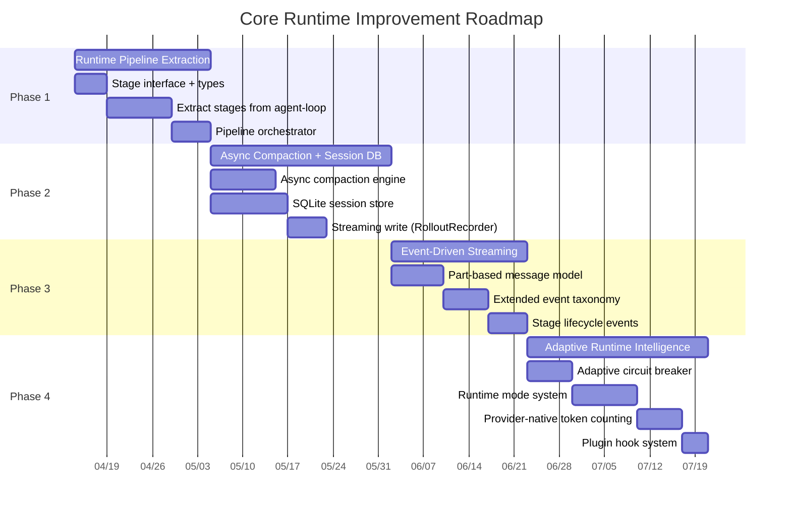
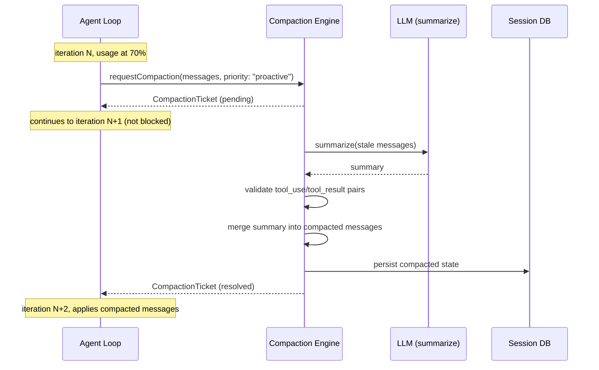
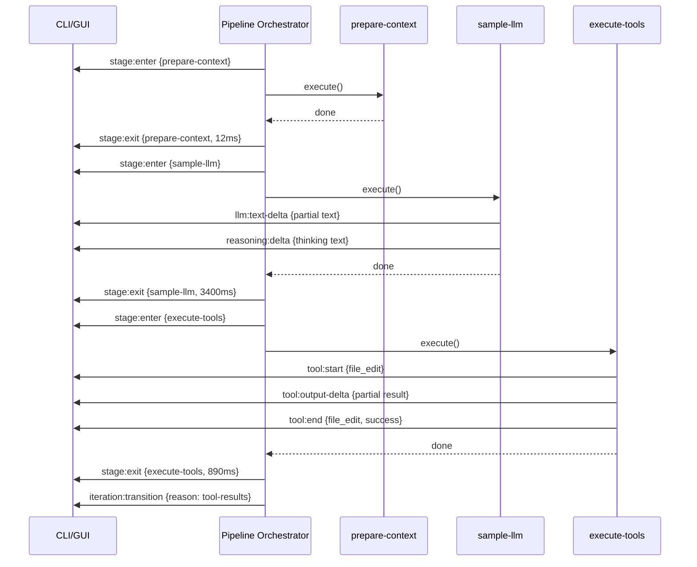
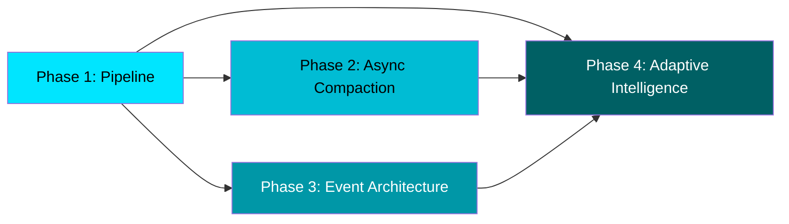

# 01 — Core Runtime Improvement Plan

> **Version**: 2.0 (2026-04-04)
> **Scope**: Agent Loop, Context Management, Session Persistence, Streaming Architecture
> **Status**: Planning — replaces v1.0 based on competitive analysis of OpenCode + Codex CLI
> **Owner**: Core Runtime Team

---

## Table of Contents

1. [Executive Summary](#1-executive-summary)
2. [Competitive Landscape Analysis](#2-competitive-landscape-analysis)
3. [Current DHelix Gaps](#3-current-dhelix-gaps)
4. [Improvement Plan](#4-improvement-plan)
5. [Implementation Details](#5-implementation-details)
6. [Success Metrics](#6-success-metrics)
7. [Risk Assessment](#7-risk-assessment)

---

## 1. Executive Summary

### 1.1 Current Position

DHelix Code는 이미 동작하는 ReAct agent loop, 3-layer context compaction, dual-model routing,
circuit breaker, recovery strategy 시스템을 갖추고 있다. 이는 대부분의 오픈소스 coding assistant보다
성숙한 기반이다.

**핵심 자산**:
- `src/core/agent-loop.ts` — 1,302 LOC의 ReAct 루프. 스트리밍, 병렬 도구 실행, 권한 검사, 체크포인트 통합
- `src/core/context-manager.ts` — 1,059 LOC. Microcompaction + auto-compaction + rehydration 3단계
- `src/core/system-prompt-builder.ts` — 1,073 LOC. Priority-based, token-budget-aware 프롬프트 조립
- `src/core/circuit-breaker.ts` — 186 LOC. No-change/same-error/max-iteration 3중 감지
- `src/core/recovery-strategy.ts` — 107 LOC. 6 error pattern regex 매칭 복구

### 1.2 Strategic Direction

2026년 업계 트렌드와 경쟁사 분석을 통해 확인된 핵심 gap은 "기능의 부재"가 아니라 **"runtime maturity"**이다.

| Dimension | DHelix Current | Target State |
|-----------|---------------|--------------|
| Agent loop | Monolithic 1,302 LOC function | Pipeline of 8+ named stages |
| Compaction | Synchronous, blocks agent loop | Async background, proactive at 70% |
| Circuit breaker | Hardcoded thresholds | Adaptive, task-type-aware |
| Session storage | Filesystem JSONL | SQLite + streaming write |
| Token counting | Approximate (±5-10%) | Provider-native or calibrated |
| Streaming | Event-based but untyped pipeline | Part-based message model (40+ events) |
| Runtime observability | trace() to stderr | Structured stage metrics + spans |
| Cold storage | 24h TTL, no compression | LZ4 compressed, enforced GC |

### 1.3 Expected Outcomes

- **Long sessions**: 50회+ 반복에서도 품질 유지 (현재 ~30회 이후 degradation)
- **Latency**: 컴팩션으로 인한 blocking 제거 → p95 iteration time 40% 감소
- **Reliability**: Adaptive circuit breaker로 false-positive trip 70% 감소
- **Observability**: 모든 stage에 timing/token metrics, 회귀 탐지 가능
- **Resumability**: SQLite 세션으로 crash recovery + resume 지원

---

## 2. Competitive Landscape Analysis

### 2.1 OpenCode (Go + Effect.js)

OpenCode의 가장 큰 강점은 **structured runtime primitives**이다.

#### 2.1.1 Effect.js Functional DI

```
OpenCode 패턴:
  Effect.gen → Layer → Service → automatic resource cleanup
  구조적 동시성(structured concurrency) 내장
  리소스 누수 불가능 — scope 종료 시 자동 해제

DHelix 현재:
  manual try/finally + AbortController
  리소스 정리가 호출자 책임 (실수 가능)
```

**핵심 교훈**: DHelix는 Effect.js를 도입할 필요는 없지만, `Disposable`/`AsyncDisposable` 패턴을
runtime stage에 적용하여 리소스 누수를 방지해야 한다.

#### 2.1.2 SQLite-Backed Sessions (Drizzle ORM)

```
OpenCode:
  SQLite + Drizzle ORM
  세션 = DB row → 즉각적 조회, 정렬, 필터
  Compaction metadata도 DB에 저장
  자동 cleanup은 SQL VACUUM/DELETE

DHelix 현재:
  JSONL 파일 + index.json + 파일 잠금(lock)
  세션 목록 = 디렉토리 전체 스캔
  동시 접근 = 수동 락 파일 (stale lock 30초)
  자동 cleanup = 미구현
```

**핵심 교훈**: Filesystem 세션은 소규모에서는 동작하지만, 100+ 세션에서 성능/안정성 문제가 발생한다.

#### 2.1.3 Session Compaction Strategy

```
OpenCode:
  Backward-scanning pruning (가장 오래된 것부터 제거가 아님)
  PRUNE_MINIMUM = 20K tokens (최소 보존)
  PRUNE_PROTECT = 40K tokens (보호 대역)
  tool_use/tool_result 쌍 일관성 보장

DHelix 현재:
  Forward scanning (오래된 것부터 제거)
  preserveRecentTurns = 5 (고정)
  tool_use/tool_result 쌍 일관성 → 부분적 (orphaned tool_result 가능)
```

#### 2.1.4 Doom Loop Detection

```
OpenCode:
  3회 동일한 tool call = 즉시 circuit break
  tool call signature 기반 비교

DHelix 현재:
  MAX_DUPLICATE_TOOL_CALLS = 3 (동일 패턴 있음 ✓)
  그러나 signature 비교가 JSON.stringify 의존 → 인자 순서 차이에 취약
```

#### 2.1.5 Formal Agent Modes

```
OpenCode:
  build | plan | explore | general | compaction
  각 mode별로 도구 제한, 프롬프트 차이, 행동 규칙 구분

DHelix 현재:
  dualModelRouter의 architect/editor phase 감지
  그러나 formal mode enum이 아닌 heuristic 기반
  mode별 도구 필터링 없음
```

#### 2.1.6 Part-Based Message Model

```
OpenCode:
  TextPart | ToolPart | ReasoningPart | FilePart | SnapshotPart
  각 Part에 metadata (tokens, timestamp, source)
  Compaction시 Part 단위로 선별적 제거/보존

DHelix 현재:
  ChatMessage { role, content: string, toolCalls?: [...] }
  content가 flat string → 부분 압축 불가
  Compaction은 메시지 단위 전체 제거/보존만 가능
```

#### 2.1.7 Plugin Hooks

```
OpenCode:
  system prompt transform hook
  chat params hook
  tool definitions hook
  → 외부 플러그인이 runtime behavior를 안전하게 수정 가능

DHelix 현재:
  onPreCompact callback만 존재
  다른 stage에 hook point 없음
```

### 2.2 Codex CLI (Rust)

Codex CLI의 차별점은 **durable agent runtime**과 **connection optimization**이다.

#### 2.2.1 AgentControl — spawn/fork/resume

```
Codex:
  AgentControl::spawn_agent() — 새 에이전트 생성
  AgentControl::fork() — 현재 상태에서 분기
  AgentControl::resume() — 중단된 세션 재개
  Thread-based session model (parent-child 관계)

DHelix 현재:
  runAgentLoop() 단일 진입점
  fork/resume 없음
  서브에이전트는 별도 spawner (src/core/subagent 없이 agent-loop 재호출)
```

#### 2.2.2 RolloutRecorder — JSONL Streaming Persistence

```
Codex:
  RolloutRecorder — 각 message를 실시간으로 JSONL에 append
  crash시에도 마지막 기록까지 보존
  streaming write → 메모리에 전체 transcript 유지 불필요

DHelix 현재:
  session-auto-save.ts (66 LOC) — 주기적 전체 덮어쓰기
  crash시 마지막 auto-save 이후 데이터 손실
  atomicWrite로 안전성은 확보하지만 실시간 append 아님
```

#### 2.2.3 WebSocket Prewarm + Connection Reuse

```
Codex:
  WebSocket prewarm — 첫 LLM 호출 전에 연결 확립
  연결 재사용으로 subsequent call latency 감소
  SSE 연결에 retry budget + fallback

DHelix 현재:
  매 LLM 호출마다 새 HTTP 연결 (SDK 기본 동작)
  connection pooling은 SDK에 위임 (명시적 제어 없음)
```

#### 2.2.4 Compact API Endpoint

```
Codex:
  전용 /compact API → 서버 측에서 최적화된 context reduction
  latent-space compaction 활용 가능

DHelix 현재:
  클라이언트 측 LLM 호출로 summarization
  Anthropic native compaction API 미활용
```

#### 2.2.5 App Server Architecture (Axum + REST)

```
Codex:
  핵심 런타임이 library로 분리
  Axum web server가 REST API로 감싸서 노출
  CLI, GUI, 웹 클라이언트 모두 같은 core 사용

DHelix 현재:
  CLI (Ink/React)와 core가 직접 결합
  core를 별도 서버로 노출하는 인터페이스 없음
```

### 2.3 2026 Industry Trends

| Trend | Status | DHelix Impact |
|-------|--------|---------------|
| Anchored Iterative Summarization | Production-proven | 현재 full-reconstruction 방식보다 우수 |
| 70% threshold trigger | Industry consensus | DHelix는 83.5% — 10%+ 늦음 |
| Anthropic native compaction API | Available | 미활용 — 즉시 통합 가능 |
| Latent-space compaction | Emerging | attention matching으로 token generation 제거 |
| Proactive background summarization | Best practice | DHelix는 preemptive 있지만 동기적 |
| Context drift = 65% enterprise failures | Research finding | 계측/방어 전략 필요 |

---

## 3. Current DHelix Gaps

### Gap A. Monolithic Agent Loop — CRITICAL

**파일**: `src/core/agent-loop.ts` (1,302 LOC)

`runAgentLoop()` 함수는 line 488에서 시작하여 파일 끝까지 **815 LOC의 단일 함수**이다.
이 함수 안에 다음이 모두 포함되어 있다:

1. Context preparation (observation masking + compaction)
2. Preemptive compaction check
3. Tool definition resolution (deferred mode 포함)
4. LLM request preparation (strategy.prepareRequest)
5. LLM call with retry loop (streaming/non-streaming)
6. Recovery strategy execution
7. Response validation (empty response, incomplete response)
8. Tool call extraction + validation + fallback
9. Duplicate tool call detection (doom loop)
10. Permission checking
11. Tool call grouping + parallel execution
12. Guardrail application (input/output)
13. Checkpoint creation
14. Tool result truncation
15. Circuit breaker recording
16. Loop termination decision

**문제점**:
- 테스트가 함수 전체를 실행해야 함 — 개별 stage 단위 테스트 불가
- 새 기능 추가 시 815줄 함수 내부에 if/else 분기 누적
- stage 간 의존성이 implicit — 변수 mutation으로 전달
- 타이밍/메트릭 수집이 산발적 (trace() 호출만)
- 다른 runtime 모드(plan, explore) 추가 시 분기 폭발

**Severity**: CRITICAL — 모든 다른 개선의 전제 조건

### Gap B. Synchronous Compaction Blocking — CRITICAL

**파일**: `src/core/context-manager.ts`, `src/core/agent-loop.ts` (line 569-590)

```typescript
// agent-loop.ts line 583-584
const { messages: compacted } = await contextManager.compact(managedMessages);
managedMessages = [...compacted];
```

컴팩션은 LLM 호출을 포함하므로 수 초~수십 초가 걸릴 수 있다.
이 동안 agent loop 전체가 blocking된다.

**문제점**:
- 사용자 체감: "멈춤" 현상 (UI 피드백 있지만 실제로 아무것도 못 함)
- 83.5%에서 trigger → 이미 context가 빡빡한 상태에서 LLM 호출 추가 부담
- 컴팩션 실패 시 loop 전체가 throw → 복구 어려움
- OpenCode는 proactive background summarization으로 이 문제를 회피

**Severity**: CRITICAL — 장시간 세션에서 UX를 심각하게 저하

### Gap C. Hardcoded Iteration Limits — HIGH

**파일**: `src/core/circuit-breaker.ts`

```typescript
const NO_CHANGE_THRESHOLD = 5;       // 하드코딩
const SAME_ERROR_THRESHOLD = 5;      // 하드코딩
const DEFAULT_MAX_ITERATIONS = 50;   // 하드코딩
```

**문제점**:
- 간단한 질문(1-2 iteration 예상)과 대규모 리팩토링(30+ iteration 필요)에 같은 임계값 적용
- 50 iteration 제한은 복잡한 작업에 부족할 수 있으나, 단순 작업에서는 과도하게 관대
- NO_CHANGE_THRESHOLD = 5는 LLM이 "생각 중"인 경우 false positive 발생 가능
- 사용자 피드백/작업 복잡도에 따른 동적 조정 메커니즘 없음
- OpenCode는 formal agent mode별로 다른 제한을 적용

**Severity**: HIGH — 사용자 경험 저하 + 리소스 낭비

### Gap D. Filesystem Sessions — HIGH

**파일**: `src/core/session-manager.ts` (662 LOC)

```
현재 구조:
~/.dhelix/sessions/
├── index.json               # 전체 세션 목록 (경량 인덱스)
├── {session-id}/
│   ├── transcript.jsonl     # 메시지 기록
│   └── metadata.json        # 세션 메타데이터
```

**문제점**:
- `index.json` 전체를 메모리에 로드하여 세션 목록 조회 → O(n) 스캔
- 파일 잠금 메커니즘 (LOCK_TIMEOUT_MS=5000, STALE_LOCK_MS=30000) → race condition 가능
- 자동 cleanup 미구현 — 세션이 누적되면 디스크 사용량 증가
- 세션 검색(내용 기반) 불가 — 파일명/날짜로만 식별
- crash recovery: auto-save 주기 사이의 데이터 손실 위험
- Codex의 RolloutRecorder 방식(실시간 append)과 비교하면 안정성이 떨어짐
- 동시에 여러 DHelix 인스턴스가 같은 세션에 접근할 때 데이터 무결성 보장 불확실

**Severity**: HIGH — 안정성 + 확장성 제한

### Gap E. Approximate Token Counting — MEDIUM

**파일**: `src/llm/token-counter.ts` (269 LOC)

```
현재 방식:
  countTokens(text) → tiktoken 기반 정확한 계산 (LRU 캐시)
  estimateTokens(text) → text.length / 4 기반 근사치 (스트리밍 중 사용)
  실시간 추정 시 API 사용량과 ±5-10% 오차

문제점:
  1. 실시간 추정(estimateTokens)이 컴팩션 trigger에 사용될 때 타이밍이 부정확
  2. tool result truncation이 과도하거나 부족할 수 있음
  3. 다국어(한국어) 텍스트에서 오차가 더 큼 (한글 1글자 ≈ 2-3 tokens)
  4. provider별 tokenizer 차이 (OpenAI tiktoken vs Anthropic) 미반영
```

**Severity**: MEDIUM — 기능 정확성에 영향하지만 현재 safety margin으로 커버됨

### Gap F. No Formal Runtime Stage Model — HIGH

**현재 상태**: `runAgentLoop()` 내부에 implicit stage가 존재하지만 명시적 모델이 없다.

```
비교:
  OpenCode → query.ts pipeline: budgeting → snip → microcompact → collapse → autocompact → sample
  각 stage가 명명되고 시간 측정되며 독립적으로 테스트 가능

  DHelix → 단일 while 루프 안에 모든 stage가 인라인
  stage 간 전환이 코드 순서로만 표현됨
  "왜 다음 iteration이 필요한지"에 대한 transition reason 없음
```

**문제점**:
- Runtime behavior를 inspect/benchmark할 수 없음
- 새 stage 추가(예: plan mode, explore mode)가 if/else 분기로만 가능
- compaction이나 rehydration 같은 stage를 비동기로 분리할 수 없음
- Telemetry 수집이 ad-hoc — stage 경계가 없으므로 어디서 시간이 걸리는지 불명확

**Severity**: HIGH — Gap A와 결합하여 runtime evolution의 근본적 장벽

### Gap G. No Event-Driven Streaming Architecture — MEDIUM

**파일**: `src/utils/events.ts` (259 LOC)

현재 이벤트 시스템은 mitt 기반으로 타입 안전하지만, **granularity가 부족**하다.

```
현재 이벤트 (약 30개):
  llm:start, llm:text-delta, llm:tool-delta, llm:complete, llm:usage, llm:error
  agent:iteration, agent:complete, agent:retry, agent:usage-update
  tool:start, tool:end, tool:error
  context:pre-compact, context:compacted
  ...

OpenCode 이벤트 (40+ 타입):
  reasoning-delta, tool-input-delta, tool-output-delta
  stage:enter, stage:exit
  compaction:start, compaction:progress, compaction:end
  session:snapshot
  mode:change
  ...
```

**문제점**:
- Stage 진입/퇴출 이벤트 없음 → UI가 현재 stage를 표시할 수 없음
- Compaction progress 이벤트 없음 → "압축 중..." 상태에서 진행률 표시 불가
- Tool input/output delta 이벤트 분리 안 됨 → 실시간 도구 실행 시각화 제한
- Reasoning delta(thinking)와 text delta가 동일한 수준의 이벤트 → 구분 어려움

**Severity**: MEDIUM — UX 향상과 외부 통합에 필요하지만 기능은 동작

### Gap H. Cold Storage Not Optimized — MEDIUM

**파일**: `src/core/context-manager.ts` (line 295-338)

```typescript
// 현재 cold storage: plain text 저장, 24h TTL
const COLD_STORAGE_TTL_MS = 24 * 60 * 60 * 1000;

// cleanup은 compaction 카운트 기반으로만 실행
// lastGcCompactionCount 차이가 3 이상일 때 실행
```

**문제점**:
- Plain text 저장 → 압축 없음 (LZ4/gzip으로 70%+ 절약 가능)
- TTL 기반 cleanup만 → 디스크 용량 제한 기반 cleanup 없음
- GC가 compaction 횟수에만 의존 → 장시간 idle 세션에서 GC 안 됨
- 큰 파일(>100KB) cold storage 시 디스크 I/O 부담
- cold ref access tracking은 있지만 re-read 우선순위에 미반영

**Severity**: MEDIUM — 장시간 사용 시 디스크 누적, 성능 영향 제한적

---

## 4. Improvement Plan

### Overview: 4-Phase Execution



### Phase 1: Runtime Pipeline Extraction (3 weeks)

**목표**: 1,302 LOC monolithic agent loop을 명명된 stage pipeline으로 분해

**원칙**:
- 기존 behavior를 100% 보존 — refactoring only, no feature changes
- 각 stage는 독립적으로 테스트 가능
- Stage 간 데이터 전달은 명시적 context object를 통해
- Pipeline은 순차/분기/반복을 지원하는 orchestrator가 관리

**Target stage model**:

```
┌─────────────────────────────────────────────────────────┐
│                    Pipeline Orchestrator                  │
│                                                          │
│  ┌──────────┐   ┌──────────┐   ┌──────────┐            │
│  │ PREPARE  │──▶│ COMPACT  │──▶│ RESOLVE  │            │
│  │ context  │   │ context  │   │ tools    │            │
│  └──────────┘   └──────────┘   └──────────┘            │
│       │              │              │                    │
│       ▼              ▼              ▼                    │
│  ┌──────────┐   ┌──────────┐   ┌──────────┐            │
│  │ SAMPLE   │──▶│ EXTRACT  │──▶│ PREFLIGHT│            │
│  │ LLM call │   │ tool     │   │ policy   │            │
│  │          │   │ calls    │   │ + perms  │            │
│  └──────────┘   └──────────┘   └──────────┘            │
│       │              │              │                    │
│       ▼              ▼              ▼                    │
│  ┌──────────┐   ┌──────────┐   ┌──────────┐            │
│  │ EXECUTE  │──▶│ PERSIST  │──▶│ EVALUATE │            │
│  │ tools    │   │ results  │   │ continue?│            │
│  └──────────┘   └──────────┘   └──────────┘            │
│                                      │                   │
│                                      ▼                   │
│                              [next iteration or exit]    │
└─────────────────────────────────────────────────────────┘
```

### Phase 2: Async Compaction & Session DB Migration (4 weeks)

**목표**: Compaction을 비동기로 전환하고, session persistence를 SQLite로 마이그레이션

**원칙**:
- Compaction은 background에서 실행, agent loop는 차단되지 않음
- SQLite는 better-sqlite3 (동기) 또는 sql.js (WASM) 중 선택
- 기존 JSONL 세션에서 자동 마이그레이션 경로 제공
- Crash safety: WAL mode + streaming write

### Phase 3: Event-Driven Streaming Architecture (3 weeks)

**목표**: Part-based message model 도입, 이벤트 체계 확장, stage lifecycle 이벤트

**원칙**:
- 기존 ChatMessage와의 하위 호환성 유지
- 점진적 마이그레이션 — 새 Part 모델과 기존 string content 공존
- 외부 소비자(GUI, 웹, VS Code extension)가 사용할 수 있는 이벤트 API

### Phase 4: Adaptive Runtime Intelligence (4 weeks)

**목표**: 작업 유형/복잡도에 따라 runtime 파라미터를 동적으로 조정

**원칙**:
- Formal agent mode (build, plan, explore, general)
- Mode별 tool filtering, iteration limit, compaction strategy
- Provider-native token counting (tiktoken, Anthropic API)
- Plugin hook system at critical stage boundaries

---

## 5. Implementation Details

### 5.1 Phase 1: Runtime Pipeline Extraction

#### 5.1.1 Stage Interface Definition

**New file**: `src/core/runtime/stage.ts`

```typescript
/**
 * Runtime stage — agent loop의 하나의 처리 단계.
 *
 * 모든 stage는 동일한 인터페이스를 구현하며,
 * pipeline orchestrator가 순서대로 실행합니다.
 */
export interface RuntimeStage<TInput, TOutput> {
  /** Stage 고유 이름 (metrics/logging에 사용) */
  readonly name: StageName;

  /** Stage 실행. input을 받아 output을 반환. */
  execute(input: TInput, ctx: RuntimeContext): Promise<TOutput>;
}

/** 명명된 stage 목록 */
export type StageName =
  | "prepare-context"
  | "compact-context"
  | "resolve-tools"
  | "sample-llm"
  | "extract-calls"
  | "preflight-policy"
  | "execute-tools"
  | "persist-results"
  | "evaluate-continuation";

/**
 * Runtime context — stage 간 공유되는 상태.
 * 불변은 아니지만, 변경 이력이 추적됩니다.
 */
export interface RuntimeContext {
  /** 현재 반복 번호 */
  readonly iteration: number;

  /** 전체 대화 메시지 (mutable for tool result append) */
  messages: ChatMessage[];

  /** 이번 iteration에서 관리된 메시지 (compaction 적용 후) */
  managedMessages: ChatMessage[];

  /** LLM 응답 (sample stage 이후 설정) */
  response?: ChatResponse;

  /** 추출된 도구 호출 (extract stage 이후 설정) */
  extractedCalls?: readonly ExtractedToolCall[];

  /** 도구 실행 결과 (execute stage 이후 설정) */
  toolResults?: readonly ToolCallResult[];

  /** 이번 iteration의 시작 시각 */
  readonly startedAt: number;

  /** Stage별 timing metrics */
  readonly timings: Map<StageName, number>;

  /** Circuit breaker 참조 */
  readonly circuitBreaker: CircuitBreaker;

  /** Usage aggregator 참조 */
  readonly usageAggregator: UsageAggregator;

  /** Abort signal */
  readonly signal?: AbortSignal;

  /** 현재 transition reason (왜 이번 iteration이 실행되는지) */
  transitionReason: TransitionReason;
}

/** iteration이 시작되는 이유 */
export type TransitionReason =
  | "initial"           // 첫 번째 iteration
  | "tool-results"      // 도구 결과를 LLM에 전달하기 위해
  | "recovery"          // 에러 복구 후 재시도
  | "compaction-retry"  // 컴팩션 후 재시도
  | "user-input"        // 사용자 추가 입력
  | "continuation";     // LLM이 더 할 일이 있다고 판단
```

#### 5.1.2 Stage Implementations

**New files** (each extracts a section from `agent-loop.ts`):

| File | Source (agent-loop.ts lines) | Responsibility |
|------|------------------------------|----------------|
| `src/core/runtime/stages/prepare-context.ts` | 564-590 | Observation masking, context manager prepare, preemptive compaction |
| `src/core/runtime/stages/compact-context.ts` | 569-590 | Compaction check + execution (later: async) |
| `src/core/runtime/stages/resolve-tools.ts` | 593-603 | Tool definition resolution (hot + deferred) |
| `src/core/runtime/stages/sample-llm.ts` | 605-735 | LLM call with retry loop, streaming, error classification |
| `src/core/runtime/stages/extract-calls.ts` | 763-850 | Tool call extraction, validation, fallback, doom loop detection |
| `src/core/runtime/stages/preflight-policy.ts` | ~850-950 | Permission checking, guardrail application |
| `src/core/runtime/stages/execute-tools.ts` | ~950-1100 | Tool grouping, parallel execution, checkpoint, result truncation |
| `src/core/runtime/stages/persist-results.ts` | NEW | Append tool results to messages, emit events |
| `src/core/runtime/stages/evaluate-continuation.ts` | ~1100-1302 | Circuit breaker recording, empty/incomplete detection, loop decision |

#### 5.1.3 Pipeline Orchestrator

**New file**: `src/core/runtime/pipeline.ts`

```typescript
/**
 * Pipeline orchestrator — stage를 순서대로 실행하고
 * stage 간 전환, 에러 처리, metrics 수집을 관리합니다.
 */
export class RuntimePipeline {
  private readonly stages: Map<StageName, RuntimeStage<unknown, unknown>>;
  private readonly events: AppEventEmitter;
  private readonly hooks: PipelineHooks;

  /** stage 실행 순서 (mode에 따라 다를 수 있음) */
  private readonly stageOrder: readonly StageName[] = [
    "prepare-context",
    "compact-context",
    "resolve-tools",
    "sample-llm",
    "extract-calls",
    "preflight-policy",
    "execute-tools",
    "persist-results",
    "evaluate-continuation",
  ];

  /**
   * 단일 iteration을 실행합니다.
   * 각 stage를 순서대로 실행하며, stage 간 timing을 측정합니다.
   */
  async executeIteration(ctx: RuntimeContext): Promise<IterationOutcome> {
    for (const stageName of this.stageOrder) {
      if (ctx.signal?.aborted) {
        return { action: "abort" };
      }

      const stage = this.stages.get(stageName);
      if (!stage) continue;

      // Hook: before stage
      await this.hooks.onBeforeStage?.(stageName, ctx);
      this.events.emit("stage:enter", { stage: stageName, iteration: ctx.iteration });

      const stageStart = performance.now();
      try {
        await stage.execute(ctx, ctx);  // stage mutates ctx
      } catch (error) {
        this.events.emit("stage:error", { stage: stageName, error });
        return this.handleStageError(stageName, error, ctx);
      }

      const elapsed = performance.now() - stageStart;
      ctx.timings.set(stageName, elapsed);
      this.events.emit("stage:exit", { stage: stageName, elapsed, iteration: ctx.iteration });

      // Hook: after stage
      await this.hooks.onAfterStage?.(stageName, ctx);
    }

    return ctx.extractedCalls && ctx.extractedCalls.length > 0
      ? { action: "continue", reason: "tool-results" }
      : { action: "complete" };
  }
}

/** Iteration 결과 — 다음 행동 결정 */
export type IterationOutcome =
  | { action: "continue"; reason: TransitionReason }
  | { action: "complete" }
  | { action: "abort" }
  | { action: "error"; error: unknown };

/** Pipeline hook points */
export interface PipelineHooks {
  onBeforeStage?: (stage: StageName, ctx: RuntimeContext) => Promise<void>;
  onAfterStage?: (stage: StageName, ctx: RuntimeContext) => Promise<void>;
  onIterationStart?: (ctx: RuntimeContext) => Promise<void>;
  onIterationEnd?: (outcome: IterationOutcome, ctx: RuntimeContext) => Promise<void>;
}
```

#### 5.1.4 Refactored Agent Loop Entry Point

**Modified file**: `src/core/agent-loop.ts`

After pipeline extraction, `runAgentLoop` shrinks from 815 LOC to approximately 80-100 LOC:

```typescript
export async function runAgentLoop(
  config: AgentLoopConfig,
  initialMessages: readonly ChatMessage[],
): Promise<AgentLoopResult> {
  const pipeline = createPipeline(config);
  const ctx = createInitialContext(config, initialMessages);

  while (ctx.iteration < ctx.maxIterations && ctx.circuitBreaker.shouldContinue()) {
    if (ctx.signal?.aborted) {
      return buildResult(ctx, /* aborted */ true);
    }

    ctx.iteration++;
    config.events.emit("agent:iteration", { iteration: ctx.iteration });

    const outcome = await pipeline.executeIteration(ctx);

    switch (outcome.action) {
      case "continue":
        ctx.transitionReason = outcome.reason;
        break;
      case "complete":
        return buildResult(ctx, false);
      case "abort":
        return buildResult(ctx, true);
      case "error":
        throw outcome.error;
    }
  }

  return buildResult(ctx, false);
}
```

#### 5.1.5 Runtime Metrics

**New file**: `src/core/runtime/metrics.ts`

```typescript
/**
 * Stage-level 실행 메트릭 수집기.
 * 각 stage의 실행 시간, 호출 횟수, 에러율을 추적합니다.
 */
export interface StageMetrics {
  readonly stageName: StageName;
  readonly totalExecutions: number;
  readonly totalDurationMs: number;
  readonly averageDurationMs: number;
  readonly p95DurationMs: number;
  readonly errorCount: number;
  readonly lastExecutedAt: string | null;
}

export interface RuntimeMetricsSnapshot {
  readonly stages: readonly StageMetrics[];
  readonly totalIterations: number;
  readonly totalDurationMs: number;
  readonly compactionCount: number;
  readonly transitionReasons: Record<TransitionReason, number>;
}

export class RuntimeMetricsCollector {
  private readonly stageTimings: Map<StageName, number[]> = new Map();
  private readonly stageErrors: Map<StageName, number> = new Map();
  private readonly transitionCounts: Map<TransitionReason, number> = new Map();

  recordStage(name: StageName, durationMs: number, error?: boolean): void { /* ... */ }
  recordTransition(reason: TransitionReason): void { /* ... */ }
  snapshot(): RuntimeMetricsSnapshot { /* ... */ }
}
```

#### 5.1.6 File Changes Summary — Phase 1

| Action | File | LOC Change |
|--------|------|------------|
| NEW | `src/core/runtime/stage.ts` | +120 |
| NEW | `src/core/runtime/pipeline.ts` | +200 |
| NEW | `src/core/runtime/metrics.ts` | +150 |
| NEW | `src/core/runtime/stages/prepare-context.ts` | +80 |
| NEW | `src/core/runtime/stages/compact-context.ts` | +60 |
| NEW | `src/core/runtime/stages/resolve-tools.ts` | +40 |
| NEW | `src/core/runtime/stages/sample-llm.ts` | +200 |
| NEW | `src/core/runtime/stages/extract-calls.ts` | +120 |
| NEW | `src/core/runtime/stages/preflight-policy.ts` | +100 |
| NEW | `src/core/runtime/stages/execute-tools.ts` | +180 |
| NEW | `src/core/runtime/stages/persist-results.ts` | +50 |
| NEW | `src/core/runtime/stages/evaluate-continuation.ts` | +100 |
| NEW | `src/core/runtime/index.ts` | +30 |
| MODIFY | `src/core/agent-loop.ts` | -700 (shrink to ~600 LOC) |
| NEW | `test/unit/core/runtime/pipeline.test.ts` | +300 |
| NEW | `test/unit/core/runtime/stages/*.test.ts` | +600 (9 files) |
| **Total** | | ~+2,330 new (src 1,430 + test 900), -700 removed |

#### 5.1.7 Migration Strategy

1. **Week 1**: Define stage interface, RuntimeContext, TransitionReason types
2. **Week 2**: Extract stages one-by-one from agent-loop.ts, maintaining tests
   - Extract in order: prepare-context → compact → resolve → sample (largest)
   - After each extraction: run full test suite to verify no regression
3. **Week 3**: Build pipeline orchestrator, wire all stages, add stage metrics
   - Replace original runAgentLoop body with pipeline call
   - Add stage:enter/stage:exit events
   - Verify all existing tests pass with new pipeline

**Critical invariant**: `npm run check` must pass after every extraction step.

---

### 5.2 Phase 2: Async Compaction & Session DB Migration

#### 5.2.1 Async Compaction Engine

**New file**: `src/core/runtime/async-compaction.ts`

**Architecture**:



**Key design decisions**:

```typescript
/**
 * Async compaction engine.
 * Agent loop에서 분리되어 background에서 실행됩니다.
 *
 * 두 가지 trigger 모드:
 * 1. Proactive (70% threshold) — background에서 미리 압축, loop 차단 없음
 * 2. Reactive (85% threshold) — 급한 경우 foreground에서 실행 (fallback)
 */
export class AsyncCompactionEngine {
  private pendingCompaction: CompactionTicket | null = null;
  private readonly proactiveThreshold = 0.70;   // Industry best practice
  private readonly reactiveThreshold = 0.85;    // Emergency fallback
  private readonly preserveMinTokens = 20_000;  // OpenCode의 PRUNE_MINIMUM 참고
  private readonly protectTokens = 40_000;      // OpenCode의 PRUNE_PROTECT 참고

  /**
   * Background compaction 요청.
   * Agent loop를 차단하지 않고 Promise를 반환합니다.
   */
  async requestCompaction(
    messages: readonly ChatMessage[],
    priority: "proactive" | "reactive",
  ): Promise<CompactionTicket> { /* ... */ }

  /**
   * 이전 compaction 결과가 준비되었는지 확인.
   * Agent loop의 prepare-context stage에서 매 iteration 호출.
   */
  getCompactedMessages(): ChatMessage[] | null { /* ... */ }

  /**
   * tool_use/tool_result 쌍 일관성 검증.
   * Compaction 경계에서 orphaned tool_result가 없는지 확인합니다.
   * (OpenCode에서 배운 교훈)
   */
  private validatePairIntegrity(messages: ChatMessage[]): ChatMessage[] { /* ... */ }
}

interface CompactionTicket {
  readonly id: string;
  readonly status: "pending" | "resolved" | "failed";
  readonly priority: "proactive" | "reactive";
  readonly requestedAt: number;
  readonly resolvedAt?: number;
  readonly result?: CompactionResult;
}
```

**Anthropic Native Compaction API Integration**:

```typescript
/**
 * Anthropic의 native compaction API를 활용한 서버 측 압축.
 * 클라이언트 측 LLM summarization보다 빠르고 정확합니다.
 *
 * Fallback: native API 실패 시 기존 LLM summarization으로 전환
 */
async function nativeCompact(
  client: LLMProvider,
  messages: readonly ChatMessage[],
): Promise<CompactionResult | null> {
  // Anthropic provider인 경우에만 native compaction 시도
  if (!isAnthropicProvider(client)) return null;

  try {
    return await client.compact({
      messages,
      strategy: "anchored-iterative",  // 2026 best practice
    });
  } catch {
    return null;  // fallback to client-side summarization
  }
}
```

#### 5.2.2 SQLite Session Store

**New file**: `src/core/session/sqlite-store.ts`

**선택**: `better-sqlite3` (동기, native addon)
- 이유: 세션 저장/조회는 짧은 작업이므로 동기가 더 단순
- ESM 호환 verified
- Node.js 20+ 지원

**Schema**:

```sql
-- 세션 테이블
CREATE TABLE sessions (
  id TEXT PRIMARY KEY,
  title TEXT,
  model TEXT NOT NULL,
  working_directory TEXT NOT NULL,
  created_at TEXT NOT NULL DEFAULT (datetime('now')),
  updated_at TEXT NOT NULL DEFAULT (datetime('now')),
  message_count INTEGER DEFAULT 0,
  total_tokens INTEGER DEFAULT 0,
  status TEXT DEFAULT 'active'  -- active | completed | archived
);

-- 메시지 테이블 (streaming write 지원)
CREATE TABLE messages (
  id INTEGER PRIMARY KEY AUTOINCREMENT,
  session_id TEXT NOT NULL REFERENCES sessions(id) ON DELETE CASCADE,
  sequence INTEGER NOT NULL,  -- 메시지 순서
  role TEXT NOT NULL,          -- user | assistant | system | tool
  content TEXT,                -- 텍스트 내용
  tool_calls TEXT,             -- JSON: 도구 호출 배열
  tool_call_id TEXT,           -- tool result인 경우 원본 호출 ID
  tokens INTEGER,              -- 이 메시지의 토큰 수
  created_at TEXT NOT NULL DEFAULT (datetime('now')),
  UNIQUE(session_id, sequence)
);

-- 컴팩션 이력 테이블
CREATE TABLE compaction_history (
  id INTEGER PRIMARY KEY AUTOINCREMENT,
  session_id TEXT NOT NULL REFERENCES sessions(id) ON DELETE CASCADE,
  original_tokens INTEGER NOT NULL,
  compacted_tokens INTEGER NOT NULL,
  removed_messages INTEGER NOT NULL,
  summary TEXT NOT NULL,
  strategy TEXT NOT NULL,       -- native | llm-summarize | truncate
  created_at TEXT NOT NULL DEFAULT (datetime('now'))
);

-- 인덱스
CREATE INDEX idx_messages_session ON messages(session_id, sequence);
CREATE INDEX idx_sessions_updated ON sessions(updated_at DESC);
CREATE INDEX idx_sessions_status ON sessions(status);

-- WAL mode for concurrent read + write
PRAGMA journal_mode = WAL;
PRAGMA synchronous = NORMAL;
```

**Streaming Write (RolloutRecorder pattern)**:

```typescript
/**
 * Codex의 RolloutRecorder에서 영감을 받은 streaming message writer.
 * 각 메시지를 즉시 DB에 저장하여 crash시에도 데이터 보존.
 */
export class StreamingSessionWriter {
  private readonly db: Database;
  private nextSequence: number;

  /**
   * 단일 메시지를 즉시 DB에 append.
   * agent loop의 매 메시지 추가 시점에 호출됩니다.
   */
  appendMessage(sessionId: string, message: ChatMessage): void {
    const stmt = this.db.prepare(`
      INSERT INTO messages (session_id, sequence, role, content, tool_calls, tool_call_id, tokens)
      VALUES (?, ?, ?, ?, ?, ?, ?)
    `);
    stmt.run(
      sessionId,
      this.nextSequence++,
      message.role,
      message.content ?? null,
      message.toolCalls ? JSON.stringify(message.toolCalls) : null,
      message.toolCallId ?? null,
      countTokens(message.content ?? ""),
    );
  }

  /**
   * 세션의 전체 메시지를 복원 (resume 시 사용).
   */
  loadMessages(sessionId: string): ChatMessage[] { /* ... */ }
}
```

**Migration from JSONL**:

```typescript
/**
 * 기존 JSONL 세션을 SQLite로 마이그레이션합니다.
 * 첫 실행 시 자동으로 수행되며, 완료 후 JSONL 파일은 보존 (rollback 대비).
 */
export async function migrateJsonlToSqlite(
  jsonlDir: string,
  db: Database,
): Promise<MigrationResult> {
  // 1. index.json에서 세션 목록 로드
  // 2. 각 세션의 transcript.jsonl 파싱
  // 3. SQLite에 INSERT
  // 4. 검증 (메시지 수 일치 확인)
  // 5. migration_complete 마커 파일 생성
}
```

#### 5.2.3 Cold Storage Optimization

**Modified file**: `src/core/context-manager.ts`

```typescript
// 변경 1: LZ4 압축 적용 (70%+ 크기 절감)
import { compress, decompress } from "lz4-napi";  // native addon, 빠름

async function writeColdStorage(path: string, content: string): Promise<void> {
  const compressed = await compress(Buffer.from(content, "utf-8"));
  await writeFile(path + ".lz4", compressed);
}

async function readColdStorage(path: string): Promise<string> {
  const compressed = await readFile(path + ".lz4");
  const decompressed = await decompress(compressed);
  return decompressed.toString("utf-8");
}

// 변경 2: 디스크 용량 기반 cleanup 추가
const MAX_COLD_STORAGE_BYTES = 100 * 1024 * 1024;  // 100MB per session

async function enforceColdStorageLimit(dir: string): Promise<void> {
  // LRU eviction: 가장 오래된 파일부터 제거하여 용량 제한 준수
}

// 변경 3: 주기적 GC (compaction 횟수 대신 타이머 기반)
// startPeriodicGC() — 5분마다 expired + orphaned 파일 정리
```

#### 5.2.4 File Changes Summary — Phase 2

| Action | File | LOC Change |
|--------|------|------------|
| NEW | `src/core/runtime/async-compaction.ts` | +350 |
| NEW | `src/core/session/sqlite-store.ts` | +400 |
| NEW | `src/core/session/streaming-writer.ts` | +150 |
| NEW | `src/core/session/migration.ts` | +200 |
| MODIFY | `src/core/context-manager.ts` | ~+100 (compression + GC) |
| MODIFY | `src/core/session-manager.ts` | ~+50 (SQLite adapter) |
| MODIFY | `src/core/runtime/stages/compact-context.ts` | ~+80 (async integration) |
| NEW | `test/unit/core/session/sqlite-store.test.ts` | +250 |
| NEW | `test/unit/core/runtime/async-compaction.test.ts` | +300 |
| NEW | `test/unit/core/session/migration.test.ts` | +150 |
| **Total** | | ~+2,030 new |

**Dependencies**:
- `better-sqlite3` — SQLite3 native addon
- `lz4-napi` — LZ4 compression (optional, fallback to gzip)

---

### 5.3 Phase 3: Event-Driven Streaming Architecture

#### 5.3.1 Part-Based Message Model

**New file**: `src/core/runtime/message-parts.ts`

```typescript
/**
 * Part-based message model — OpenCode의 Part 시스템에서 영감.
 *
 * 기존 ChatMessage의 content: string을 content: MessagePart[]로 확장합니다.
 * 각 Part는 독립적인 메타데이터를 가지며, compaction시 선별적 처리가 가능합니다.
 */

/** Base part with common metadata */
interface BasePart {
  readonly type: string;
  readonly id: string;
  readonly tokens?: number;
  readonly createdAt: number;
}

/** 텍스트 응답 Part */
export interface TextPart extends BasePart {
  readonly type: "text";
  readonly content: string;
}

/** 도구 호출 Part */
export interface ToolCallPart extends BasePart {
  readonly type: "tool-call";
  readonly toolName: string;
  readonly toolCallId: string;
  readonly arguments: Record<string, unknown>;
  readonly status: "pending" | "executing" | "completed" | "failed";
}

/** 도구 결과 Part */
export interface ToolResultPart extends BasePart {
  readonly type: "tool-result";
  readonly toolCallId: string;
  readonly content: string;
  readonly isError: boolean;
  readonly isTruncated: boolean;
  /** Cold storage reference (if content was evicted) */
  readonly coldRef?: string;
}

/** Reasoning/thinking Part (Claude extended thinking) */
export interface ReasoningPart extends BasePart {
  readonly type: "reasoning";
  readonly content: string;
  readonly isRedacted?: boolean;  // thinking block이 모델에 의해 편집된 경우
}

/** 파일 참조 Part (compaction 후 파일 목록 등) */
export interface FilePart extends BasePart {
  readonly type: "file";
  readonly filePath: string;
  readonly language?: string;
  readonly lineRange?: { start: number; end: number };
}

/** 컴팩션 경계 마커 Part */
export interface CompactionBoundaryPart extends BasePart {
  readonly type: "compaction-boundary";
  readonly compactionNumber: number;
  readonly summary: string;
  readonly removedMessageCount: number;
  readonly tokensReclaimed: number;
}

/** 스냅샷 Part (세션 상태 캡처) */
export interface SnapshotPart extends BasePart {
  readonly type: "snapshot";
  readonly filesModified: readonly string[];
  readonly todoState?: unknown;
  readonly contextUsage: number;
}

export type MessagePart =
  | TextPart
  | ToolCallPart
  | ToolResultPart
  | ReasoningPart
  | FilePart
  | CompactionBoundaryPart
  | SnapshotPart;

/**
 * Extended ChatMessage with part-based content.
 * content 필드는 하위 호환성을 위해 유지하되,
 * parts 필드가 있으면 parts를 우선 사용합니다.
 */
export interface RichMessage {
  readonly role: "user" | "assistant" | "system" | "tool";
  readonly content: string;  // backward compat: flat text representation
  readonly parts?: readonly MessagePart[];  // structured parts (optional)
  readonly toolCalls?: readonly ExtractedToolCall[];
  readonly toolCallId?: string;
  readonly metadata?: {
    readonly model?: string;
    readonly iteration?: number;
    readonly stage?: StageName;
    readonly transitionReason?: TransitionReason;
  };
}
```

**Interop with existing ChatMessage**:

```typescript
/**
 * ChatMessage ↔ RichMessage 변환 유틸리티.
 * 점진적 마이그레이션을 위해 두 형식 간 양방향 변환을 제공합니다.
 */
export function toRichMessage(msg: ChatMessage): RichMessage {
  return {
    ...msg,
    parts: [{ type: "text", id: randomUUID(), content: msg.content ?? "", createdAt: Date.now() }],
  };
}

export function toChatMessage(msg: RichMessage): ChatMessage {
  return {
    role: msg.role,
    content: msg.content,
    toolCalls: msg.toolCalls,
    toolCallId: msg.toolCallId,
  };
}
```

#### 5.3.2 Extended Event Taxonomy

**Modified file**: `src/utils/events.ts`

새로 추가할 이벤트 타입 (기존 ~30개 → 확장 후 ~60개):

```typescript
// === Stage lifecycle events ===
"stage:enter": { stage: StageName; iteration: number };
"stage:exit": { stage: StageName; elapsed: number; iteration: number };
"stage:error": { stage: StageName; error: Error; iteration: number };
"stage:skip": { stage: StageName; reason: string; iteration: number };

// === Compaction events (granular) ===
"compaction:scheduled": { priority: "proactive" | "reactive"; usage: number };
"compaction:start": { strategy: string; messageCount: number };
"compaction:progress": { phase: string; percentComplete: number };
"compaction:pair-repair": { repairedCount: number };
"compaction:end": { result: CompactionResult; durationMs: number };
"compaction:failed": { error: Error; fallback: string };

// === Tool execution events (granular) ===
"tool:input-delta": { toolCallId: string; toolName: string; argsDelta: string };
"tool:output-delta": { toolCallId: string; content: string };
"tool:checkpoint-created": { toolCallId: string; filePath: string };
"tool:permission-requested": { toolCallId: string; toolName: string };
"tool:permission-granted": { toolCallId: string };
"tool:permission-denied": { toolCallId: string; reason: string };
"tool:guardrail-triggered": { toolCallId: string; guardrail: string };

// === Session events ===
"session:message-appended": { sessionId: string; sequence: number; role: string };
"session:snapshot": { sessionId: string; messageCount: number; tokens: number };
"session:compaction-saved": { sessionId: string; compactionId: number };

// === Runtime mode events ===
"mode:change": { from: RuntimeMode; to: RuntimeMode; reason: string };
"mode:tool-filter-applied": { mode: RuntimeMode; enabledTools: readonly string[] };

// === Transition events ===
"iteration:transition": {
  iteration: number;
  reason: TransitionReason;
  metrics: {
    stageDurations: Record<StageName, number>;
    totalDurationMs: number;
    tokensUsed: number;
  };
};

// === Reasoning events (extended thinking) ===
"reasoning:start": { iteration: number };
"reasoning:delta": { text: string; tokensSoFar: number };
"reasoning:end": { totalTokens: number; durationMs: number };
```

#### 5.3.3 Stage Lifecycle Event Integration

Stage lifecycle 이벤트를 pipeline orchestrator에 통합:



#### 5.3.4 File Changes Summary — Phase 3

| Action | File | LOC Change |
|--------|------|------------|
| NEW | `src/core/runtime/message-parts.ts` | +250 |
| NEW | `src/core/runtime/message-interop.ts` | +80 |
| MODIFY | `src/utils/events.ts` | +150 (new event types) |
| MODIFY | `src/core/runtime/pipeline.ts` | +60 (stage lifecycle events) |
| MODIFY | `src/core/context-manager.ts` | +100 (part-aware compaction) |
| NEW | `test/unit/core/runtime/message-parts.test.ts` | +200 |
| NEW | `test/unit/utils/events-extended.test.ts` | +150 |
| **Total** | | ~+990 new |

---

### 5.4 Phase 4: Adaptive Runtime Intelligence

#### 5.4.1 Adaptive Circuit Breaker

**Modified file**: `src/core/circuit-breaker.ts`

```typescript
/**
 * Adaptive Circuit Breaker — 작업 유형과 진행 상황에 따라 임계값을 동적으로 조정.
 *
 * 기존 하드코딩 임계값:
 *   NO_CHANGE_THRESHOLD = 5
 *   SAME_ERROR_THRESHOLD = 5
 *   DEFAULT_MAX_ITERATIONS = 50
 *
 * 새로운 적응형 임계값:
 *   mode별 기본값 + progress heuristic으로 동적 조정
 */
export interface AdaptiveCircuitBreakerConfig {
  /** 런타임 모드 (mode별 기본값 적용) */
  readonly mode: RuntimeMode;
  /** 사용자가 지정한 최대 반복 횟수 (override) */
  readonly maxIterationsOverride?: number;
  /** Progress detector — 외부에서 "진전이 있는지" 판단하는 콜백 */
  readonly progressDetector?: ProgressDetector;
}

/** 런타임 모드별 기본 파라미터 */
const MODE_DEFAULTS: Record<RuntimeMode, CircuitBreakerParams> = {
  build: {
    maxIterations: 80,        // 대규모 빌드/리팩토링 허용
    noChangeThreshold: 7,     // 빌드 중간에 "생각" 시간 허용
    sameErrorThreshold: 4,    // 빌드 에러는 빨리 차단
    doomLoopThreshold: 3,     // 동일 도구 반복 차단
  },
  plan: {
    maxIterations: 20,        // 계획은 짧게
    noChangeThreshold: 3,
    sameErrorThreshold: 3,
    doomLoopThreshold: 2,
  },
  explore: {
    maxIterations: 40,        // 탐색은 중간
    noChangeThreshold: 5,
    sameErrorThreshold: 4,
    doomLoopThreshold: 3,
  },
  general: {
    maxIterations: 50,        // 기존 기본값 유지
    noChangeThreshold: 5,
    sameErrorThreshold: 5,
    doomLoopThreshold: 3,
  },
  compaction: {
    maxIterations: 5,         // 컴팩션 모드는 짧게
    noChangeThreshold: 2,
    sameErrorThreshold: 2,
    doomLoopThreshold: 2,
  },
};

/**
 * Progress detector — iteration 결과에서 "의미 있는 진전"을 판단합니다.
 *
 * 단순 파일 변경/출력 유무 외에:
 * - 새 파일 생성 = 높은 진전
 * - 테스트 통과 = 높은 진전
 * - 같은 파일 반복 수정 = 낮은 진전
 * - 도구 호출 다양성 증가 = 진전 신호
 */
export interface ProgressDetector {
  evaluate(result: IterationResult, history: readonly IterationResult[]): ProgressScore;
}

export type ProgressScore = "high" | "medium" | "low" | "none";
```

**Doom loop detection 개선** (Gap from OpenCode comparison):

```typescript
/**
 * Tool call signature 비교 개선.
 * JSON.stringify 대신 canonical form으로 비교하여
 * 인자 순서 차이에 의한 false negative 제거.
 */
function canonicalToolSignature(call: ExtractedToolCall): string {
  const sortedArgs = Object.keys(call.arguments as Record<string, unknown>)
    .sort()
    .map(k => `${k}:${JSON.stringify((call.arguments as Record<string, unknown>)[k])}`)
    .join("|");
  return `${call.name}::${sortedArgs}`;
}
```

#### 5.4.2 Runtime Mode System

**New file**: `src/core/runtime/modes.ts`

```typescript
/**
 * Formal runtime modes — OpenCode의 agent mode 시스템에서 영감.
 *
 * 각 mode는 다음을 제어합니다:
 * 1. 활성화할 도구 목록 (tool filter)
 * 2. Circuit breaker 파라미터
 * 3. Compaction 전략 (proactive threshold, 보존 턴 수)
 * 4. System prompt 보강 (mode-specific instructions)
 * 5. LLM 파라미터 (temperature, max_tokens)
 */
export type RuntimeMode = "build" | "plan" | "explore" | "general" | "compaction";

export interface ModeConfig {
  readonly mode: RuntimeMode;
  /** 이 mode에서 사용 가능한 도구 (undefined = 전체) */
  readonly enabledTools?: readonly string[];
  /** 이 mode에서 비활성화할 도구 */
  readonly disabledTools?: readonly string[];
  /** Circuit breaker 파라미터 */
  readonly circuitBreakerParams: CircuitBreakerParams;
  /** Compaction 설정 */
  readonly compaction: {
    readonly proactiveThreshold: number;
    readonly reactiveThreshold: number;
    readonly preserveRecentTurns: number;
  };
  /** LLM 파라미터 override */
  readonly llmParams?: {
    readonly temperature?: number;
    readonly maxTokens?: number;
  };
  /** System prompt에 추가할 mode-specific 지침 */
  readonly systemPromptAddendum?: string;
}

/** Mode별 도구 필터링 규칙 */
const MODE_TOOL_FILTERS: Record<RuntimeMode, { disabled: readonly string[] }> = {
  plan: {
    // plan mode에서는 파일 수정 도구 비활성화
    disabled: ["file_write", "file_edit", "bash_exec", "mkdir"],
  },
  explore: {
    // explore mode에서는 쓰기 도구 비활성화
    disabled: ["file_write", "file_edit"],
  },
  build: {
    disabled: [],  // 모든 도구 사용 가능
  },
  general: {
    disabled: [],
  },
  compaction: {
    // compaction mode에서는 최소한의 도구만
    disabled: [
      "bash_exec", "bash_output", "web_search", "web_fetch",
      "file_write", "file_edit", "mkdir",
      "goto_definition", "find_references", "get_type_info", "safe_rename",
    ],
  },
};

/**
 * Mode를 자동 감지합니다.
 * 사용자 메시지의 의도를 분석하여 적절한 mode를 반환합니다.
 *
 * Heuristic:
 * - "plan", "설계", "계획" → plan
 * - "탐색", "찾아", "어디", "explain" → explore
 * - "구현", "빌드", "만들어", "수정", "fix" → build
 * - 나머지 → general
 */
export function detectMode(messages: readonly ChatMessage[]): RuntimeMode {
  const lastUserMsg = messages.findLast(m => m.role === "user");
  if (!lastUserMsg?.content) return "general";

  const text = lastUserMsg.content.toLowerCase();

  const planKeywords = ["plan", "설계", "계획", "architecture", "design", "outline"];
  const exploreKeywords = ["explain", "탐색", "찾아", "어디", "what is", "how does", "explore"];
  const buildKeywords = ["implement", "구현", "빌드", "만들어", "수정", "fix", "build", "create", "write"];

  if (planKeywords.some(k => text.includes(k))) return "plan";
  if (exploreKeywords.some(k => text.includes(k))) return "explore";
  if (buildKeywords.some(k => text.includes(k))) return "build";

  return "general";
}
```

#### 5.4.3 Provider-Native Token Counting

**Modified file**: `src/llm/token-counter.ts`

```typescript
/**
 * Provider-native token counting.
 *
 * 전략:
 * 1. Provider가 usage를 반환하면 그 값을 truth로 사용
 * 2. 사전 추정이 필요한 경우:
 *    - OpenAI: tiktoken (js-tiktoken WASM)
 *    - Anthropic: Anthropic tokenizer API 또는 calibrated approximation
 *    - 기타: calibrated char/4 + language-specific 보정
 * 3. 추정치와 실제값의 차이를 추적하여 보정 계수 자동 조정
 */

/** Calibration 데이터 — 실제 API usage와 추정치의 차이를 기록 */
interface TokenCalibration {
  readonly model: string;
  readonly samples: Array<{
    readonly estimated: number;
    readonly actual: number;
  }>;
  readonly correctionFactor: number;  // estimated * factor = calibrated
}

export class CalibratedTokenCounter {
  private calibrations: Map<string, TokenCalibration> = new Map();

  /**
   * 토큰 수를 추정합니다.
   * calibration 데이터가 있으면 보정 계수를 적용합니다.
   */
  estimate(text: string, model: string): number {
    const raw = this.rawEstimate(text, model);
    const cal = this.calibrations.get(model);
    return cal ? Math.round(raw * cal.correctionFactor) : raw;
  }

  /**
   * 실제 API usage를 기록하여 calibration을 업데이트합니다.
   * LLM 응답의 usage 필드에서 자동으로 호출됩니다.
   */
  recordActual(model: string, estimated: number, actual: number): void {
    const cal = this.calibrations.get(model) ?? {
      model,
      samples: [],
      correctionFactor: 1.0,
    };

    const samples = [...cal.samples, { estimated, actual }].slice(-100);  // 최근 100개
    const avgRatio = samples.reduce((sum, s) => sum + s.actual / s.estimated, 0) / samples.length;

    this.calibrations.set(model, {
      model,
      samples,
      correctionFactor: avgRatio,
    });
  }

  private rawEstimate(text: string, model: string): number {
    // 한국어 보정: 한글 문자 비율에 따라 보정 계수 적용
    const koreanChars = (text.match(/[\uAC00-\uD7AF]/g) || []).length;
    const koreanRatio = koreanChars / Math.max(text.length, 1);

    // 기본: 4 chars/token, 한국어 비중에 따라 2.5~4 chars/token
    const charsPerToken = 4 - (koreanRatio * 1.5);
    return Math.ceil(text.length / charsPerToken);
  }
}
```

#### 5.4.4 Plugin Hook System

**New file**: `src/core/runtime/hooks.ts`

```typescript
/**
 * Plugin hook system — runtime의 주요 지점에서 외부 코드를 실행.
 * OpenCode의 plugin hook 패턴에서 영감.
 *
 * Hook points:
 * 1. System prompt transform — 시스템 프롬프트를 수정/확장
 * 2. Chat params transform — LLM 호출 파라미터를 수정
 * 3. Tool definitions transform — 도구 목록을 수정
 * 4. Stage before/after — 특정 stage 전후에 실행
 * 5. Message transform — 메시지를 변환
 */

export interface RuntimeHook {
  readonly name: string;
  readonly priority: number;  // 낮을수록 먼저 실행
}

export interface SystemPromptHook extends RuntimeHook {
  readonly type: "system-prompt";
  transform(prompt: string, ctx: HookContext): string | Promise<string>;
}

export interface ChatParamsHook extends RuntimeHook {
  readonly type: "chat-params";
  transform(params: ChatRequest, ctx: HookContext): ChatRequest | Promise<ChatRequest>;
}

export interface ToolDefsHook extends RuntimeHook {
  readonly type: "tool-definitions";
  transform(defs: readonly ToolDefinitionForLLM[], ctx: HookContext):
    readonly ToolDefinitionForLLM[] | Promise<readonly ToolDefinitionForLLM[]>;
}

export interface StageHook extends RuntimeHook {
  readonly type: "stage";
  readonly stage: StageName;
  readonly timing: "before" | "after";
  execute(ctx: RuntimeContext): void | Promise<void>;
}

export type AnyHook = SystemPromptHook | ChatParamsHook | ToolDefsHook | StageHook;

/**
 * Hook registry — hook 등록, 정렬, 실행을 관리합니다.
 */
export class HookRegistry {
  private hooks: AnyHook[] = [];

  register(hook: AnyHook): void {
    this.hooks.push(hook);
    this.hooks.sort((a, b) => a.priority - b.priority);
  }

  unregister(name: string): void {
    this.hooks = this.hooks.filter(h => h.name !== name);
  }

  async applySystemPromptHooks(prompt: string, ctx: HookContext): Promise<string> {
    let result = prompt;
    for (const hook of this.hooks.filter(h => h.type === "system-prompt") as SystemPromptHook[]) {
      result = await hook.transform(result, ctx);
    }
    return result;
  }

  async applyToolDefsHooks(
    defs: readonly ToolDefinitionForLLM[],
    ctx: HookContext,
  ): Promise<readonly ToolDefinitionForLLM[]> {
    let result = defs;
    for (const hook of this.hooks.filter(h => h.type === "tool-definitions") as ToolDefsHook[]) {
      result = await hook.transform(result, ctx);
    }
    return result;
  }

  // ... similar for other hook types
}
```

#### 5.4.5 File Changes Summary — Phase 4

| Action | File | LOC Change |
|--------|------|------------|
| MODIFY | `src/core/circuit-breaker.ts` | +150 (adaptive) |
| NEW | `src/core/runtime/modes.ts` | +250 |
| MODIFY | `src/llm/token-counter.ts` | +200 (calibrated) |
| NEW | `src/core/runtime/hooks.ts` | +300 |
| NEW | `src/core/runtime/progress-detector.ts` | +100 |
| NEW | `test/unit/core/runtime/modes.test.ts` | +200 |
| NEW | `test/unit/core/runtime/hooks.test.ts` | +200 |
| NEW | `test/unit/core/circuit-breaker-adaptive.test.ts` | +200 |
| NEW | `test/unit/llm/calibrated-counter.test.ts` | +150 |
| **Total** | | ~+1,750 new |

---

## 6. Success Metrics

### 6.1 Runtime Performance Metrics

| Metric | Current | Phase 1 Target | Phase 2 Target | Phase 4 Target |
|--------|---------|----------------|----------------|----------------|
| Agent loop function LOC | 815 | <100 | <100 | <100 |
| p50 iteration time (ms) | ~3,500 | ~3,400 | ~2,800 | ~2,500 |
| p95 iteration time (ms) | ~12,000 | ~11,000 | ~7,000 | ~6,000 |
| Compaction blocking time | 3-15s | 3-15s | 0s (async) | 0s |
| Stage-level timing coverage | 0% | 100% | 100% | 100% |

### 6.2 Reliability Metrics

| Metric | Current | Target | Phase |
|--------|---------|--------|-------|
| Circuit breaker false positive rate | Unknown (~15% est.) | <5% | Phase 4 |
| Orphaned tool_result after compaction | Possible | 0 | Phase 2 |
| Session crash data loss (messages) | Up to auto-save interval | 0 (streaming write) | Phase 2 |
| Token counting error vs API | ±5-10% | ±2% | Phase 4 |
| Long session quality (50+ iterations) | Degraded | Maintained | Phase 2+4 |

### 6.3 Observability Metrics

| Metric | Current | Target | Phase |
|--------|---------|--------|-------|
| Named event types | ~30 | ~60 | Phase 3 |
| Stage-level metrics emitted | 0 | 9 stages | Phase 1 |
| Compaction metrics tracked | 6 fields | 12 fields | Phase 2 |
| Transition reason tracking | None | All transitions | Phase 1 |
| Runtime mode reporting | None | Active mode in UI | Phase 4 |

### 6.4 Session Management Metrics

| Metric | Current | Target | Phase |
|--------|---------|--------|-------|
| Session list load time (100 sessions) | ~200ms (file scan) | <10ms (SQL index) | Phase 2 |
| Session search capability | Filename only | Full-text content | Phase 2 |
| Auto-cleanup | None | TTL + count limit | Phase 2 |
| Concurrent access safety | File lock | SQLite WAL | Phase 2 |
| Cold storage compression ratio | 1:1 (none) | ~3:1 (LZ4) | Phase 2 |

### 6.5 Regression Signals (CI에 추가)

Phase 1 완료 후 CI에 추가할 벤치마크:

```bash
# 1. 단일 iteration 시간 측정
npm run bench:iteration-time

# 2. 10-turn 세션의 컨텍스트 drift 측정
npm run bench:context-drift

# 3. 50-turn 세션의 품질 유지 측정
npm run bench:long-session

# 4. Compaction 왕복 무결성 검증
npm run bench:compaction-integrity

# 5. Stage timing 분포 기록
npm run bench:stage-timings
```

---

## 7. Risk Assessment

### 7.1 Phase 1 Risks

| Risk | Severity | Probability | Mitigation |
|------|----------|-------------|------------|
| Behavior regression during extraction | HIGH | MEDIUM | 각 stage 추출 후 즉시 `npm run check` 실행. 기존 integration test가 safety net |
| Stage 간 implicit dependency 누락 | HIGH | LOW | 현재 코드의 모든 변수 의존성을 매핑하고 RuntimeContext에 명시적으로 선언 |
| Pipeline overhead (stage 전환 비용) | LOW | LOW | Stage 전환은 sync function call — overhead 무시 가능 (<1ms) |
| Dual-model router 호환성 | MEDIUM | LOW | Router를 stage context에 통합하여 기존 동작 보존 |

### 7.2 Phase 2 Risks

| Risk | Severity | Probability | Mitigation |
|------|----------|-------------|------------|
| SQLite native addon 빌드 실패 (일부 환경) | MEDIUM | MEDIUM | `sql.js` (WASM) 을 fallback으로 제공. 또는 기존 JSONL을 계속 지원 |
| JSONL → SQLite 마이그레이션 데이터 손실 | HIGH | LOW | 원본 JSONL 삭제하지 않음. 마이그레이션 후 검증 단계 (메시지 수 비교) |
| Async compaction race condition | HIGH | MEDIUM | CompactionTicket으로 상태 관리. compacted 메시지 적용 시 version check |
| LZ4 native addon 호환성 | LOW | LOW | gzip fallback 제공 (Node.js built-in zlib) |
| better-sqlite3 ESM 호환성 | MEDIUM | LOW | v11+ 에서 ESM 지원 확인됨. 문제 시 dynamic import 사용 |

### 7.3 Phase 3 Risks

| Risk | Severity | Probability | Mitigation |
|------|----------|-------------|------------|
| Part-based model과 기존 코드 호환성 | MEDIUM | MEDIUM | ChatMessage에 optional `parts` 필드로 점진적 도입. 기존 `content` 유지 |
| 이벤트 수 증가로 인한 성능 영향 | LOW | LOW | mitt는 매우 가벼움. 리스너가 없는 이벤트는 no-op |
| UI 업데이트 필요 (새 이벤트 소비) | MEDIUM | HIGH | Phase 3와 동시에 CLI component 업데이트 계획. 새 이벤트는 optional |

### 7.4 Phase 4 Risks

| Risk | Severity | Probability | Mitigation |
|------|----------|-------------|------------|
| Mode 자동 감지 정확도 | MEDIUM | MEDIUM | Keyword heuristic으로 시작하고, 사용자가 명시적으로 mode를 지정할 수 있는 UI 제공 |
| Adaptive circuit breaker가 너무 관대 | MEDIUM | LOW | Mode별 기본값은 보수적으로 설정. 데이터 수집 후 조정 |
| Plugin hook 보안 | HIGH | LOW | Hook은 내부 코드만 등록 가능 (외부 plugin은 MCP를 통해). 실행 timeout 적용 |
| Token calibration 수렴 시간 | LOW | LOW | 100 samples 이내 수렴 예상. 초기에는 보수적 추정 유지 |

### 7.5 Cross-Phase Dependencies



**Phase 1은 모든 후속 Phase의 전제 조건이다.**
- Phase 2는 `compact-context` stage를 async로 교체하므로 stage 분리가 필요
- Phase 3는 stage lifecycle 이벤트가 pipeline에서 발행되므로 pipeline이 필요
- Phase 4는 mode별로 pipeline stage 순서/파라미터를 변경하므로 pipeline 추상화가 필요

Phase 2와 Phase 3는 서로 독립적이므로 병렬 진행 가능하다.

### 7.6 Rollback Strategy

각 Phase는 feature flag로 활성화/비활성화할 수 있어야 한다:

```typescript
// src/config/feature-flags.ts
export const RUNTIME_FLAGS = {
  /** Phase 1: pipeline orchestrator 사용 (false면 기존 monolithic loop) */
  USE_PIPELINE: process.env.DHELIX_USE_PIPELINE !== "false",

  /** Phase 2: SQLite 세션 (false면 JSONL fallback) */
  USE_SQLITE_SESSIONS: process.env.DHELIX_SQLITE_SESSIONS === "true",

  /** Phase 2: async compaction (false면 동기 compaction) */
  USE_ASYNC_COMPACTION: process.env.DHELIX_ASYNC_COMPACTION === "true",

  /** Phase 3: part-based messages (false면 flat string) */
  USE_MESSAGE_PARTS: process.env.DHELIX_MESSAGE_PARTS === "true",

  /** Phase 4: adaptive circuit breaker (false면 고정 임계값) */
  USE_ADAPTIVE_CB: process.env.DHELIX_ADAPTIVE_CB === "true",

  /** Phase 4: runtime modes (false면 general only) */
  USE_RUNTIME_MODES: process.env.DHELIX_RUNTIME_MODES === "true",
} as const;
```

기본적으로 Phase 1만 활성화된 채 배포하고, 안정성 확인 후 Phase 2~4를 점진적으로 활성화한다.

---

## Appendix A: File-Level Impact Map

### A.1 Files Modified

| File | Phase | Change Type | Impact |
|------|-------|-------------|--------|
| `src/core/agent-loop.ts` | 1 | Major refactor (1302→~600 LOC) | Runtime entry point 유지, 내부를 pipeline 호출로 대체 |
| `src/core/context-manager.ts` | 2,3 | Enhancement | Cold storage 압축, Part-aware compaction |
| `src/core/circuit-breaker.ts` | 4 | Enhancement | Adaptive 파라미터, mode-aware |
| `src/core/session-manager.ts` | 2 | Enhancement | SQLite adapter layer 추가 |
| `src/core/session-auto-save.ts` | 2 | Deprecate | StreamingSessionWriter로 대체 |
| `src/utils/events.ts` | 3 | Enhancement | ~30 new event types |
| `src/llm/token-counter.ts` | 4 | Enhancement | Calibrated counting + Korean 보정 |
| `src/core/recovery-strategy.ts` | 4 | Enhancement | Mode-aware recovery 파라미터 |

### A.2 New Files

| File | Phase | Purpose |
|------|-------|---------|
| `src/core/runtime/stage.ts` | 1 | Stage interface, RuntimeContext, types |
| `src/core/runtime/pipeline.ts` | 1 | Pipeline orchestrator |
| `src/core/runtime/metrics.ts` | 1 | Stage-level metrics collector |
| `src/core/runtime/stages/*.ts` (9 files) | 1 | Individual stage implementations |
| `src/core/runtime/index.ts` | 1 | Barrel export |
| `src/core/runtime/async-compaction.ts` | 2 | Background compaction engine |
| `src/core/session/sqlite-store.ts` | 2 | SQLite session store |
| `src/core/session/streaming-writer.ts` | 2 | Real-time message persistence |
| `src/core/session/migration.ts` | 2 | JSONL → SQLite migration |
| `src/core/runtime/message-parts.ts` | 3 | Part-based message model |
| `src/core/runtime/message-interop.ts` | 3 | ChatMessage ↔ RichMessage 변환 |
| `src/core/runtime/modes.ts` | 4 | Runtime mode system |
| `src/core/runtime/hooks.ts` | 4 | Plugin hook registry |
| `src/core/runtime/progress-detector.ts` | 4 | Adaptive progress evaluation |
| `src/config/feature-flags.ts` | All | Feature flags for rollback |

### A.3 New Test Files

| File | Phase | Coverage Target |
|------|-------|-----------------|
| `test/unit/core/runtime/pipeline.test.ts` | 1 | 90%+ |
| `test/unit/core/runtime/stages/*.test.ts` (9 files) | 1 | 85%+ each |
| `test/unit/core/runtime/async-compaction.test.ts` | 2 | 90%+ |
| `test/unit/core/session/sqlite-store.test.ts` | 2 | 90%+ |
| `test/unit/core/session/migration.test.ts` | 2 | 85%+ |
| `test/unit/core/runtime/message-parts.test.ts` | 3 | 85%+ |
| `test/unit/core/runtime/modes.test.ts` | 4 | 85%+ |
| `test/unit/core/runtime/hooks.test.ts` | 4 | 85%+ |
| `test/unit/core/circuit-breaker-adaptive.test.ts` | 4 | 90%+ |
| `test/unit/llm/calibrated-counter.test.ts` | 4 | 85%+ |

---

## Appendix B: Competitive Feature Mapping

어떤 개선이 어떤 경쟁사의 어떤 기능에 대응하는지 매핑:

| DHelix Improvement | OpenCode Feature | Codex Feature | Industry Trend |
|-------------------|-----------------|---------------|----------------|
| Pipeline extraction | query.ts pipeline stages | - | Runtime maturity |
| Async compaction | Background pruning | Compact API endpoint | Proactive summarization |
| SQLite sessions | Drizzle ORM + SQLite | - | Structured persistence |
| Streaming write | - | RolloutRecorder JSONL | Crash safety |
| Part-based messages | Part model (5 types) | - | Structured streaming |
| Extended events | 40+ event types | - | Observability |
| Adaptive circuit breaker | - | - | Task-aware limits |
| Runtime modes | build/plan/explore/general | - | Formal agent modes |
| Calibrated tokens | - | - | Accuracy at scale |
| Plugin hooks | Plugin system (3 hooks) | - | Extensibility |
| tool_use pair repair | Preserved-tail invariants | - | Compaction quality |
| Doom loop (canonical) | 3-call identical detection | - | Loop prevention |
| Connection prewarm | - | WebSocket prewarm | Latency reduction |
| Compaction boundary | Richer post-compact state | - | Context continuity |
| LZ4 cold storage | - | - | Disk efficiency |

---

## Appendix C: Priority Matrix

| Item | Impact | Effort | Phase | Priority |
|------|--------|--------|-------|----------|
| Pipeline extraction | CRITICAL | HIGH (3w) | 1 | P0 |
| Async compaction | CRITICAL | HIGH (2w) | 2 | P0 |
| SQLite sessions | HIGH | HIGH (3w) | 2 | P0 |
| Streaming write | HIGH | MEDIUM (1w) | 2 | P0 |
| tool_use pair repair | HIGH | LOW (3d) | 2 | P0 |
| Part-based messages | HIGH | MEDIUM (1.5w) | 3 | P1 |
| Extended event taxonomy | MEDIUM | MEDIUM (1w) | 3 | P1 |
| Runtime modes | HIGH | MEDIUM (2w) | 4 | P1 |
| Adaptive circuit breaker | MEDIUM | MEDIUM (1w) | 4 | P1 |
| Calibrated token counting | MEDIUM | MEDIUM (1w) | 4 | P1 |
| Plugin hooks | MEDIUM | MEDIUM (1w) | 4 | P2 |
| LZ4 cold storage | LOW | LOW (3d) | 2 | P2 |
| Connection prewarm | MEDIUM | LOW (3d) | Future | P2 |
| Doom loop canonical fix | LOW | LOW (2d) | 4 | P2 |

---

## Appendix D: Glossary

| Term | Definition |
|------|-----------|
| **Anchored Iterative Summarization** | 고정점(anchor)을 기준으로 반복적으로 요약하는 기법. Full reconstruction보다 정보 보존율이 높음 |
| **Circuit Breaker** | 무한 루프 방지 패턴. "회로 차단기"에서 유래. 문제 감지 시 자동으로 실행 중지 |
| **Cold Storage** | 자주 접근하지 않는 데이터를 디스크에 보관하는 전략. 메모리(hot) ↔ 디스크(cold) |
| **Compaction** | 컨텍스트 윈도우의 오래된 메시지를 요약으로 압축하는 과정 |
| **Doom Loop** | LLM이 같은 도구 호출을 무한 반복하는 현상 |
| **Hot Tail** | 컨텍스트에서 항상 인라인으로 유지하는 최근 N개의 도구 결과 |
| **Microcompaction** | 대용량 도구 출력을 cold storage로 이동시키는 연속적 압축 |
| **Observation Masking** | 오래된 도구 결과의 상세 내용을 마스킹하여 토큰 절약 |
| **Part-based Message** | 메시지를 TextPart, ToolPart 등 구조화된 단위로 분리하는 모델 |
| **Preemptive Compaction** | 임계치 도달 전에 미리 실행하는 예방적 압축 |
| **ReAct** | Reasoning + Acting. LLM이 추론과 행동을 교대로 수행하는 에이전트 패턴 |
| **Rehydration** | 압축 후 최근 사용 파일을 다시 읽어 신선한 컨텍스트를 제공하는 과정 |
| **RolloutRecorder** | Codex의 실시간 메시지 기록 방식. JSONL append로 crash safety 보장 |
| **Runtime Mode** | build/plan/explore/general 등 에이전트의 행동 모드. 도구/파라미터가 mode별로 다름 |
| **Stage** | Pipeline의 하나의 처리 단계. prepare, compact, sample, execute 등 |
| **WAL (Write-Ahead Logging)** | SQLite의 동시 읽기/쓰기를 지원하는 저널링 모드 |

---

> **Next Steps**: Phase 1 sprint 실행 시 `sprint-execution` skill을 사용하여
> 병렬 개발팀을 구성합니다. 파일 충돌 분석 후 3-4개 팀으로 분배하여
> stage 추출을 동시에 진행합니다.
