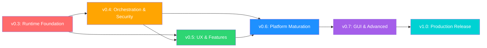

# DHelix Revolution Master Roadmap

> **Version**: 3.0 (2026-04-04)
> **기반**: OpenCode + Codex CLI Deep Dive 경쟁 분석, DHelix 자체 평가, 2026 업계 트렌드 조사
> **목표**: v0.2.0 → v1.0 — "promising CLI" → "production-grade AI coding platform"

---

## Executive Summary

DHelix Code는 리라이트가 아닌 **규율 있는 진화**가 필요하다.

### 현재 위치 (v0.2.0)

| Dimension | 현재 점수 | 경쟁사 수준 | Gap |
|-----------|----------|------------|-----|
| Core Runtime | 72% | OpenCode 88%, Codex 85% | **HIGH** |
| Tool System | 78% | OpenCode 90%, Codex 85% | **MEDIUM** |
| AI Orchestration | 55% | OpenCode 85%, Codex 80% | **CRITICAL** |
| CLI UX/UI | 78% | OpenCode 82%, Codex 85% | **MEDIUM** |
| Feature Ecosystem | 62% | OpenCode 87%, Codex 75% | **HIGH** |
| Security & Ops | 72% | OpenCode 82%, Codex 92% | **HIGH** |

### 3개 프로젝트에서 배운 핵심 교훈

**OpenCode에서 배울 것:**
- Effect.js 기반 composable DI → 우리는 Disposable/AsyncDisposable 패턴 적용
- SQLite + Drizzle ORM 세션 → filesystem JSONL에서 마이그레이션
- 20+ LLM 프로바이더 via Vercel AI SDK → 프로바이더 확장
- Plugin hook 시스템 (system prompt, chat params, tool definitions) → hook maturation
- Part-based message model (40+ event types) → event-driven streaming
- 47개 도구 + batch/patch/plan 도구 → 도구 확장
- SKILL.md + 5개 디렉토리 재귀 탐색 → skill system 강화

**Codex에서 배울 것:**
- OS-level sandboxing (Seatbelt/Landlock/restricted-token) → 보안 최우선
- Rust 네이티브 바이너리 → 성능 최적화 참고
- AgentControl spawn/fork/resume 패턴 → 멀티에이전트 성숙
- TOML execution policy + approval tracking → 정책 엔진
- WebSocket prewarm + request compression → 연결 최적화
- App Server (REST API over core runtime) → API 서비스 레이어
- Thread-based session model → 세션 분기/포크

**2026 업계 트렌드:**
- MCP 2026: OAuth 2.1+PKCE, Agent-to-Agent (Q3), Registry (Q4)
- 컨텍스트: Anchored Iterative Summarization, 70% 임계점 선제 압축
- 멀티에이전트: 워크트리 격리 표준, Tier 1(로컬)/2(클라우드)/3(자동화)
- CLI vs MCP: CLI가 토큰 효율 10-32x, 신뢰도 100% vs 72%
- Enterprise: 샌드박스, 감사 추적, 비용 텔레메트리, 규정 준수

---

## Strategic Thesis

### 빌드 순서 (변경 불가)

```
1. Runtime Maturity          ← 모든 것의 기초
2. Tool Execution Pipeline   ← 런타임 위에 도구 분리
3. Provider & Orchestration  ← 도구 위에 멀티모델/에이전트
4. Security & Sandboxing     ← 실행 기반 위에 보안 계층
5. Operator UX               ← 안정적 기반 위에 UX 혁신
6. Feature Platform          ← 최종 확장성 (MCP, Plugin, Skills)
```

이 순서를 뒤집으면 기능은 빨리 늘지만 안정성이 무너진다.

### 핵심 원칙

1. **기존 거대 루프에 더 많은 로직을 밀어넣지 않는다** — 분리한다
2. **모든 주요 기능은 메트릭을 방출한다** — 관측 불가능한 것은 최적화할 수 없다
3. **모든 런타임 리팩토링은 회귀 테스트를 동반한다** — 테스트 없는 리팩토링 금지
4. **Background work는 검사/재개 가능해야 한다** — fire-and-forget 금지
5. **Skills/Plugins은 trust model을 먼저 확보한다** — 힘을 주기 전에 신뢰 확보
6. **Additive migration > destructive rewrite** — 점진적 마이그레이션 우선
7. **GUI는 운영 필요에 따른다** — 미학이 아닌 문제 해결
8. **DHelix 고유 강점을 보존·심화한다** — 무조건적 모방 금지

### DHelix 고유 강점 (보존 대상)

경쟁사 대비 이미 앞서있거나 독자적인 영역:

| 강점 | 설명 |
|------|------|
| **Adaptive Schema** | 모델 능력에 따라 도구 스키마를 동적 조정 — OpenCode/Codex 없음 |
| **Tool Call Corrector** | 저성능 모델의 인자 오류를 자동 교정 — 고유 기능 |
| **3-Layer Compaction** | Micro + Auto + Rehydration — 가장 정교한 압축 전략 |
| **Code Intelligence Guide** | System prompt에 tree-sitter 기반 코드 인텔리전스 통합 |
| **Hot Tool Loading** | 6개 핵심 도구 즉시 로드, 나머지 lazy — 프롬프트 토큰 절약 |
| **Instruction Layering** | 5-layer config merge (global → project → local → session → command) |
| **Team DAG Scheduler** | Topological sort 기반 병렬 팀 오케스트레이션 |
| **Permission 5-Mode** | default → acceptEdits → plan → dontAsk → bypass 점진적 신뢰 |

---

## Version Roadmap

### v0.3.0 — Runtime Foundation (8 weeks)

> Wave 1: 런타임 안정화 + 도구 파이프라인 분리

**Core Runtime (01)**

| 작업 | 우선순위 | 예상 LOC | 대상 파일 |
|------|---------|---------|----------|
| Agent loop pipeline 분리 (8 named stages) | P0 | +800 | `src/core/runtime-pipeline.ts` (신규) |
| RuntimeStage enum + transition model | P0 | +200 | `src/core/runtime-stages.ts` (신규) |
| Async compaction engine | P0 | +400 | `src/core/async-compaction.ts` (신규) |
| SQLite session store (Drizzle) | P0 | +600 | `src/storage/session-db.ts` (신규) |
| Per-stage timing metrics | P1 | +300 | `src/core/runtime-metrics.ts` (신규) |
| Compaction invariants (pair coherence) | P1 | +200 | `src/core/compaction-invariants.ts` (신규) |
| Cold storage GC + LZ4 compression | P2 | +150 | `src/core/cold-storage.ts` (수정) |

**Tool System (02)**

| 작업 | 우선순위 | 예상 LOC | 대상 파일 |
|------|---------|---------|----------|
| ToolExecutionPipeline 추출 (preflight→schedule→execute→postprocess) | P0 | +500 | `src/tools/execution-pipeline.ts` (신규) |
| 표준화된 에러 핸들링 (ToolError type hierarchy) | P0 | +200 | `src/tools/tool-errors.ts` (신규) |
| apply_patch 도구 | P1 | +150 | `src/tools/builtin/apply-patch.ts` (신규) |
| batch_file_ops 도구 | P1 | +200 | `src/tools/builtin/batch-file-ops.ts` (신규) |
| Tool streaming protocol | P2 | +300 | `src/tools/tool-stream.ts` (신규) |

**예상 결과:**
- Agent loop: 1,302 LOC monolith → 8개 stage module (각 100-200 LOC)
- Compaction latency: blocking → async (p95 iteration time 40% 감소)
- Session storage: JSONL → SQLite (100+ session에서도 <100ms 조회)
- Tool execution: embedded → 4-stage pipeline

---

### v0.4.0 — Orchestration & Security (8 weeks)

> Wave 2: 멀티모델/에이전트 + OS-level 보안

**AI Orchestration (03)**

| 작업 | 우선순위 | 예상 LOC | 대상 파일 |
|------|---------|---------|----------|
| ProviderRegistry 추상화 | P0 | +400 | `src/llm/provider-registry.ts` (신규) |
| Google Gemini 프로바이더 | P0 | +200 | `src/llm/providers/gemini.ts` (신규) |
| Azure OpenAI 프로바이더 | P1 | +150 | `src/llm/providers/azure.ts` (신규) |
| Dual-model auto-routing 구현 | P0 | +300 | `src/llm/dual-model-router.ts` (수정) |
| Typed AgentManifest | P1 | +250 | `src/subagents/agent-manifest.ts` (신규) |
| Session fork/branch/merge | P1 | +400 | `src/core/session-fork.ts` (신규) |
| Orchestration event store | P2 | +300 | `src/subagents/orchestration-store.ts` (신규) |

**Security (06)**

| 작업 | 우선순위 | 예상 LOC | 대상 파일 |
|------|---------|---------|----------|
| Process-level sandbox (restricted env) | P0 | +400 | `src/sandbox/process-sandbox.ts` (신규) |
| macOS Seatbelt integration | P0 | +300 | `src/sandbox/seatbelt.ts` (신규) |
| Linux Landlock integration | P0 | +300 | `src/sandbox/landlock.ts` (신규) |
| TOML execution policy engine | P1 | +250 | `src/permissions/policy-engine.ts` (신규) |
| Persistent approval DB (SQLite) | P1 | +200 | `src/permissions/approval-db.ts` (신규) |
| Trust tier model (T0-T3) | P1 | +200 | `src/permissions/trust-tiers.ts` (신규) |
| Output secret masking | P2 | +150 | `src/guardrails/output-masker.ts` (신규) |

**예상 결과:**
- LLM 프로바이더: 3개 → 5+ (Gemini, Azure 추가)
- Dual-model router: 35% → 80% 완성
- bash_exec: OS-level sandbox로 파일시스템/네트워크 격리
- Permission: regex 기반 → policy engine + persistent DB

---

### v0.5.0 — Operator UX & Features (8 weeks)

> Wave 3: CLI 혁신 + Feature Platform 구축

**CLI UX (04)**

| 작업 | 우선순위 | 예상 LOC | 대상 파일 |
|------|---------|---------|----------|
| ShellLayout 추상화 (transcript + prompt + footer + overlay) | P0 | +500 | `src/cli/layout/shell-layout.tsx` (신규) |
| Diff viewer (syntax-aware) | P0 | +400 | `src/cli/components/DiffViewer.tsx` (신규) |
| Job/Task/Approval panels | P1 | +350 | `src/cli/components/panels/` (신규) |
| Agent tab switching (Alt+1..9) | P1 | +200 | `src/cli/components/AgentTabs.tsx` (신규) |
| MessageList virtualization | P1 | +200 | `src/cli/components/MessageList.tsx` (수정) |
| Performance optimization (React.memo + async Shiki) | P2 | +150 | 여러 컴포넌트 수정 |

**Feature Ecosystem (05)**

| 작업 | 우선순위 | 예상 LOC | 대상 파일 |
|------|---------|---------|----------|
| MCP health check + auto-reconnect | P0 | +200 | `src/mcp/health-monitor.ts` (신규) |
| MCP granular tool filtering | P0 | +150 | `src/mcp/tool-filter.ts` (신규) |
| MCP streaming support | P1 | +200 | `src/mcp/streaming.ts` (신규) |
| Typed skill manifest + composition | P0 | +300 | `src/skills/skill-manifest.ts` (신규) |
| Hook system event coverage 확대 (42% → 80%) | P1 | +400 | `src/hooks/` (다수 수정) |
| Plugin platform 기초 (load/unload/hook registry) | P1 | +500 | `src/plugins/` (신규 디렉토리) |
| Incremental tree-sitter indexing | P2 | +300 | `src/indexing/incremental-indexer.ts` (신규) |

**예상 결과:**
- CLI: transcript-centric → operator workspace
- MCP: 72% → 88% (health check, streaming, filtering)
- Skills: 65% → 82% (typed manifest, composition)
- Plugin: 10% → 50% (기초 플랫폼)

---

### v0.6.0 — Platform Maturation (8 weeks)

> Wave 4: 확장성 + Enterprise 준비

**Orchestration 고도화**

| 작업 | 우선순위 |
|------|---------|
| AWS Bedrock + Mistral + Groq 프로바이더 | P1 |
| Ollama/LMStudio/vLLM/llama.cpp 로컬 모델 통합 | P1 |
| Chat template 자동 감지 엔진 | P1 |
| 로컬 모델 벤치마크 프레임워크 (tool calling + code editing + latency) | P1 |
| Agent peer-to-peer communication | P1 |
| Weighted model selection (cost vs quality) | P2 |
| A/B testing infrastructure | P2 |
| Connection pool + WebSocket prewarm | P2 |

**Feature Platform 확장**

| 작업 | 우선순위 |
|------|---------|
| MCP OAuth 2.1 + PKCE | P1 |
| MCP resource/prompt template integration | P1 |
| Additional LSP languages (C++, C#, Swift, Kotlin) | P1 |
| Semantic code search (vector-based) | P2 |
| Command graph unification (built-in + MCP + skill + plugin) | P1 |
| Refactoring tools (extract, inline) | P2 |

**Enterprise & Ops**

| 작업 | 우선순위 |
|------|---------|
| Container-based sandbox (Docker/microVM) | P1 |
| SIEM-compatible audit log export | P1 |
| Runtime metrics dashboard (OTLP) | P1 |
| Managed policy bundles | P2 |
| SSO/SAML integration path | P2 |

---

### v0.7.0 — GUI & Advanced (8 weeks)

> Wave 5: GUI companion + 고급 기능

| 작업 | 설명 |
|------|------|
| Web dashboard (Next.js + WebSocket) | Session explorer, MCP manager, job monitor |
| MCP Agent-to-Agent readiness | Q3 2026 MCP spec 대응 |
| MCP Registry client | Q4 2026 Registry 연동 |
| IDE integration v2 | VSCode inline diff, diagnostics forwarding |
| Code mode tool (AST-based structured editing) | Codex 벤치마킹 |
| Background agent cloud execution (Tier 2) | Remote agent runtime |
| Accessibility (WCAG 2.1 AA) | Screen reader, contrast, keyboard |

---

### v1.0.0 — Production Release

**Release criteria:**

| Metric | Target |
|--------|--------|
| Core Runtime | 90%+ |
| Tool System | 90%+ |
| AI Orchestration | 85%+ |
| CLI UX | 90%+ |
| Feature Ecosystem | 85%+ |
| Security & Ops | 90%+ |
| Test coverage | 85%+ |
| Long-session (50+ turns) success rate | 95%+ |
| Compaction quality (info retention) | 90%+ |
| MCP reconnect success | 99%+ |
| OS sandbox coverage | macOS + Linux |

---

## Cross-Cutting Concerns

### 테스트 전략

모든 Wave에 적용되는 테스트 요구사항:

| 카테고리 | 요구사항 |
|---------|---------|
| Unit | 모든 새 모듈은 80%+ coverage |
| Integration | Agent loop + context manager 상호작용 테스트 |
| Golden scenario | 런타임 전환 시퀀스, 이벤트, 메타데이터 스냅샷 |
| Long-session | 50+ turn 세션에서 compaction/resume 검증 |
| Security | Adversarial 테스트 (injection, path traversal, secret leak) |
| Performance | Token counting 정확도, compaction 지연, LSP cold-start 벤치마크 |

### 마이그레이션 전략

대규모 리팩토링 시 안전한 전환 프로세스:

```
Phase 1: Shadow mode — 새 메타데이터를 기록하되 UX 변경 없음
Phase 2: Read-path parity — 신/구 모두 읽되 새 것 우선
Phase 3: Operator adoption — 검증 후 새 상태 노출
Phase 4: Decommission — 안정성 확인 후 구 경로 제거
```

### 종속성 그래프



---

## Supporting Documents

### 핵심 계획 문서 (v2.0 — 2026-04-04 갱신)

| # | 문서 | 핵심 내용 | Lines |
|---|------|----------|-------|
| 01 | [Core Runtime Improvement Plan](01-core-runtime-improvement-plan.md) | Agent loop pipeline, async compaction, SQLite session, event streaming | 2,015 |
| 02 | [Tools and Execution Improvement Plan](02-tools-and-execution-improvement-plan.md) | ToolExecutionPipeline, 도구 확장 (23→33), plugin discovery | 1,451 |
| 03 | [AI Orchestration Improvement Plan](03-ai-orchestration-improvement-plan.md) | Provider 확장 (3→10+), typed agent manifest, model router | 1,340 |
| 04 | [CLI UX/UI and GUI Plan](04-cli-ux-ui-and-gui-plan.md) | ShellLayout, diff viewer, GUI companion, accessibility | 1,431 |
| 05 | [Feature Ecosystem Improvement Plan](05-feature-ecosystem-improvement-plan.md) | MCP 진화, skill overhaul, plugin platform, LSP 강화 | 1,719 |
| 06 | [Security, Extensibility, and Ops Plan](06-security-extensibility-and-ops-plan.md) | OS sandbox, policy engine, trust tiers, enterprise readiness | 1,241 |

### 참조 문서 (v1.0 — 유지)

| # | 문서 | 내용 |
|---|------|------|
| 10 | Epics and Workstreams | 에픽 분류 및 작업 흐름 |
| 11 | First Implementation Batch | 초기 구현 배치 |
| 12 | Engineering Task Breakdown | 엔지니어링 태스크 분해 |
| 13 | Implementation Milestones | 구현 마일스톤 |
| 14 | Context Runtime and Session Benchmarks | 런타임/세션 벤치마크 |
| 15 | Extension Platform Evolution | 확장 플랫폼 진화 |
| 16 | Remote Background and Operator Model | 원격/백그라운드 모델 |
| 17 | Shell Layout and IDE UX Notes | 셸 레이아웃/IDE UX |
| 18 | MCP LSP and Intelligence Wiring Gaps | MCP/LSP 연결 격차 |
| 19 | Runtime Ownership and Memory Unification | 런타임 소유권/메모리 통합 |
| 20 | Benchmark Target File-Level Map | 벤치마크 대상 파일 맵 |
| 21 | DHelix File-Level Refactor Map | DHelix 파일별 리팩토링 맵 |
| 22 | Core Runtime Invariants and Stage Model | 런타임 불변식/스테이지 모델 |
| 23 | Compaction Session Continuity and Resume | 압축/세션 연속성/재개 |
| 24 | Command Permission and Extension Governance | 명령/권한/확장 거버넌스 |
| 25 | Official Reference Notes | 공식 레퍼런스 노트 |
| 26 | Verification and Regression Strategy | 검증/회귀 전략 |
| 27 | Rollout Migration and Compatibility Plan | 배포/마이그레이션/호환성 |

---

## Competitive Benchmark Summary

### OpenCode vs Codex vs DHelix — 핵심 비교

| Area | OpenCode 강점 | Codex 강점 | DHelix 현재 | DHelix 목표 |
|------|-------------|-----------|------------|------------|
| **Runtime** | Effect.js DI, SQLite sessions, Part-based messages | AgentControl spawn/fork, RolloutRecorder | Monolithic loop, JSONL sessions | Pipeline stages, SQLite, event streaming |
| **Tools** | 47 tools, batch, code search | 40+ tools, code mode, structured editing | 23 tools, adaptive schema | 33+ tools, pipeline, plugin discovery |
| **Providers** | 20+ via AI SDK | OpenAI + local | 3 (Anthropic, OpenAI-compat, Responses) | 10+ (Gemini, Azure, Bedrock, local) |
| **Agents** | 5+ modes, plugin hooks | Spawn/fork/resume, depth tracking | 3 modes, DAG scheduling | 8+ modes, peer-to-peer, manifest |
| **Security** | Wildcard permissions, arity system | **OS-level sandbox** (Seatbelt/Landlock) | 5-mode + guardrails | OS sandbox + policy engine + trust tiers |
| **MCP** | Full SDK, OAuth, resources | rmcp, tool aggregation | Basic client, no streaming | Health check, streaming, OAuth 2.1 |
| **UX** | SolidJS TUI, tab switching | Ratatui, diff rendering | Ink React, basic | ShellLayout, diff viewer, GUI companion |
| **Skills** | SKILL.md, 5 dirs, remote | Built-in, include_dir | Basic loader | Typed manifest, composition, trust |
| **Plugins** | TypeScript hooks, npm/local/git | N/A | None | Multi-surface platform |
| **Sessions** | SQLite + forking | Thread model + rollout | JSONL files | SQLite + fork/branch/merge |

---

## Success Metrics (Program-Level)

| Metric | v0.2 (현재) | v0.5 (목표) | v1.0 (목표) |
|--------|------------|------------|------------|
| Long-session success (50+ turns) | ~70% | 85% | 95%+ |
| Compaction quality (info retention) | ~75% | 85% | 90%+ |
| Compaction latency (p95) | 3-5s (blocking) | <500ms (async) | <200ms |
| Parallel delegation completion | ~80% | 90% | 95%+ |
| MCP reconnect success | ~60% | 90% | 99%+ |
| Tool execution success rate | ~92% | 96% | 99%+ |
| LLM provider count | 3 | 5+ | 10+ |
| Built-in tool count | 23 | 28 | 33+ |
| Test coverage | ~75% | 80% | 85%+ |
| CLI response latency (p95) | ~50ms | <20ms | <10ms |
| OS sandbox coverage | None | macOS | macOS + Linux |

---

## Immediate Starting Point (v0.3 Sprint 1)

이 6가지가 먼저 착지하지 않으면, 이후 모든 작업이 불안정한 기반 위에 놓인다:

```
1. RuntimePipeline extraction (agent-loop.ts → 8 stage modules)
2. ToolExecutionPipeline extraction (executor → preflight/schedule/execute/postprocess)
3. AsyncCompactionEngine (synchronous → background worker)
4. SQLite SessionStore (JSONL → Drizzle ORM)
5. ProviderRegistry abstraction (hardcoded → pluggable)
6. Compaction invariants (pair coherence enforcement)
```

---

## Final Recommendation

**선택적 모방이 최고의 벤치마크 전략이다.**

OpenCode/Codex가 이미 integration tax를 지불한 곳을 복제하라:
- 런타임 스테이징, 실행 분리, 세션 영속화, OS 샌드박싱, MCP 운영 강건성

DHelix만의 강점을 보존하고 심화하라:
- Adaptive Schema, Tool Call Corrector, 3-Layer Compaction, Code Intelligence Guide, Instruction Layering, Team DAG

이 조합이 "promising CLI"에서 **"production-grade AI coding platform"**으로 가는 경로다.
