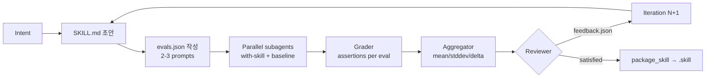
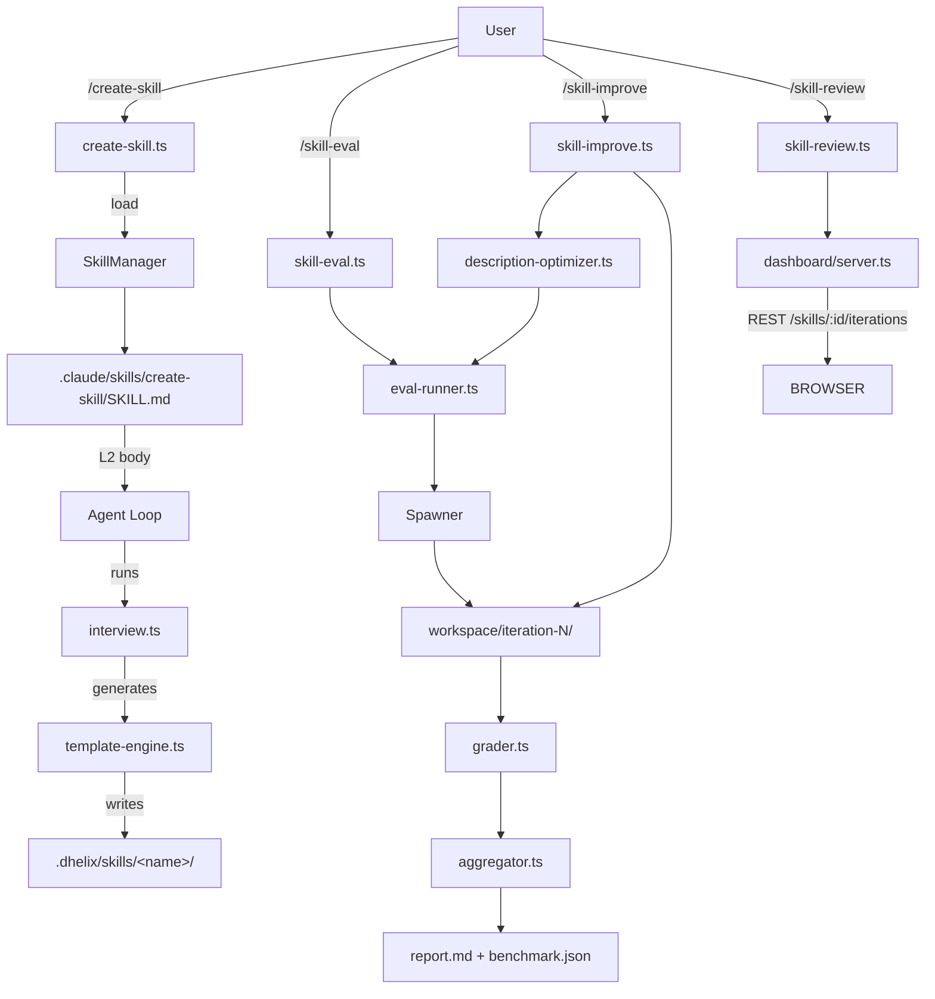
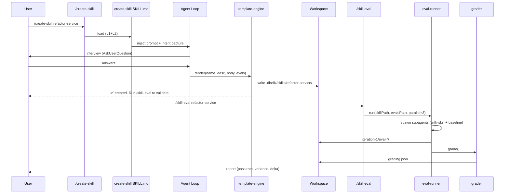
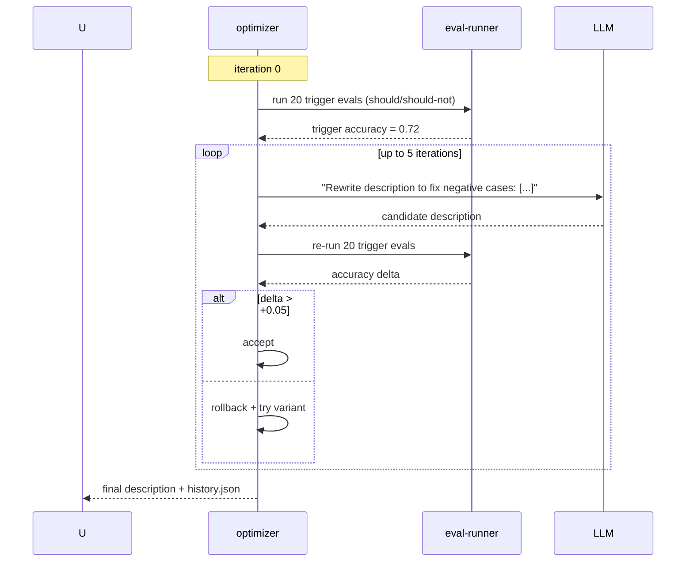

# dhelix `create-skill` 개발 계획

> **벤치마크 대상**: [anthropics/skills — skill-creator v2.0](https://github.com/anthropics/skills/tree/main/skills/skill-creator)
> **목표**: dhelix-code 배포 번들에 "양질의 스킬을 자동으로 생성·평가·개선하는" 기본 스킬(`create-skill`)을 포함.
> **Author**: Claude Code Specialist lens
> **상태**: Draft · 2026-04-17

---

## 0. TL;DR

Claude Code의 `skill-creator`는 단순한 템플릿 생성기가 아니라 **Create → Eval → Improve → Benchmark** 4-모드 반복 루프를 가진 **스킬 엔지니어링 프레임워크**다. v2.0에서 eval harness, description 최적화 루프, baseline 비교, 브라우저 뷰어가 추가되어 "스킬 품질을 측정 가능한 지표로 드라이브"한다.

dhelix는 스킬 로더/매니페스트/실행기/컴포저/서브에이전트가 이미 갖춰져 있으나, 평가·개선 루프 인프라와 스킬 *생성* 워크플로우가 전무하다. 본 계획은 다음 4 Phase로 나눠 구현한다:

| Phase | 기간 | 산출물 | 사용자 가치 |
|-------|------|--------|-------------|
| **P1. Scaffold** | 1주 | `.claude/skills/create-skill/SKILL.md` + 인터뷰 워크플로우 | 즉시 스킬 생성 가능 (Claude.ai 모드 수준) |
| **P2. Eval Harness** | 2주 | `src/skills/creator/{eval-runner,grader,aggregator}.ts` + CLI | 스킬 품질을 수치로 검증 |
| **P3. Improve & Benchmark** | 2주 | description optimizer, baseline 비교, `/skill-review` 뷰어 | 반복 개선으로 트리거 정확도 향상 |
| **P4. Distribution** | 1주 | `.dskill` 패키지 포맷, plugin marketplace 훅 | 사용자 스킬 공유 |

**"기본 스킬"**로는 P1만 번들된다. P2–P4는 **내장 모듈(`src/skills/creator/`)**로 제공하고, 스킬 본문에서 서브프로세스/서브에이전트를 통해 호출한다 (Claude Code가 Python 스크립트를 쉘로 호출하는 것과 동일한 패턴을 TypeScript로 포팅).

---

## 1. 목차

- [2. 배경 & 동기](#2-배경--동기)
- [3. Claude Code skill-creator v2.0 해부](#3-claude-code-skill-creator-v20-해부)
- [4. dhelix 스킬 시스템 현황](#4-dhelix-스킬-시스템-현황)
- [5. 갭 분석 & 스코프](#5-갭-분석--스코프)
- [6. 설계 원칙](#6-설계-원칙)
- [7. 아키텍처](#7-아키텍처)
- [8. Phase 1 — Scaffold (기본 스킬)](#8-phase-1--scaffold-기본-스킬)
- [9. Phase 2 — Eval Harness](#9-phase-2--eval-harness)
- [10. Phase 3 — Improve & Benchmark](#10-phase-3--improve--benchmark)
- [11. Phase 4 — Distribution](#11-phase-4--distribution)
- [12. 데이터 스키마](#12-데이터-스키마)
- [13. 테스트 전략](#13-테스트-전략)
- [14. 리스크 & 완화](#14-리스크--완화)
- [15. 참고 자료](#15-참고-자료)

---

## 2. 배경 & 동기

### 2.1 Why now

- dhelix v0.2에서 스킬 시스템(`src/skills/`)이 안정화되었고, 현재 `.claude/skills/` 하위에 12개 검증 스킬이 존재한다. 그러나 **"스킬을 사용자가 만들 때의 표준 워크플로우"**가 없어 Quality drift(형식 불일치, description 품질 저하, 테스트 누락)가 관찰된다.
- Anthropic이 2026-03에 skill-creator v2.0을 공개하며 *"description 최적화 + eval harness + baseline 비교"* 를 공식 베스트 프랙티스로 정립했다. dhelix가 이를 **TypeScript 네이티브**로 포팅하면 **Claude Code와 동일한 표준 위에서 스킬 생태계 호환**을 얻는다 (SKILL.md 표준은 공용).
- 사용자가 스킬을 잘 만들수록 dhelix의 유즈케이스가 확장되며, 이는 DBR(Daily Bound Requests) 상승과 장기 리텐션으로 연결된다.

### 2.2 사용자 시나리오

```
[신규 사용자] 
  $ dhelix
  > /create-skill
  <인터뷰 진행>
  → .dhelix/skills/refactor-service/SKILL.md 생성
  → evals/evals.json 에 3개 테스트 프롬프트 기록
  > /skill-eval refactor-service
  → [baseline 60% vs with-skill 87%] variance 리포트
  > /skill-improve refactor-service
  → description + body 개선 제안 적용
  > /skill-eval refactor-service
  → [with-skill 94%] — commit & share
```

**핵심**: "스킬을 만든다"가 아니라 **"스킬을 측정·개선하면서 수렴시킨다"**가 사용자 여정이다.

---

## 3. Claude Code skill-creator v2.0 해부

### 3.1 공식 저장소 레이아웃

소스: [`anthropics/skills/skills/skill-creator/`](https://github.com/anthropics/skills/tree/main/skills/skill-creator)

```
skill-creator/
├── SKILL.md               # 엔트리 (metadata + 본문)
├── agents/                # 서브에이전트 정의 (spawn-able 작업 분할)
├── assets/                # 템플릿/보일러플레이트
├── eval-viewer/           # 브라우저 리뷰 UI (Outputs/Benchmark 탭)
├── references/
│   └── schemas.md         # 7개 JSON 스키마 (evals/history/grading/metrics/...)
├── scripts/               # python -m scripts.<name> 형태로 호출
│   ├── init_skill.py
│   ├── package_skill.py
│   ├── aggregate_benchmark.py
│   ├── generate_review.py
│   └── run_loop.py
└── LICENSE.txt
```

### 3.2 4 운영 모드

| 모드 | 입력 | 출력 | 핵심 동작 |
|------|------|------|-----------|
| **Create** | intent (자연어) | SKILL.md + 초안 evals | 인터뷰 → 초안 → 검증 |
| **Eval** | 스킬 경로 + evals.json | grading.json + metrics.json | 병렬 subagent 실행 + 채점 |
| **Improve** | feedback.json | 개정된 SKILL.md (iteration-N/) | 피드백 일반화 → body/description 개정 |
| **Benchmark** | with-skill + baseline 결과 | benchmark.json + comparison.json | 통계 분석 + blind 비교 |

### 3.3 Progressive Disclosure 3-level 로딩

| Level | 로드 시점 | 토큰 | 내용 |
|-------|-----------|------|------|
| **L1 Metadata** | 세션 시작 | ~100 | YAML frontmatter (`name`, `description`) |
| **L2 Body** | 스킬 트리거 시 | <5k | SKILL.md 본문 |
| **L3 Resources** | 명시적 read 시 | 무제한 | `scripts/`, `references/`, `assets/` |

> **교훈**: SKILL.md는 500줄 이내로 유지. 긴 콘텐츠는 `references/`로 분리해 **필요할 때만** 로드.

### 3.4 Description 작성 규칙 (v2.0 신규)

Claude Code가 강조하는 원칙 (source: [SKILL.md — Key Principles](https://github.com/anthropics/skills/blob/main/skills/skill-creator/SKILL.md)):

1. **"Pushy" 톤** — `"Make sure to use when ..."` 로 undertriggering 방어
2. **When-to-use 메타데이터 필수** — 본문이 아닌 frontmatter `description`에 포함
3. **Positive + Negative 예시** — `should-trigger` 8–10개 + `should-not-trigger` 8–10개
4. **자동 최적화 루프** — `python -m scripts.run_loop` (최대 5회 반복)
5. **`ALWAYS`/`MUST` 남용 금지** — 대신 *why*를 설명하면 모델이 맥락 추론 가능

### 3.5 Eval Harness 흐름



### 3.6 Platform Adaptation

- **Claude.ai** (서브에이전트 없음): 순차 실행, baseline 생략, description 최적화 생략
- **Cowork** (브라우저 없음): `generate_review.py --static <path>` 로 정적 HTML 생성

> **dhelix 시사점**: dhelix는 TUI(Ink) 환경이므로 `eval-viewer`를 **in-TUI** 또는 **dashboard(`src/dashboard/`)** 로 이중 제공.

---

## 4. dhelix 스킬 시스템 현황

### 4.1 인프라 (이미 존재)

| 모듈 | 경로 | 책임 |
|------|------|------|
| Types | `src/skills/types.ts` | `SkillFrontmatter`, `SkillDefinition`, `SkillExecutionResult` |
| Manifest | `src/skills/manifest.ts` | 확장 `SkillManifest` (version, triggers, inputs, outputs, requires, trustLevel, dependencies) |
| Loader | `src/skills/loader.ts` | YAML frontmatter + 본문 파싱 |
| Executor | `src/skills/executor.ts` | 변수 치환 + `!command` 동적 컨텍스트 |
| Manager | `src/skills/manager.ts` | 4개 디렉토리(`.dhelix/skills`, `~/.dhelix/skills`, …) 로드 |
| Composer | `src/skills/composer.ts` | 다중 스킬 파이프라인(순차/병렬/조건부) |
| Command Bridge | `src/skills/command-bridge.ts` | `userInvocable` 스킬 → 슬래시 커맨드 자동 변환 |
| Dependency | `src/skills/dependency-resolver.ts` | Kahn 알고리즘 로드 순서 |

### 4.2 Manifest 파워 (활용 포인트)

dhelix의 `SkillManifest`(`src/skills/manifest.ts:82-101`)는 이미 다음을 지원 → **새 인프라 없이 활용 가능**:

- `triggers`: 자동 매칭 패턴 (description 최적화 시 eval 포함 가능)
- `inputs` / `outputs`: 타입-안전 스킬 I/O
- `requires`: 필요한 도구/권한/최소 모델 등급
- `trustLevel`: `built-in` | `project` | `community` | `untrusted`
- `dependencies`: 다른 스킬 선로드

### 4.3 서브에이전트 인프라 (P2 핵심 전제)

`src/subagents/`에 Spawner + P2P MessageBus + Memory + Worktree 격리가 이미 존재(CLAUDE.md 아키텍처 다이어그램 참조). **evals의 "병렬 subagent 실행"을 포팅할 기반이 이미 완성**.

### 4.4 현존 built-in 스킬 포맷 (준거)

`.claude/skills/manage-skills/SKILL.md` 를 관찰한 결과 dhelix 스킬의 사실상 표준은:

```yaml
---
name: <kebab-case>
description: <한 줄 한국어 설명 + 트리거 맥락>
disable-model-invocation: <boolean>  # 선택
argument-hint: "<usage hint>"
---

# <Title>

## 목적
## 실행 시점
## 워크플로우
### Step 1: ...
## Related Files
## 예외사항
```

### 4.5 알려진 제약 (PR에서 선행 수정 필요)

`.claude/docs/skill-system-critical-fixes.md` 에 정리된 3 이슈:
1. `skill:fork` 리스너 미연결 → fork 컨텍스트 스킬 무동작
2. `executor.ts:85` 의 `exec()` 셸 인젝션 취약점
3. `modelOverride` 무시됨 (`useAgentLoop.ts:719-721`)

**본 계획에서는 이 3개를 P1 블로커로 취급** — create-skill이 생성한 스킬이 fork 모드를 쓸 수 있어야 하고, 안전한 셸 실행이 보안 요구사항이며, per-skill 모델 지정(예: 작은 채점자는 haiku)이 Eval 경제성에 직결된다.

---

## 5. 갭 분석 & 스코프

### 5.1 Claude Code ↔ dhelix 매핑

| Claude Code 컴포넌트 | dhelix 대응 | 상태 |
|---------------------|-------------|------|
| `skill-creator/SKILL.md` | `.claude/skills/create-skill/SKILL.md` | **없음 → P1에서 신규** |
| `scripts/init_skill.py` | `src/skills/creator/scaffold.ts` | **없음 → P1** |
| `scripts/package_skill.py` | `src/skills/creator/package.ts` | **없음 → P4** |
| `scripts/aggregate_benchmark.py` | `src/skills/creator/benchmark.ts` | **없음 → P3** |
| `scripts/generate_review.py` | `/skill-review` + dashboard widget | **없음 → P3** |
| `scripts/run_loop.py` | `src/skills/creator/description-optimizer.ts` | **없음 → P3** |
| 병렬 subagent runner | `src/subagents/spawner.ts` | **존재 — 재사용** |
| `evals/evals.json` | `<skill-dir>/evals/evals.json` | **없음 → P2 (스키마 재사용)** |
| `eval-viewer/` (HTML) | Dashboard REST + React | **부분 (dashboard 있음) → P3에서 엔드포인트 추가** |
| Progressive disclosure | `SkillManager` body lazy-load | **개선 필요 — P2에서 L3 resources 지연 로드** |
| `references/schemas.md` | 본 계획서 §12 | **작성 중** |

### 5.2 In-scope

- `.claude/skills/create-skill/` 전체 번들 (SKILL.md + references + 보조 스킬)
- 모든 런타임 로직은 `src/skills/creator/`에 TypeScript로 구현
- 기존 `SkillManifest`, `SkillManager`, `Spawner`를 **최대한 재사용**
- 테스트는 Vitest (`test/unit/skills/creator/*.test.ts`, `test/integration/skill-creator.test.ts`)
- 3개 선행 critical fix (fork 리스너, exec 셸인젝션, modelOverride) 포함

### 5.3 Out-of-scope (v1에서는 제외)

- ❌ 타 LLM 벤더 최적화 (초기 구현은 dhelix 기본 모델 라우팅 사용)
- ❌ 웹 기반 스킬 마켓플레이스 (P4는 포맷만 정의)
- ❌ 자동 보안 감사(생성된 스킬의 permission/tool 접근권 검증) — `verify-implementation` 스킬 재사용
- ❌ 다국어 description (한국어 기준; i18n은 후속)

---

## 6. 설계 원칙

1. **표준 호환** — SKILL.md / evals.json 포맷은 Anthropic 공식 스키마 상위 호환. 사용자가 dhelix에서 만든 스킬을 Claude Code에 그대로 가져다 써도 작동.
2. **Progressive disclosure 준수** — `create-skill/SKILL.md` 본문은 500줄 이하. 상세 가이드는 `references/`로 분리.
3. **TypeScript 네이티브** — Python 의존 제거. Node 20+ / ESM / Zod 검증.
4. **기존 인프라 재사용 우선** — SkillManifest, Spawner, SessionManager, Dashboard 재사용. 신규 모듈 최소화.
5. **Trust-level aware** — 생성된 스킬은 기본 `trustLevel: "project"`. `built-in`은 번들 스킬만.
6. **Immutability / no any / ESM `.js`** — CLAUDE.md 키 규칙 준수.
7. **Model economy** — 채점자(grader)는 기본 Haiku, 창작(SKILL.md 작성)은 Sonnet+. ModelRouter의 task classification 활용.
8. **Observable** — 모든 이터레이션은 `<workspace>/iteration-N/` 에 불변 기록 → `/analytics` 가 metric 집계.

---

## 7. 아키텍처

### 7.1 모듈 배치

```
src/skills/creator/                      # 신규
  index.ts                               # public API 배럴
  scaffold.ts                            # init_skill 포팅
  interview.ts                           # 인터뷰 상태 머신
  template-engine.ts                     # SKILL.md/evals.json 템플릿
  eval-runner.ts                         # 병렬 subagent runner
  grader.ts                              # assertion evaluator
  aggregator.ts                          # benchmark 통계
  description-optimizer.ts               # run_loop 포팅
  package.ts                             # .dskill 아카이브
  workspace.ts                           # iteration-N 레이아웃 관리
  types.ts                               # EvalCase, Grading, Benchmark, History

src/commands/
  create-skill.ts                        # 신규 (Phase 1)
  skill-eval.ts                          # 신규 (Phase 2)
  skill-improve.ts                       # 신규 (Phase 3)
  skill-review.ts                        # 신규 (Phase 3, dashboard 트리거)
  skill-package.ts                       # 신규 (Phase 4)

.claude/skills/create-skill/             # 번들된 기본 스킬
  SKILL.md
  references/
    description-patterns.md
    writing-style.md
    anti-patterns.md
    eval-guide.md
  assets/
    SKILL.md.hbs                         # handlebars 템플릿
    evals.json.hbs

test/unit/skills/creator/
  scaffold.test.ts
  template-engine.test.ts
  grader.test.ts
  aggregator.test.ts
  description-optimizer.test.ts

test/integration/
  skill-creator-e2e.test.ts              # 인터뷰 → 생성 → eval → 리포트
```

### 7.2 컴포넌트 다이어그램



### 7.3 데이터 플로우



### 7.4 시퀀스 — Description 최적화 루프 (P3)



---

## 8. Phase 1 — Scaffold (기본 스킬)

**목표**: 사용자가 `/create-skill <name>` 한 번으로 구조적으로 올바른 SKILL.md를 생성. eval 인프라 없이도 단독 가치 제공.

### 8.1 Deliverables

| # | 산출물 | 파일 | 비고 |
|---|--------|------|------|
| P1.1 | 선행 픽스: `skill:fork` 리스너 연결 | `src/cli/hooks/useAgentLoop.ts` | critical-fix #1 |
| P1.2 | 선행 픽스: `exec()` → `execFile()` | `src/skills/executor.ts:85` | critical-fix #2 |
| P1.3 | 선행 픽스: `modelOverride` 전달 | `src/cli/hooks/useAgentLoop.ts:719-721` | critical-fix #3 |
| P1.4 | `create-skill` 스킬 번들 | `.claude/skills/create-skill/SKILL.md` + `references/` + `assets/` | 번들 포함 |
| P1.5 | `/create-skill` 슬래시 커맨드 | `src/commands/create-skill.ts` | 스킬을 fork 컨텍스트로 호출 |
| P1.6 | `scaffold.ts` | `src/skills/creator/scaffold.ts` | 이름 충돌 검사, 디렉토리 레이아웃 |
| P1.7 | `template-engine.ts` | `src/skills/creator/template-engine.ts` | Handlebars 렌더 + Zod 검증 |
| P1.8 | CLAUDE.md 업데이트 | `CLAUDE.md` Skills 테이블 | `create-skill` 등록 |
| P1.9 | 번들 경로 추가 | `src/skills/manager.ts:28-37` `SKILL_DIRS` | `process.resourcesPath/.claude/skills` (배포 시) |
| P1.10 | 테스트 | `test/unit/skills/creator/scaffold.test.ts`, `template-engine.test.ts` | 80%+ 커버리지 |

### 8.2 `create-skill` SKILL.md 초안 (요약)

```yaml
---
name: create-skill
description: >
  Create, modify, and test dhelix skills. Use when the user wants
  to add a new skill from scratch, refine an existing skill,
  write evaluation tests for a skill, or benchmark skill quality.
  Examples: "create a skill for X", "make a slash command that Y",
  "turn this workflow into a reusable skill", "test my skill".
userInvocable: true
disableModelInvocation: false
argumentHint: "[skill-name] [--from-intent \"...\"] [--mode create|improve|eval]"
trustLevel: built-in
requires:
  tools: ["read_file", "write_file", "ask_user_question"]
  minModelTier: medium
---

# Skill Creator (dhelix)

## Mission
Guide the user through **Create → Eval → Improve → Benchmark** to produce
skills that reliably trigger on intended prompts and reliably **skip** on
non-intended prompts.

## When This Triggers
- `/create-skill [name]` (explicit)
- user says "make a skill", "automate this workflow", "turn this into /xxx"
- user wants to improve an existing skill's triggering behavior

## Workflow

### Mode: CREATE
1. **Capture intent** — ask 5 questions via `AskUserQuestion`:
   - What problem does this skill solve?
   - Give 3 example prompts that SHOULD trigger it.
   - Give 3 example prompts that should NOT trigger it.
   - Expected output format (code, report, file edits)?
   - Does it need fork (subagent) or inline?

2. **Draft SKILL.md** — use `references/description-patterns.md` rules.
   Make description "pushy": include "Use when..." clause with concrete
   triggers. Body ≤ 500 lines. Defer long content to `references/`.

3. **Draft evals.json** — 2-3 prompts from step 1, no assertions yet.

4. **Validate** — call `scaffold.ts`:
   - Zod-validate frontmatter
   - Check name uniqueness
   - Verify referenced tools exist in ToolRegistry

5. **Report & next step** — suggest `/skill-eval <name>` when Phase 2 is available.

### Mode: IMPROVE
(Phase 3 — see references/improvement-loop.md)

### Mode: EVAL
(Phase 2 — see references/eval-guide.md)

## Quality Bar
A skill is "created" only when:
- [ ] frontmatter passes `skillManifestSchema` Zod parse
- [ ] description contains explicit "Use when..." + ≥ 3 trigger examples
- [ ] body has `## Mission`, `## When This Triggers`, `## Workflow`
- [ ] body ≤ 500 lines
- [ ] no absolute directives without *why*
- [ ] `<name>.dhelix/skills/<name>/evals/evals.json` exists with ≥ 2 cases

## References
- [Description patterns](references/description-patterns.md)
- [Writing style (imperative)](references/writing-style.md)
- [Anti-patterns](references/anti-patterns.md)
- [Eval guide](references/eval-guide.md)
```

### 8.3 템플릿 엔진

`src/skills/creator/template-engine.ts` 최소 인터페이스:

```ts
export interface SkillScaffoldInput {
  readonly name: string;           // kebab-case
  readonly description: string;    // "pushy", includes "Use when..."
  readonly triggers: readonly string[];       // should-trigger examples
  readonly antiTriggers: readonly string[];   // should-not-trigger
  readonly fork: boolean;
  readonly tools?: readonly string[];
  readonly minModelTier?: "low" | "medium" | "high";
  readonly workflowSteps: readonly string[];
}

export interface SkillScaffoldOutput {
  readonly skillMd: string;        // rendered SKILL.md
  readonly evalsJson: string;      // initial evals
  readonly manifest: SkillManifest;
}

export function renderSkillScaffold(input: SkillScaffoldInput): SkillScaffoldOutput;
```

구현은 Handlebars (이미 `src/utils/` 에 유사 유틸 여부 확인) 또는 순수 string interpolation. 렌더 후 `validateManifest()` 로 자체 검증.

### 8.4 DoD (Definition of Done) — Phase 1

- [ ] `/create-skill demo-skill` 실행 → 인터뷰 5-step → `.dhelix/skills/demo-skill/SKILL.md` 생성
- [ ] 생성된 SKILL.md 가 `skillManifestSchema`를 통과
- [ ] `npm run check` 통과 (typecheck + lint + test + build)
- [ ] `madge --circular src/` 0 cycle
- [ ] 테스트 커버리지 ≥ 80% (skills/creator 모듈 기준)
- [ ] CLAUDE.md Skills 테이블에 `create-skill` 행 추가
- [ ] 선행 critical-fix 3건 모두 반영 + 회귀 테스트 통과

---

## 9. Phase 2 — Eval Harness

**목표**: 생성된 스킬을 **subagent 병렬 실행 + assertion 채점 + variance 통계**로 평가.

### 9.1 Deliverables

| # | 산출물 | 파일 |
|---|--------|------|
| P2.1 | `EvalCase`, `Grading`, `Metrics`, `Timing` 타입 | `src/skills/creator/types.ts` |
| P2.2 | `workspace.ts` | `src/skills/creator/workspace.ts` — `<skill>/workspace/iteration-N/eval-<id>/` 레이아웃 |
| P2.3 | `eval-runner.ts` | 병렬 subagent 실행 — Spawner 활용, `with-skill` + `baseline` 동시 |
| P2.4 | `grader.ts` | assertion 채점 (자연어 assertion → LLM-as-judge, haiku-tier) |
| P2.5 | `aggregator.ts` | pass rate, mean/stddev, win/lose/tie |
| P2.6 | `/skill-eval` 커맨드 | `src/commands/skill-eval.ts` |
| P2.7 | `references/eval-guide.md` | create-skill 스킬이 로드하는 L3 참고 |
| P2.8 | 테스트 | 유닛 + integration (실 subagent 스폰) |

### 9.2 `evals.json` 스키마 (§12에서 전체 정의)

```jsonc
{
  "skill_name": "refactor-service",
  "cases": [
    {
      "id": "e1",
      "prompt": "Refactor UserService to extract validation into a separate class.",
      "files": ["src/services/UserService.ts"],
      "expectations": [
        "A new class (e.g. UserValidator) is extracted.",
        "UserService no longer contains inline validation logic.",
        "No public API is broken."
      ],
      "expected_output_contains": ["class UserValidator", "UserService"]
    }
  ]
}
```

### 9.3 Runner 동작

1. `iteration-N` 디렉토리 생성 (`N = max(existing)+1`)
2. 각 case 당 **2개 subagent** 스폰 (`with-skill`, `baseline`)
   - `with-skill`: 시스템 프롬프트에 SKILL.md body 주입
   - `baseline`: SKILL.md 없이 동일 프롬프트
3. 각 subagent는 isolated worktree(`src/subagents/worktree.ts`) 에서 실행
4. 결과 수집: `output.txt`, `transcript.json`, `metrics.json`, `timing.json`
5. 총 subagent 수 = `len(cases) × 2` → 기본 parallel limit = 3 (config)

### 9.4 Grader

`grader.ts`는 expectations 한 건씩을 **LLM-as-judge**로 채점:

```ts
export interface GradingInput {
  readonly caseId: string;
  readonly prompt: string;
  readonly output: string;
  readonly expectation: string;
}
export interface GradingOutput {
  readonly passed: boolean;
  readonly evidence: string;
  readonly reasoning: string;
}

export async function gradeExpectation(
  input: GradingInput,
  opts: { model?: string; signal?: AbortSignal },
): Promise<GradingOutput>;
```

- 기본 모델: `haiku-4-5` (cost: 3x 저렴)
- 프롬프트 템플릿: `assets/grader-prompt.md` (Chain-of-Thought + structured output)
- 결과는 `grading.json`에 append

### 9.5 Aggregator 출력

`benchmark.json` (§12 참조):

```jsonc
{
  "iteration": 1,
  "configs": {
    "with_skill": { "pass_rate": 0.87, "mean_duration_ms": 12300, "stddev": 2100 },
    "baseline":   { "pass_rate": 0.62, "mean_duration_ms": 14100, "stddev": 3200 }
  },
  "delta": { "pass_rate": +0.25, "duration_ms": -1800 },
  "per_case": [ ... ]
}
```

### 9.6 DoD — Phase 2

- [ ] `npm run test -- skills/creator` 전 녹색
- [ ] `/skill-eval <name>` → iteration-N 디렉토리 생성 + benchmark.json 출력
- [ ] 병렬 실행 시 Spawner resource limit 존중 (`maxConcurrent`)
- [ ] Grader가 subagent 취소(AbortSignal) 전파
- [ ] `src/analytics/` 에 "skills eval runs" metric 노출

---

## 10. Phase 3 — Improve & Benchmark

**목표**: feedback 기반 자동 개선 + description optimizer + 브라우저/대시보드 뷰어.

### 10.1 Deliverables

| # | 산출물 | 파일 |
|---|--------|------|
| P3.1 | `description-optimizer.ts` | `run_loop` 포팅 — 20개 trigger eval 자동 생성 후 5회 최대 이터레이션 |
| P3.2 | `improve.ts` | feedback.json → 새 iteration SKILL.md |
| P3.3 | `/skill-improve` 커맨드 | `src/commands/skill-improve.ts` |
| P3.4 | Blind comparator | `src/skills/creator/comparator.ts` — comparison.json 생성 |
| P3.5 | Dashboard 엔드포인트 | `src/dashboard/routes/skills.ts` — `GET /api/skills/:name/iterations` |
| P3.6 | Dashboard 위젯 | `src/dashboard/ui/SkillReview.tsx` — Outputs / Benchmark 탭 |
| P3.7 | `/skill-review` 커맨드 | 로컬 서버 시작 + 브라우저 오픈 |
| P3.8 | `--static` 출력 | `skill-review --static ./report.html` (Cowork 대응) |

### 10.2 Description Optimizer 알고리즘

```
procedure optimizeDescription(skill, maxIter=5):
  triggerEvals = generate 10 should-trigger + 10 should-not-trigger (LLM)
  current = baseline description
  bestAccuracy = evalTriggers(current, triggerEvals)
  history = [{version: 0, desc: current, accuracy: bestAccuracy}]

  for i in 1..maxIter:
    failures = triggerEvals.filter(e => !e.passed)
    candidate = LLM.rewrite(current, failures)
    accuracy = evalTriggers(candidate, triggerEvals)
    history.append({version: i, desc: candidate, accuracy})
    if accuracy > bestAccuracy + 0.05:
      current = candidate
      bestAccuracy = accuracy
    else if accuracy < bestAccuracy - 0.10:
      break  # regression guard
  return {final: current, history}
```

### 10.3 DoD — Phase 3

- [ ] `/skill-improve <name>` 실행 시 iteration-N+1 생성 + description history 기록
- [ ] Dashboard `/api/skills/<name>/iterations` 응답이 `comparison.json` 포함
- [ ] `--static` 모드로 정적 HTML 생성 가능
- [ ] 5회 이터레이션 상한 지수 백오프 존재
- [ ] Regression guard 테스트 (인위적 나쁜 candidate → rollback)

---

## 11. Phase 4 — Distribution

**목표**: 스킬을 **포터블 `.dskill` 파일**로 패키징 + 설치/검증 커맨드.

### 11.1 `.dskill` 포맷

```
refactor-service-1.0.0.dskill        (== tar.gz)
├── SKILL.md                          (required)
├── manifest.json                     (denormalized from frontmatter)
├── evals/
│   ├── evals.json
│   └── iteration-final/              (최신 iteration snapshot, 선택)
├── references/
├── assets/
├── signature.asc                     (선택, GPG)
└── README.md
```

### 11.2 Deliverables

| # | 산출물 | 파일 |
|---|--------|------|
| P4.1 | `package.ts` | tar + 매니페스트 추출 + integrity hash |
| P4.2 | `install.ts` | `.dskill` 압축 해제 + trustLevel 결정 (커뮤니티 다운로드면 `community`) |
| P4.3 | `/skill-package` 커맨드 | 포맷 검증 + 패키징 |
| P4.4 | `/skill-install` 커맨드 | 설치 + verify-implementation 스킬 자동 실행 |
| P4.5 | plugin marketplace 훅 | `src/plugins/marketplace.ts` REST `GET /skills` (후속 이슈 연동) |

### 11.3 Security — 설치 시 검사

- tar-slip 방지 (`..`/절대 경로 포함 엔트리 거부)
- `manifest.requires.tools` 전체가 ToolRegistry에 존재하는지 확인
- `allowedTools`가 trustLevel 정책을 위반하지 않는지 (예: `untrusted`는 `execute_bash` 금지)
- 기존 `src/permissions/` 정책 엔진 재사용

### 11.4 DoD — Phase 4

- [ ] `/skill-package <name>` → `<name>-<version>.dskill` 생성, SHA256 출력
- [ ] `/skill-install ./file.dskill` → `.dhelix/skills/<name>/` 설치 + 자동 검증
- [ ] security test: tar-slip 시도 거부
- [ ] Spec: `docs/skill-format-spec.md` 작성 (후속 버전 호환 보장)

---

## 12. 데이터 스키마

모두 Zod 스키마로 구현 (`src/skills/creator/types.ts`). Claude Code `references/schemas.md` 와 **호환 상위집합**.

### 12.1 EvalCase

```ts
export const evalCaseSchema = z.object({
  id: z.string().min(1),
  prompt: z.string().min(1),
  files: z.array(z.string()).optional(),
  expectations: z.array(z.string().min(1)).min(1),
  expected_output_contains: z.array(z.string()).optional(),
  expected_output_excludes: z.array(z.string()).optional(),
  tags: z.array(z.string()).optional(),
  // dhelix 확장
  trigger_only: z.boolean().default(false),  // description optimizer 전용
  should_trigger: z.boolean().default(true), // false = negative example
});
```

### 12.2 Grading

```ts
export const gradingSchema = z.object({
  case_id: z.string(),
  expectations: z.array(z.object({
    text: z.string(),
    passed: z.boolean(),
    evidence: z.string(),
    reasoning: z.string().optional(),
  })),
  claims_extracted: z.array(z.string()).optional(),
  improvement_suggestions: z.array(z.string()).optional(),
});
```

### 12.3 Benchmark

```ts
export const benchmarkSchema = z.object({
  skill_name: z.string(),
  iteration: z.number().int().nonnegative(),
  configs: z.record(z.string(), z.object({
    runs: z.array(z.object({ run_id: z.string(), pass_rate: z.number(), duration_ms: z.number() })),
    summary: z.object({
      pass_rate: z.object({ mean: z.number(), stddev: z.number(), min: z.number(), max: z.number() }),
      duration_ms: z.object({ mean: z.number(), stddev: z.number(), min: z.number(), max: z.number() }),
    }),
  })),
  delta: z.object({
    pass_rate: z.number(),
    duration_ms: z.number(),
  }).optional(),
});
```

### 12.4 History

```ts
export const historySchema = z.object({
  skill_name: z.string(),
  entries: z.array(z.object({
    version: z.number().int(),
    parent_version: z.number().int().nullable(),
    description: z.string(),
    skill_md_hash: z.string(),
    expectation_pass_rate: z.number(),
    grading_result: z.enum(["baseline", "won", "lost", "tie"]),
    created_at: z.string(), // ISO-8601
  })),
});
```

### 12.5 Workspace 레이아웃

```
.dhelix/skills/<name>/
├── SKILL.md
├── evals/
│   └── evals.json
├── references/
└── workspace/
    ├── history.json
    └── iteration-<N>/
        ├── description-candidate.md       # P3
        ├── benchmark.json
        ├── comparison.json                # P3 blind
        ├── analysis.json                  # P3 post-hoc
        └── eval-<case-id>/
            ├── with-skill/
            │   ├── output.md
            │   ├── transcript.json
            │   ├── metrics.json
            │   ├── timing.json
            │   └── grading.json
            └── baseline/
                └── ...
```

---

## 13. 테스트 전략

### 13.1 유닛 테스트

- `scaffold.test.ts` — 이름 중복 검사, 디렉토리 권한 오류, `SkillManifest` Zod 검증
- `template-engine.test.ts` — 각 템플릿 변수 치환, null/empty edge case
- `grader.test.ts` — LLM 모킹 (`test/mocks/openai.ts` 재사용), positive/negative/ambiguous case
- `aggregator.test.ts` — 단일 run / 다중 run / NaN / 0 duration edge case
- `description-optimizer.test.ts` — regression guard, max iteration 상한, rollback

### 13.2 통합 테스트

- `test/integration/skill-creator-e2e.test.ts`
  - 시나리오: 인터뷰 mock → 스킬 생성 → evals 실행 (mocked subagent) → benchmark 출력 → 파일 존재 검증
- `test/integration/skill-creator-real.test.ts` (`SKIP_REAL_API` 환경변수 없을 때)
  - 실 LLM 호출 + 실 subagent 스폰으로 소규모 스킬 생성 · 평가
  - 타임아웃 90초

### 13.3 회귀 방지

- Critical-fix 3건 각각에 대한 회귀 테스트 추가:
  - `skill:fork` 리스너 — event emitted when skill forks subagent
  - `executor.ts exec()` — malicious `$ARGUMENTS` 주입 시 셸 escape
  - `modelOverride` — frontmatter `model: haiku-4-5` 가 Agent loop에 전달
- Description optimizer의 **nondeterminism**: 동일 seed로 2회 실행 시 동일 history (LLM mock 사용)

### 13.4 커버리지 타겟

- 모듈별 `src/skills/creator/*` : **≥ 85% 문장 / ≥ 80% 분기**
- 전체 프로젝트 baseline 유지 (현재 98.39% / 92.42%)

---

## 14. 리스크 & 완화

| # | 리스크 | 영향 | 완화 |
|---|--------|------|------|
| R1 | Eval LLM 비용 폭증 (병렬 subagent) | 🔴 높음 | 기본 grader 모델 = Haiku, parallel limit 기본 3, `--budget-usd` 플래그 |
| R2 | Description optimizer 발산 (overfit to examples) | 🟡 중 | regression guard (`-0.10` 초과 하락 시 break), trigger eval 일반화(`tags` 다양화) |
| R3 | 생성 스킬의 보안 구멍 (권한 과다) | 🔴 높음 | 기본 `trustLevel: project`, `requires.tools`만 허용, `verify-implementation` 자동 실행 |
| R4 | Progressive disclosure 위반 (생성된 SKILL.md > 500줄) | 🟡 중 | template-engine이 line count 강제, 초과 시 자동 split 제안 |
| R5 | Anthropic skill-creator v3.0 출시로 스키마 격차 | 🟢 낮음 | §12 스키마는 상위집합 — 신규 필드는 옵션으로 흡수 |
| R6 | Windows 경로 (dhelix 주요 플랫폼 중 하나) | 🟡 중 | `src/utils/path.ts` 재사용, E2E 테스트는 CI matrix에서 Windows 포함 |
| R7 | Subagent 격리 누수 (eval이 실제 파일 수정) | 🔴 높음 | 모든 eval은 worktree 격리 + 읽기 전용 마운트 (설정 가능) |
| R8 | 기존 critical-fix 3건 미해결 | 🔴 높음 | P1의 선행 블로커로 관리. fix 없으면 Phase 1도 fail |

---

## 15. 참고 자료

### 15.1 Anthropic 공식

- [anthropics/skills 저장소](https://github.com/anthropics/skills)
- [skill-creator 디렉토리](https://github.com/anthropics/skills/tree/main/skills/skill-creator)
- [skill-creator/SKILL.md](https://github.com/anthropics/skills/blob/main/skills/skill-creator/SKILL.md)
- [skill-creator/references/schemas.md](https://github.com/anthropics/skills/blob/main/skills/skill-creator/references/schemas.md)
- [Claude Code plugin-dev — skill-creator-original](https://github.com/anthropics/claude-code/blob/main/plugins/plugin-dev/skills/skill-development/references/skill-creator-original.md)
- [Agent Skills Overview (platform docs)](https://platform.claude.com/docs/en/agents-and-tools/agent-skills/overview)
- [Agent Skills — Best Practices](https://platform.claude.com/docs/en/agents-and-tools/agent-skills/best-practices)
- [Anthropic Engineering — Equipping agents with Agent Skills](https://www.anthropic.com/engineering/equipping-agents-for-the-real-world-with-agent-skills)
- [Agent Skills homepage](https://agentskills.io/home)

### 15.2 dhelix 내부

- `src/skills/types.ts` — SkillFrontmatter / SkillDefinition / SkillContext
- `src/skills/manifest.ts` — SkillManifest (확장 스키마)
- `src/skills/manager.ts` — 4-directory 로더 (`SKILL_DIRS` L28-37)
- `src/skills/executor.ts` — 변수 치환 + 동적 컨텍스트
- `src/skills/composer.ts` — 다중 스킬 파이프라인
- `src/skills/command-bridge.ts` — 슬래시 커맨드 변환
- `src/subagents/` — 병렬 실행 인프라 (P2에서 eval-runner 기반)
- `.claude/skills/manage-skills/SKILL.md` — dhelix 스킬 작성 컨벤션 준거
- `.claude/skills/add-slash-command/SKILL.md` — `/skill-*` 커맨드 추가 시 참조
- `.claude/docs/reference/skills-and-commands.md` — 스킬/커맨드 시스템 레퍼런스
- `.claude/docs/skill-system-critical-fixes.md` — P1 선행 이슈 3건

### 15.3 관련 dhelix 스킬 (생성된 create-skill이 연계 호출)

- `verify-implementation` — 설치된 스킬의 correctness 게이트 (P4.4)
- `manage-skills` — 기존 레지스트리 업데이트 (P1.8 CLAUDE.md 자동 반영)
- `dhelix-e2e-test` — end-to-end 검증 harness 재사용 가능

---

## 16. 다음 액션

1. 본 문서 리뷰 & 승인 (PRD 차원 합의)
2. P1 선행 블로커 3건을 독립 PR로 처리 (`fix(skills): ...`)
3. P1 스캐폴딩 PR — `.claude/skills/create-skill/` + `src/skills/creator/scaffold.ts` + `src/commands/create-skill.ts`
4. 사용자 dogfooding — 내부 dhelix 팀이 `/create-skill` 로 스킬 3개 생성 → 품질 피드백
5. P2 착수 조건: P1 DoD 전부 green + dogfooding feedback 수집 완료

---

*Last Updated: 2026-04-17*
