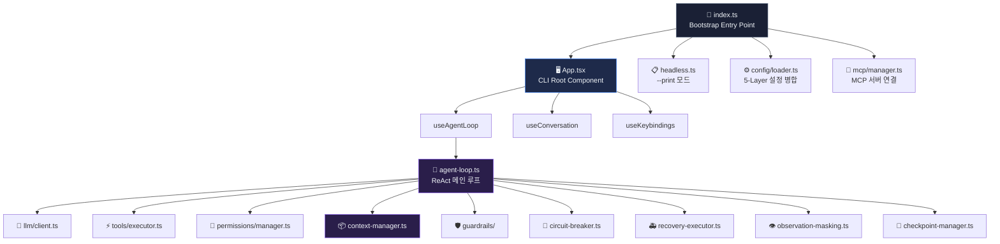
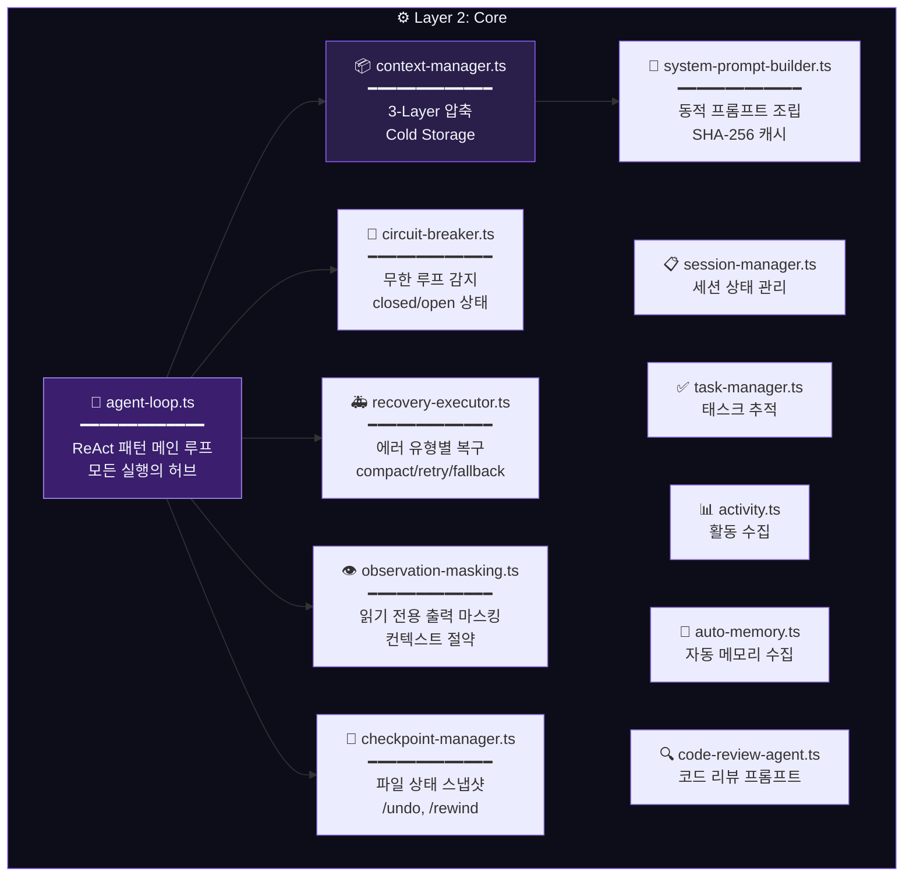
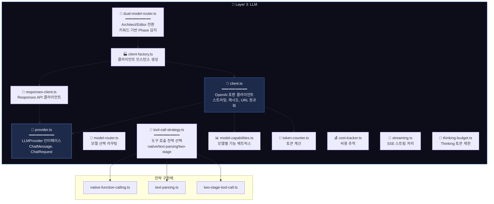
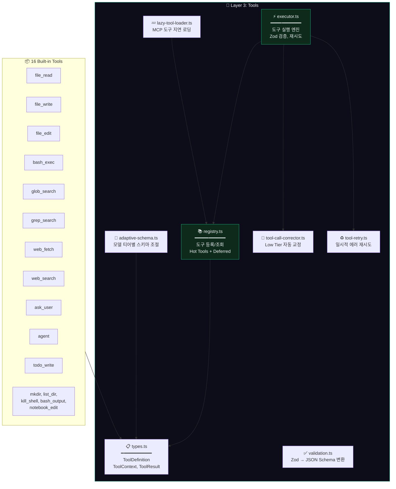
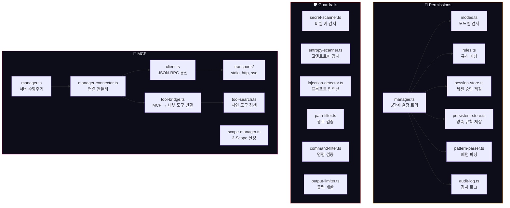
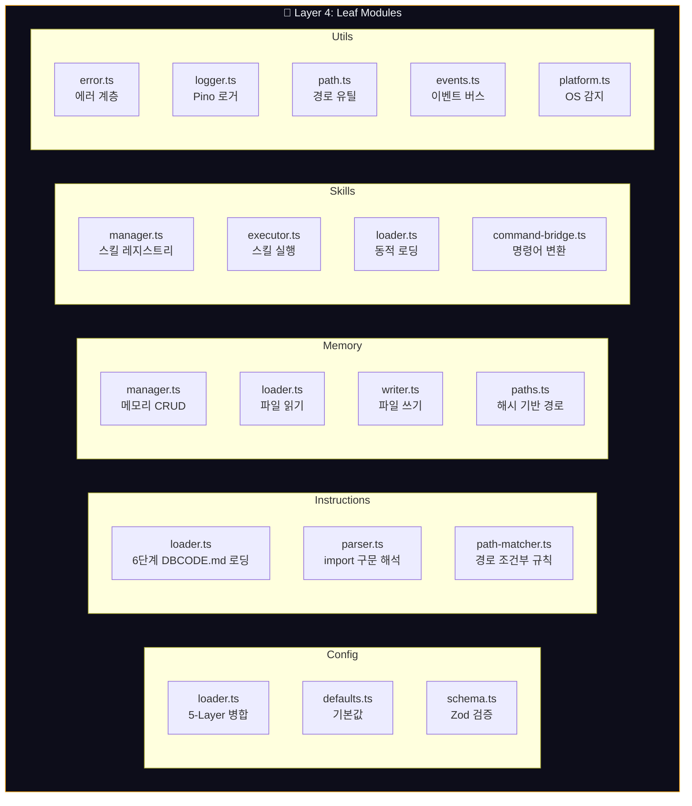
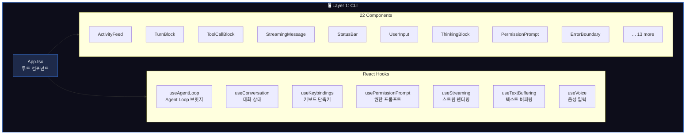

# Source Reference 문서화 계획

> 작성일: 2026-03-21
> dbcode 프로젝트의 모든 핵심 TypeScript 모듈을 초보자도 이해할 수 있도록 구조화된 문서로 작성하는 계획입니다.

---

## 1. 전체 모듈 계층 다이어그램

### 1-1. 최상위 오케스트레이션 흐름



### 1-2. Agent Loop 중심 — 하위 모듈 의존 관계



### 1-3. LLM 클라이언트 계층



### 1-4. Tool System 계층



### 1-5. Permission + Guardrails + MCP 계층



### 1-6. Leaf Layer (Config, Instructions, Memory, Utils)



### 1-7. CLI Layer (컴포넌트 + 훅)



---

## 2. 문서화 순서 (의존성 기반 Bottom-Up)

문서는 **의존성이 적은 Leaf 모듈부터 시작하여 Hub 모듈로** 올라가는 순서로 작성합니다.
이유: 하위 모듈을 먼저 문서화하면, 상위 모듈 문서에서 "관련 문서" 링크를 걸 수 있습니다.

### Phase 1: Foundation (Leaf — 의존성 0)

| # | 모듈 | 파일 | 문서 slug | 난이도 | 예상 분량 |
|---|------|------|-----------|--------|----------|
| 1 | Circuit Breaker | `src/core/circuit-breaker.ts` | `/docs/circuit-breaker` | ★☆☆ | 짧음 |
| 2 | Token Counter | `src/llm/token-counter.ts` | `/docs/token-counter` | ★☆☆ | 짧음 |
| 3 | Model Capabilities | `src/llm/model-capabilities.ts` | `/docs/model-capabilities` | ★☆☆ | 중간 |
| 4 | Cost Tracker | `src/llm/cost-tracker.ts` | `/docs/cost-tracker` | ★☆☆ | 짧음 |
| 5 | Error Hierarchy | `src/utils/error.ts` | `/docs/error-types` | ★☆☆ | 중간 |
| 6 | Event Bus | `src/utils/events.ts` | `/docs/events` | ★☆☆ | 짧음 |

### Phase 2: Security & Validation (독립적 필터)

| # | 모듈 | 파일 | 문서 slug | 난이도 | 예상 분량 |
|---|------|------|-----------|--------|----------|
| 7 | Secret Scanner | `src/guardrails/secret-scanner.ts` | `/docs/secret-scanner` | ★☆☆ | 짧음 |
| 8 | Injection Detector | `src/guardrails/injection-detector.ts` | `/docs/injection-detector` | ★★☆ | 중간 |
| 9 | Path Filter | `src/guardrails/path-filter.ts` | `/docs/path-filter` | ★☆☆ | 짧음 |
| 10 | Command Filter | `src/guardrails/command-filter.ts` | `/docs/command-filter` | ★☆☆ | 짧음 |
| 11 | Guardrails Index | `src/guardrails/index.ts` | `/docs/guardrails` | ★★☆ | 중간 |

### Phase 3: Config & Loading (설정 계층)

| # | 모듈 | 파일 | 문서 slug | 난이도 | 예상 분량 |
|---|------|------|-----------|--------|----------|
| 12 | Config Defaults | `src/config/defaults.ts` | `/docs/config-defaults` | ★☆☆ | 짧음 |
| 13 | Config Loader | `src/config/loader.ts` | `/docs/config-loader` | ★★☆ | 중간 |
| 14 | Instruction Loader | `src/instructions/loader.ts` | `/docs/instruction-loader` | ★★☆ | 중간 |
| 15 | Skill Manager | `src/skills/manager.ts` | `/docs/skill-manager` | ★★☆ | 중간 |
| 16 | Memory Manager | `src/memory/manager.ts` | `/docs/memory-manager` | ★★☆ | 중간 |

### Phase 4: LLM Client (API 통신 계층)

| # | 모듈 | 파일 | 문서 slug | 난이도 | 예상 분량 |
|---|------|------|-----------|--------|----------|
| 17 | LLM Provider Interface | `src/llm/provider.ts` | `/docs/llm-provider` | ★★☆ | 중간 |
| 18 | LLM Client | `src/llm/client.ts` | `/docs/llm-client` | ★★★ | 긴 |
| 19 | Streaming Handler | `src/llm/streaming.ts` | `/docs/streaming` | ★★☆ | 중간 |
| 20 | Tool Call Strategy | `src/llm/tool-call-strategy.ts` | `/docs/tool-call-strategy` | ★★★ | 긴 |
| 21 | Dual Model Router | `src/llm/dual-model-router.ts` | `/docs/dual-model-router` | ★★☆ | 중간 |

### Phase 5: Tool System (도구 파이프라인)

| # | 모듈 | 파일 | 문서 slug | 난이도 | 예상 분량 |
|---|------|------|-----------|--------|----------|
| 22 | Tool Types | `src/tools/types.ts` | `/docs/tool-types` | ★★☆ | 중간 |
| 23 | Tool Registry | `src/tools/registry.ts` | `/docs/tool-registry` | ★★★ | 긴 |
| 24 | Tool Executor | `src/tools/executor.ts` | `/docs/tool-executor` | ★★★ | 긴 |
| 25 | Adaptive Schema | `src/tools/adaptive-schema.ts` | `/docs/adaptive-schema` | ★★☆ | 중간 |
| 26 | Built-in Tools (일괄) | `src/tools/definitions/` | `/docs/builtin-tools` | ★★☆ | 긴 |

### Phase 6: Permission & MCP (접근 제어 + 외부 연동)

| # | 모듈 | 파일 | 문서 slug | 난이도 | 예상 분량 |
|---|------|------|-----------|--------|----------|
| 27 | Permission Manager | `src/permissions/manager.ts` | `/docs/permission-manager` | ★★★ | 긴 |
| 28 | Audit Logger | `src/permissions/audit-log.ts` | `/docs/audit-log` | ★☆☆ | 짧음 |
| 29 | MCP Client | `src/mcp/client.ts` | `/docs/mcp-client` | ★★★ | 긴 |
| 30 | MCP Tool Bridge | `src/mcp/tool-bridge.ts` | `/docs/mcp-tool-bridge` | ★★☆ | 중간 |
| 31 | MCP Manager | `src/mcp/manager.ts` | `/docs/mcp-manager` | ★★★ | 긴 |

### Phase 7: Core Engine (핵심 오케스트레이션 — 최후)

| # | 모듈 | 파일 | 문서 slug | 난이도 | 예상 분량 |
|---|------|------|-----------|--------|----------|
| 32 | Observation Masking | `src/core/observation-masking.ts` | `/docs/observation-masking` | ★★☆ | 중간 |
| 33 | Checkpoint Manager | `src/core/checkpoint-manager.ts` | `/docs/checkpoint-manager` | ★★☆ | 중간 |
| 34 | Recovery Executor | `src/core/recovery-executor.ts` | `/docs/recovery-executor` | ★★★ | 중간 |
| 35 | System Prompt Builder | `src/core/system-prompt-builder.ts` | `/docs/system-prompt-builder` | ★★★ | 긴 |
| 36 | Context Manager | `src/core/context-manager.ts` | `/docs/context-manager` | ★★★ | 긴 |
| 37 | **Agent Loop** | `src/core/agent-loop.ts` | `/docs/agent-loop` | ★★★ | 매우 긴 |

### Phase 8: CLI Layer (UI — 선택적)

| # | 모듈 | 파일 | 문서 slug | 난이도 | 예상 분량 |
|---|------|------|-----------|--------|----------|
| 38 | useAgentLoop Hook | `src/cli/hooks/useAgentLoop.ts` | `/docs/use-agent-loop` | ★★★ | 긴 |
| 39 | useConversation Hook | `src/cli/hooks/useConversation.ts` | `/docs/use-conversation` | ★★☆ | 중간 |
| 40 | ActivityFeed | `src/cli/components/ActivityFeed.tsx` | `/docs/activity-feed` | ★★☆ | 중간 |
| 41 | App.tsx (루트) | `src/cli/App.tsx` | `/docs/app` | ★★★ | 긴 |

---

## 3. 각 문서 페이지 작성 가이드

### 페이지 구조 (모든 모듈 동일)

```
📄 [모듈명]
├── 1. 개요 (Overview)
│   ├── 한 줄 설명 + 레이어 배지
│   ├── 역할 설명 (2-3문장)
│   └── 🔹 Mermaid: 아키텍처 위치 (이 모듈 강조 + 직접 연결 모듈)
│
├── 2. 레퍼런스 (Reference)
│   ├── 클래스/함수 시그니처
│   ├── 📋 파라미터 테이블 (이름 | 타입 | 필수 | 설명)
│   ├── 반환값 설명
│   └── ⚠️ Caveats (주의사항 목록)
│
├── 3. 사용법 (Usage)
│   ├── 🟢 기본 사용법 (가장 흔한 케이스)
│   ├── 🔵 고급 사용법 1
│   ├── 🟣 고급 사용법 2
│   ├── ⚠️ Pitfall: 흔한 실수 (최소 1개)
│   └── 🔬 Deep Dive: 설계 결정 배경 (접을 수 있게)
│
├── 4. 내부 구현 (Internals)
│   ├── 🔹 Mermaid: 내부 상태 흐름 / 데이터 파이프라인
│   ├── 핵심 코드 발췌 (20-30줄) + 라인별 설명
│   └── 상태 변수 목록 (변수명 | 타입 | 역할)
│
├── 5. 트러블슈팅 (Troubleshooting)
│   ├── "X가 동작하지 않아요" (3-5개)
│   └── 각 항목: 원인 → 해결책 → 예방법
│
└── 6. 관련 문서 (See Also)
    ├── 이 모듈을 사용하는 상위 모듈
    ├── 이 모듈이 의존하는 하위 모듈
    └── 같은 레이어의 형제 모듈
```

### 모듈 유형별 작성 전략

#### 🧠 Hub 모듈 (agent-loop, context-manager, permission-manager, mcp-manager)

핵심 오케스트레이터이므로 가장 상세하게 작성:
- **개요**: 전체 실행 흐름에서의 역할을 강조
- **레퍼런스**: Config 인터페이스 + Result 인터페이스 모두 문서화
- **사용법**: 실제 호출 시나리오 3개 이상
- **내부 구현**: stateDiagram으로 상태 전이 시각화
- **트러블슈팅**: 5개 이상 (실제 사용자 이슈 기반)

#### 🔌 인터페이스 모듈 (provider.ts, types.ts, tool-call-strategy.ts)

구현체가 아닌 계약을 정의하므로:
- **개요**: 이 인터페이스를 구현하는 구현체 목록 나열
- **레퍼런스**: 인터페이스의 모든 메서드/프로퍼티 설명
- **사용법**: "새 구현체를 만드는 방법" 가이드
- **내부 구현**: 구현체 비교표 (각 구현체의 차이점)

#### ⚡ 유틸리티 모듈 (token-counter, circuit-breaker, cost-tracker)

독립적이고 단순하므로:
- **개요**: 1-2문장으로 충분
- **레퍼런스**: 함수 시그니처만 간결하게
- **사용법**: 1-2개 예시
- **내부 구현**: 알고리즘이 있는 경우만 (예: Shannon 엔트로피)
- **트러블슈팅**: 1-2개 또는 생략

#### 🛡️ 보안 모듈 (guardrails/*)

보안 도메인이므로:
- **개요**: 왜 이 보안 검사가 필요한지 (위협 시나리오)
- **레퍼런스**: 탐지 패턴 목록 (정규식 등)
- **사용법**: 정상 입력 vs 차단 입력 비교 예시
- **내부 구현**: 탐지 알고리즘 설명
- **트러블슈팅**: "정상인데 차단되는 경우" (false positive 대응)

#### 🖥️ CLI 컴포넌트/훅 (Layer 1)

React 컴포넌트이므로:
- **개요**: 어떤 UI를 담당하는지 스크린샷 또는 ASCII 예시
- **레퍼런스**: Props 인터페이스 문서화
- **사용법**: JSX 사용 예시
- **내부 구현**: 상태 관리 흐름 (useState, useEffect 패턴)
- **트러블슈팅**: 렌더링 이슈, 깜빡임 등 UI 버그

---

## 4. 진행 추적

문서 작성 시 이 파일의 Phase별 테이블에서 status를 업데이트합니다:

- `planned` → 작성 예정
- `wip` → 작성 중
- `review` → 검토 중
- `ready` → 완료

완료된 문서는 `guide/src/app/docs/[slug]/page.tsx`에 생성되며,
`guide/src/app/docs/page.tsx`의 해당 모듈 status를 `"ready"`로 변경합니다.

---

## 5. 예상 일정

| Phase | 모듈 수 | 예상 시간 | 비고 |
|-------|---------|----------|------|
| Phase 1: Foundation | 6개 | ★ 빠름 | 독립 모듈, 짧은 문서 |
| Phase 2: Security | 5개 | ★ 빠름 | 패턴 유사, 일괄 가능 |
| Phase 3: Config | 5개 | ★★ 보통 | 계층 이해 필요 |
| Phase 4: LLM | 5개 | ★★★ 오래 | 복잡한 스트리밍/전략 |
| Phase 5: Tools | 5개 | ★★★ 오래 | 16개 도구 일괄 정리 |
| Phase 6: Perm + MCP | 5개 | ★★★ 오래 | 복잡한 결정 트리 |
| Phase 7: Core | 6개 | ★★★★ 매우 오래 | 핵심 엔진, 최고 상세도 |
| Phase 8: CLI | 4개 | ★★ 보통 | React 컴포넌트 |
| **합계** | **41개** | | |
